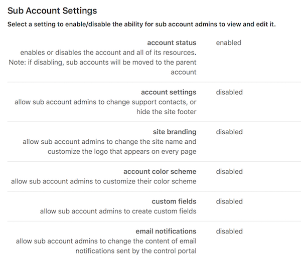

{{{
"title": "Creating a Sub Account",
"date": "11-5-2014",
"author": "Jon McClary",
"attachments": [],
"contentIsHTML": false
}}}

CenturyLink Cloud supports the ability to create sub accounts, which fall under a parent account. Sub accounts have many advantages:

* They are hierarchal - user permissions flow down, not up nor sideways. * They may be billed separately or to the parent account. * They may share parent networks or have their own. * Settings are inherited.

### Audience

Customers

### Creating a Sub Account

In CenturyLinkCloud’s Control Portal drop down menu, select Account > Sub Accounts

Click “+ create new account”

### Company Info

Change parent account if desired, such as in the case that you wish for this account to be a sub account of a sub account.

Fill in appropriate Business name, etc.

Input an Account Alias of your choice. This is a string of 2-4 alphanumeric characters which is used to identify your account and relate servers to that account by naming convention. They are globally unique so there are no duplicate aliases allowed. This is a required field. Note that an account alias cannot be reused, even after deletion of the original account with that alias.

Full Address and Phone fields are required.

### Company Info

You may input a Default Primary DNS and a Default Secondary DNS IP address. This will be the DNS server value input into your IPv4 settings when building a server. You may select your own environment DNS servers, preferred public DNS servers, or the default datacenter DNS servers (172.17.1.26, 172.17.1.27) or leave it blank, in which case it will default to the aforementioned Datacenter DNS servers, which do allow for external DNS lookup.

Bill to: Each sub account generates an invoice. You have the option of submitting the invoice to the parent account, or bill the sub account directly.

Payment Type: Input the payment type for the sub account.

Share Parent Networks: This allows the sub account to use the networks present in its parent account. If this is set to ‘NO’ then the sub account will receive unique IP ranges when deploying servers/networks.

### Settings

All settings will be inherited from the parent. Toggle on to Yes any of the settings in this section will make that section visible in the sub account. The users in that sub account will then be able to override inherited settings. Leaving the sections set to off will hide the menu for that section in the sub account, preventing the settings from being overridden. In our example sub account users will be able to change the Account Logo and Account Color Scheme from what was inherited. All other menus will be hidden.

### Data Center

Select the datacenter which you wish the new account to be homed to. This does not limit your ability to build in any other datacenter. Your VPN server will be created here. You will not be able to hide the Primary datacenter. Your will not be able to change the primary datacenter.

Click ‘Create’ to create the sub account as configured.

If the account is created successfully you will be returned to the parent account (the one you were logged in to) You'll need to navigate to the new sub account via the account drop down to the left of the menu.

If you get any errors, like the alias is in use or missed any required fields, correct them and click Create again.

**Edit Settings:**

After the sub account is created you can edit the settings. Any of these settings may be modified in the future by logging into parent account, then browsing to Account > Sub accounts and click to select the sub account for which you wish to edit settings. You will be sent to the “Sub Account Settings” page.

Edit settings from the parent account after the sub account has been created.

Menus are hidden to the sub account.

You can click any of these settings and toggle them between disabled (not visible) and enabled (visible and therefore editable).

### Adding Users/Permissions

To add new users to the sub account:

1. In the dropdown in the top left, select the sub account for which you would like to add a user.

2. Go to Account > Users and click “+ Create New User”.

3. Fill in required information.

4. Permissions can then be administered via the Account > Permissions tab.

5. Note that user permissions are hierarchical so a user may access the account to which they are assigned, and that account’s sub accounts, but not a parent account nor any other sub account on the same level.

### FAQ

**I just created my sub account. Why do I get a permission denied error when I try to access it?**

Allow a few minutes for the new account to fully replicate and try again.

**I don’t need this sub account any longer, how do I delete it?**

Account > Info. Click on “Request to close” link at bottom right.

**I disabled a sub account, but still see it in my sub accounts list.**

A disabled sub account still appears in the list, so you have the option to re-enable it. Entering the sub account via the dropdown at the top left, and going to account>info and clicking the “Request to close” link will start the process to remove the account.
