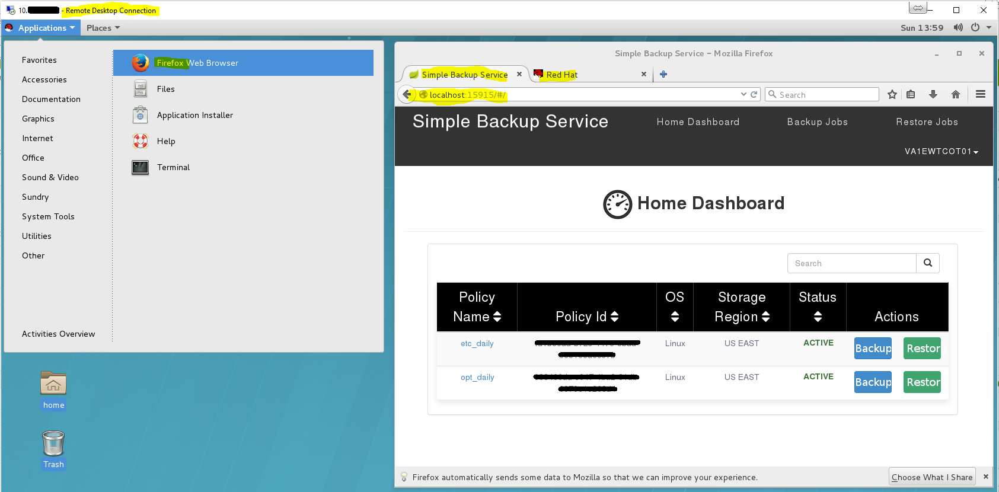

{{{
  "title": "Install RDP on Linux for Simple Backup Service (SBS)",
  "date": "03-21-2016",
  "author":  John Gerger",
  "attachments": [],
  "related-products" : [],
  "contentIsHTML": false,
  "sticky": false
}}}

The new Simple Backup Service (SBS) currently requires a web browser to perform restore operations. If you do not want to [allow remote web based connections to the Backup Agent](./sbs-agent-security.md), you may want to connect directly to the machine via RDP and use a web browser and connect to the local server’s SBS web interface. It is relatively simple to add a desktop with RDP capability to a Linux server to be able to easily establish a typical RDP session to a remote Linux server and get a desktop complete with browser etc.

How:  
(To install RDP services on a remote Red Hat 7x server for example, other OSes and versions may have similar)
```
# Establish a remote SSH session as root and install and configure a desktop with RDP on RHEL7x
# Install a full desktop
yum -y groups install "Server with GUI"

# Install RDP services
yum -y install xrdp tigervnc-server

# Allow a rule to allow RDP through the OS firewall
firewall-cmd --permanent --zone=public --add-port=3389/tcp

# Restart the firewall so the new RDP rule becomes effective
firewall-cmd --reload

# Set the RDP service to auto-start at boot-time
systemctl enable xrdp.service

# Start the RDP service manually now
systemctl start xrdp.service

# You may now RDP to Linux from Windows
# NOTE: Set mstsc to use 16bit High Color (24bit / 32bit will NOT work)
```

