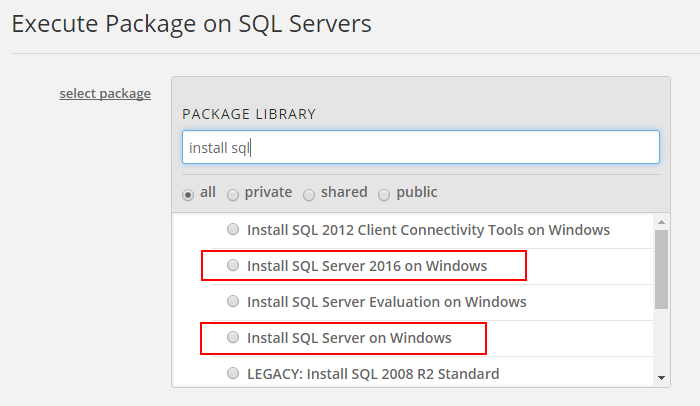
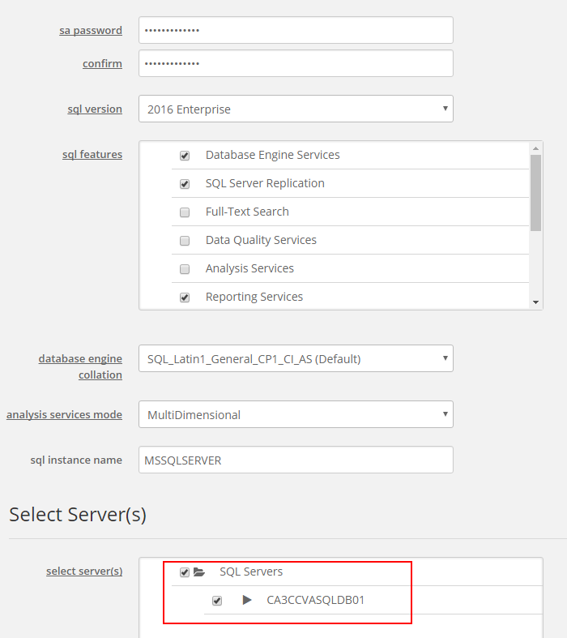
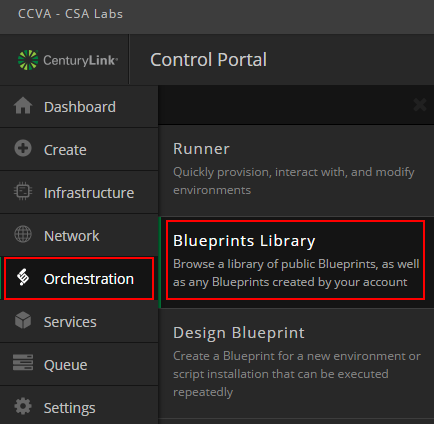
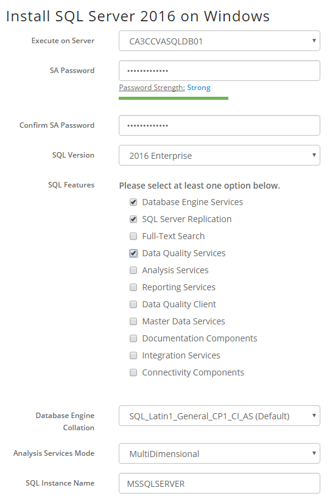
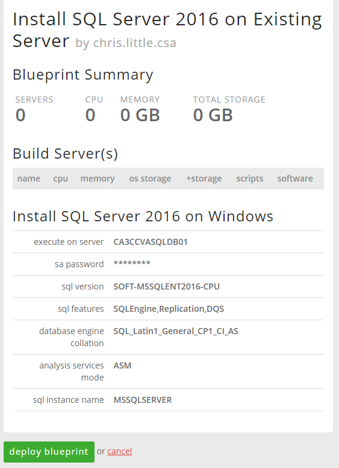

{{{
  "title": "Deploy Microsoft SQL Server using Blueprint",
  "date": "12-8-2017",
  "author": "Chris Little",
  "attachments": [],
  "contentIsHTML": false
}}}

### **IMPORTANT NOTICE**
**As of February 1, 2018 Microsoft SQL Server license fees will be increasing. If you have questions about this change or did not receive notifications on this change please contact customer care at help@ctl.io. Specifics around new costs can also be found in our [release notes.](../Release Notes/2017/2017-11-17-cloud-platform-release-notes.md)**

### Table of Contents
* [Overview](#overview)
* [Socket to vCPU Allocation](#socket-to-vcpu-allocation)
* [Prerequisites](#prerequisites)
* [Exceptions](#exceptions)
* [General Notes](#general-notes)
* [Installing Microsoft SQL Server using Execute Package](#installing-microsoft-sql-server-using-execute-package)
* [Installing Microsoft SQL Server using Blueprint Library](#installing-microsoft-sql-server-using-blueprint-library)

### Overview
CenturyLink Cloud customers can procure and deploy Microsoft SQL Server licensing within the Control Portal. Microsoft SQL Server is licensed via the Microsoft SPLA program. By using the CenturyLink Cloud public Blueprint customers have multiple ways to consume and install this business critical database software.

### Socket to vCPU Allocation
It is recommended customers review our delivery model for [Sockets to vCPU](../Servers/platform-socket-to-vcpu-allocation.md) prior to deploying Microsoft SQL Server to be fully aware of the platform default operations when allocating vCPUs for use with the database service.

### Prerequisites
* A CenturyLink Cloud Account
* ~15 GB Free Storage on C:\
* Operating System and SQL Server Edition aligns in a supported fashion:

SQL Server Edition|Supported Operating Systems
------------------|---------------------------
SQL Server 2008 R2 Web Edition 64-bit SQL Server 2008 R2 Standard Edition 64-bit SQL Server 2008 R2 Enterprise Edition 64-bit|Windows 2008 R2 Standard 64-bit Windows 2008 R2 Enterprise 64-bit Windows 2008 R2 Datacenter 64-bit Windows 2012 Datacenter 64-bit Windows 2012 R2 Datacenter 64-bit
SQL Server 2012 Web Edition 64-bit SQL Server 2012 Standard Edition 64-bit SQL Server 2012 Enterprise Edition 64-bit|Windows 2008 R2 Standard 64-bit Windows 2008 R2 Enterprise 64-bit Windows 2008 R2 Datacenter 64-bit Windows 2012 Datacenter 64-bit Windows 2012 R2 Datacenter 64-bit
SQL Server 2014 Web Edition 64-bit SQL Server 2014 Standard Edition 64-bit SQL Server 2014 Enterprise Edition 64-bit|Windows 2008 R2 Standard 64-bit Windows 2008 R2 Enterprise 64-bit Windows 2008 R2 Datacenter 64-bit Windows 2012 Datacenter 64-bit Windows 2012 R2 Datacenter 64-bit
SQL Server 2016 Web Edition 64-bit SQL Server 2016 Standard Edition 64-bit SQL Server 2016 Enterprise Edition 64-bit|Windows 2012 Datacenter 64-bit Windows 2012 R2 Datacenter 64-bit

* Validate the Hardware and Software Requirements for Installing SQL Server are met:
    * [SQL Server 2008 R2](//msdn.microsoft.com/en-us/library/ms143506%28v=sql.105%29.aspx)
    * [SQL Server 2012](//msdn.microsoft.com/en-us/library/ms143506%28v=sql.110%29.aspx)
    * [SQL Server 2014](//msdn.microsoft.com/en-us/library/ms143506%28v=sql.120%29.aspx)
    * [SQL Server 2016](//msdn.microsoft.com/en-us/library/ms143506%28v=sql.130%29.aspx)

### Exceptions
This KB does not apply to [Managed Microsoft SQL Customers](//www.ctl.io/managed-services/ms-sql).

### General Notes
The following are quick tips/notes based on past experiences with customers leveraging this Blueprint.

* It is not possible at the current time to install SQL to a drive other than C:\ via Blueprint. Customers can modify the SQL database, tempdb, log locations post install to other volumes using SQL tools
* The fee's for Microsoft SQL server will be applied automatically to the customers invoice when using the public Blueprint. These fee's are available in the [Pricing Catalog](//www.ctl.io/pricing). If you are unsure what these fee's are please contact your account manager.
* Licensing fee's are adjusted based on number of vCPU allocated to a virtual machine with a minimum of 4 vCPU license fees incurred.  Customers billing will be modified as vCPU configurations change.
* Customers can **add features** to an existing SQL instance by running the Blueprint multiple times on the same server and only selecting the additional features required.
* Customers can **add new** SQL instances by running the Blueprint multiple times on the same server.
* Due to Microsoft's licensing constraints, changing the version/edition is not possible. Customers who want to change this must create a new server and SQL instance with the version/edition desired and migrate their data.
* To remove the SQL license from your server, it must be deleted. Customers are responsible for migrating their data prior to deleting the server. Microsoft will not accept license termination unless the VM is fully removed.
* Licensing fee's are billed with a minimum of 4 vCPU and in 2 vCPU increments for a full month. These fee's are also billed using a high watermark model in which the maximum vCPU assigned to a server during a given month will incurr cost.

### Installing Microsoft SQL Server using Execute Package
1. Browse to the Group that houses the VM(s) you want to deploy SQL. Select **Execute Package**.

  

2. Search for **Install SQL** and select the **Install SQL Server on Windows** (for version 2008/2012/2014) or **Install SQL Server 2016 on Windows** (for version 2016) script.

  

3. Select SQL Installation Options.
   * Input the appropriate parameters based on the SQL server requirements for your application.
   * Select the VM(s) in the Group you want to deploy SQL. Customers can choose an individual VM or multiple. (Quick Tip: Only supported Guest Operating Systems will be shown.)

  

### Installing Microsoft SQL Server using Blueprint Library
1. Navigate to **Orchestration, Blueprint Library** in Control.

  

2. Search for **Install SQL** and select **Install SQL Server on Existing Server** (for version 2008/2012/2014) or **Install SQL Server 2016 on Existing Server** (for version 2016). Select the appropriate Blueprint.

  

3. Select Deploy Blueprint.

  

4. Input the appropriate parameters based on the SQL server requirements for your application and select the Virtual Machine you wish to execute the install against.

  

5. Confirm the virtual machine(s), features and select Deploy Blueprint.

  
