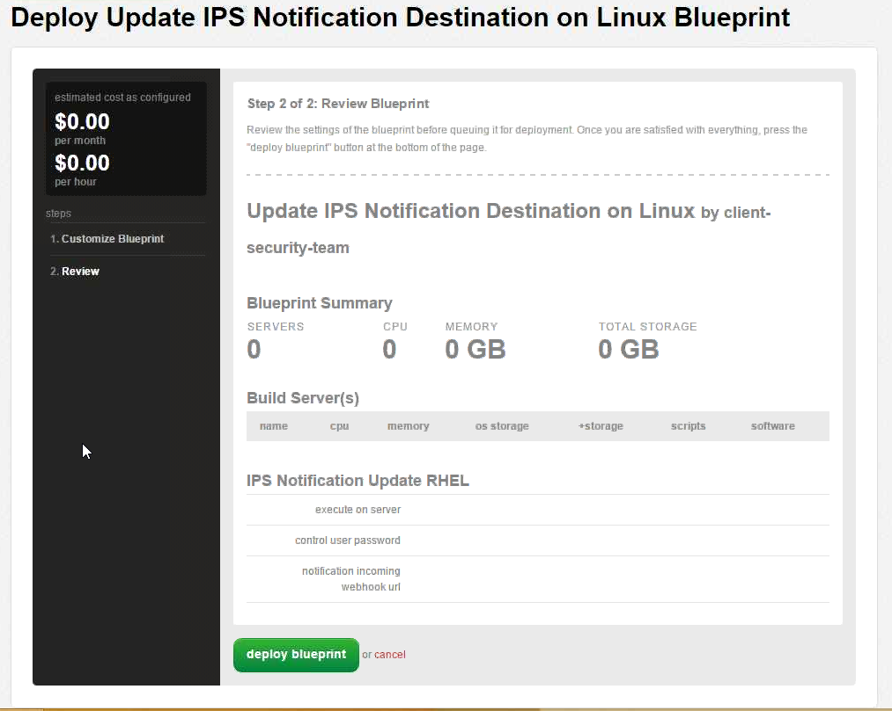

{{{
  "title": "Configuring Intrustion Prevention System (IPS) Notifications",
  "date": "08-11-2015",
  "author": "Stephanie Wong",
  "attachments": [],
  "related-products" : [],
  "contentIsHTML": false,
  "sticky": false
}}}
# Configuring Intrusion Prevention System (IPS) Notifications

## Overview

The Platform CenturyLink IPS utilizes an Agent installed on your Virtual Machine (VM) that will monitor that VM for suspicious activity. If suspicious activity is found, the Agent will log it and may block or stop the activity, and will report it based on the IPS policy. There is a default policy associated to each VM that is automatically tuned based on the host operating system and installed applications.

The Blueprint allows a customer that has purchased the IPS service from Platform CenturyLink to modify how they would like to be notified regarding IPS security events. This Blueprint will only change notification settings for the server it is run against.

## Prerequisites

* A CenturyLink Cloud Account
* Managed or Unmanaged Operating System Services on the Virtual Machine, with the IPS Agent installed
* Slack channel & WebHook URL (See Utilizing SLACK for IPS Event Notifications)

## Supported Managed Operating Systems

* Red Hat Enterprise Linux 5 (64-bit only)
* Red Hat Enterprise Linux 6 (64-bit only)
* Microsoft Windows Server 2008 (64-bit only)
* Microsoft Windows Server 2012 (64-bit only)

## Installation Process

1. Search for **Configure Notifications** in the Blueprint library. Then, click on the desired Operating System blueprint to configure Notifications. 

   

   

2. Click on the **deploy blueprint** button.

  

3. Select the appropriate Virtual Machine to execute on.

  * Enter and confirm User Password
  * Provide WebHook URL (See Utilizing SLACK for IPS Event Notifications)
  * Click **next: step 2.**
 
 

4. Review the blueprint parameters and select **deploy blueprint**.
 

 
5. The Blueprint log will show each step taken and its status during provisioning.
 

 
6. An email notification will be sent to the initiator of the Blueprint for both queuing and completion.

## Frequently Asked Questions

Q: What is a WebHook?
A: WebHook is an HTTP callback: an HTTP Post that occurs when something happens.

Q: Are there other formats or WebHooks available?
A: Not at this time. If you would like to recommend another, please send request details to [features@cti.io](mailto:features@ctl.io).

Q: Do you retain the data after the event notification is sent?
A: Yes, we retain the data for 60 days.  If you need a longer data retention period, we are working on additional add-on functionality to store this data.  If you are interested, please send request details to [features@ctl.io](mailto:features@ctl.io).

Q: Are you storing the full payload in another location?
A: Yes, we retain the data in another location for 60 days.

Q: Do you support a text message or paging service?
A: No, but we are happy to review any request sent to [features@ctl.io](mailto:features@ctl.io).
