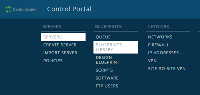
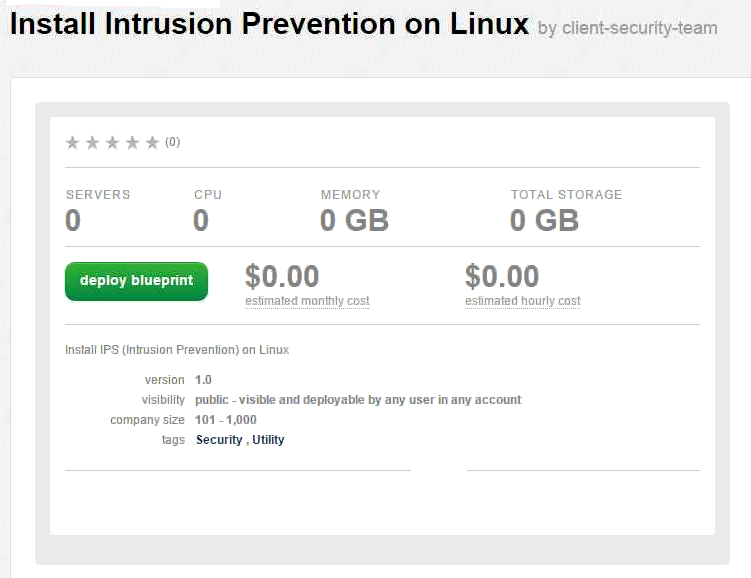
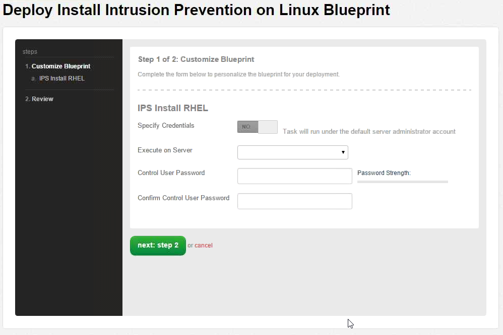

{{{
  "title": "Getting Started with Intrustion Prevention System (IPS)",
  "date": "08-11-2015",
  "author": "Stephanie Wong",
  "attachments": [],
  "contentIsHTML": false
}}}

# Getting Started with Intrusion Prevention System (IPS)

## Overview
The Platform CenturyLink IPS utilizes an Agent installed on your Virtual Machine (VM) that monitors the VM for suspicious activity. If suspicious activity is found, the Agent logs the activity, which it may block or stop, and reports the incident based on the IPS policy. There is a default policy associated with each VM that is automatically tuned based on the host operating system and installed applications.

This Blueprint is for the actual installation and activation of the IPS service on the VM. Other Blueprints will be available for modifications to the installation.

## Prerequisites
* A CenturyLink Cloud Account
* Managed or Unmanaged Operating System Services on the Virtual Machine

## Supported Managed Operating Systems
* Red Hat Enterprise Linux 5 (64-bit only)
* Red Hat Enterprise Linux 6 (64-bit only)
* Microsoft Windows Server 2008 (64-bit only)
* Microsoft Windows Server 2012 (64-bit only)

## Installation Process

1. Search for **Intrustion Prevention** in the Blueprint Library. Then, click **Intrusion Prevention Install RHEL**.  

  

   

2. Click the **deploy blueprint** button.  

  

3. From the **Execute Server** drop down list, select the appropriate virtual machine.  Enter and confirm the User Password.  Click the **next: step 2** button.  

  

4. Review the Blueprint parameters and click **deploy Blueprint**.  

  

  **Note:** The Blueprint displays each step taken and its status during provisioning.  

  

5. An email notification is sent to the initiator of the Blueprint for both queuing and completion.

**Frequently Asked Questions**

**Q:** Can I make modifications to my existing policy to further customize or tune it?

**A:** Not at this time, if you'd like to see this feature, please contact features@ctl.io.

**Q:** What does the IPS Product Provide?

**A:** Platform CenturyLink’s IPS service helps ensure secure protection against your Virtual Machine (VM) from known intrusion patterns that hackers utilize. It also allows you to spend less time on the maintenance of your system, instead allowing you to focus on the tasks for your core business. We will do the patching and ensure that all agents have up-to-date signatures for possible attacks.

**Q:** How do I configure the notifications settings to send alerts to?

**A:** Follow the process on the Notifications KB.

**Q:** Will you be adding support for additional Operating Systems?

**A:** Yes, we are working on adding additional OSes. If you have a specific OS you would like to see supported, please contact features.ctl.io.
