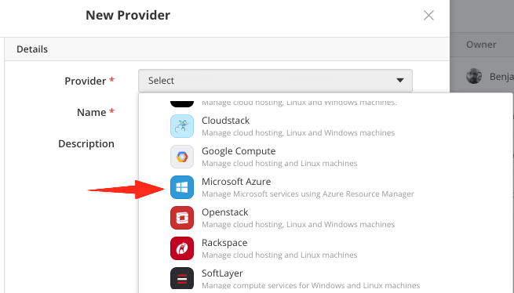
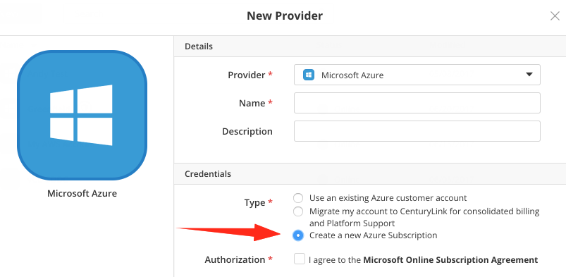
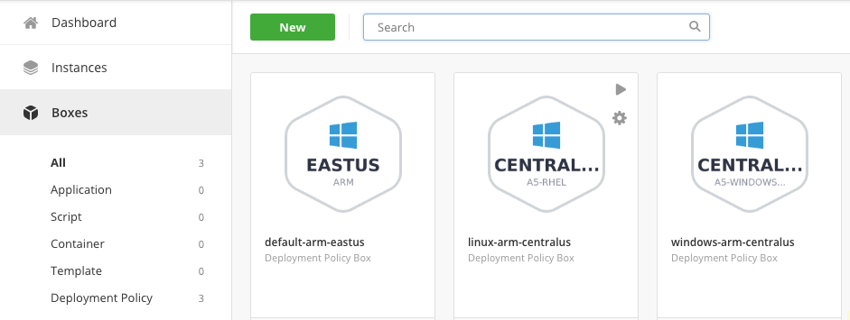

{{{
  "title": "Partner Cloud: Getting Started With A New Azure Customer Account",
  "date": "03-03-17",
  "author": "Ben Swoboda",
  "attachments": [],
  "contentIsHTML": false
}}}

### Overview

[Cloud Application Manager](https://www.ctl.io/cloud-application-manager/) offers the Cloud Integration feature, giving users the ability to benefit from CenturyLink's partnerships with other cloud providers. CenturyLink integrates the billing and assumes responsibility for Azure support. This document is specific to Azure.

multiple Azure subscriptions provides your administrators the ability to easily manage users and resources for multiple Azure projects and departments by placing them in different Azure "Accounts.""

### Audience

All of our customers are invited to use Cloud Optimization via Cloud Application Manager.

For Azure, we are currently limited to serving billable customers who are not resellers (or customers of resellers) with offices within the United States the United Kingdom, and Canada. Also, the associated CenturyLink Cloud account cannot be a demo account or internal for CenturyLink employees. If you need special considerations for setting up an account, please email [cloudintegration@ctl.io](mailto:cloudintegration@ctl.io).

### Prerequisites

* Access to Cloud Application Manager.

* The user must be an Administrator of the organization in Cloud Application Manager.

* A working knowledge of how to use [Cloud Application Manager providers](../Core Concepts/providers.md).

* An understanding of the features and benefits of [Partner Cloud Integration](partner-cloud-integration.md)

* For each CenturyLink Cloud account integrated with Azure, both CenturyLink's and Microsoft's Terms and Conditions must be accepted. These will be presented to any user attempting to create a new "Microsoft Azure" provider in Cloud Application Manager.

### Important Information

Cloud Application Manager Provider Verbiage | Description | Related Links
--- | --- | ---
Use an existing Azure customer account | This is not an optimized option. Customer pays Amazon for usage. | [Click here](../../Cloud Application Manager/Deploying Anywhere/using-microsoft-azure.md)
Migrate my account to CenturyLink for consolidated billing and Platform Support | **This is a Cloud Optimized option.** This allows an existing customer account to move under CenturyLink's care. | [Click Here](partner-cloud-integration-azure-existing.md)
Create a new Azure customer account and Subscription or a new subscription for an existing account | **This is a Cloud Optimized option.** Begins the new account creation automation, enabling the customer to immediately enter CenturyLink's care. | This document

Charges for [Azure usage](partner-cloud-integration-consolidated-billing.md) will appear on invoices from CenturyLink.

### Steps

The following steps will walk through how to set up a new Cloud Application Manager provider that has been designed to do one of the following:
* Create a new Azure Customer account and a new Azure subscription  
* If the CAM organization already has an Azure Customer with at least one subscription, create another Azure subscription.

Subscriptions created in the manners above fall within the scope of CenturyLink's responsibility.

Videos of these steps can be found [here](https://www.ctl.io/guides/).

1. Log into Cloud Application Manager.
2. Select the Providers tab
3. Select New
4. In the Provider drop-down, select "Microsoft Azure"

  

5. Provide a name for the provider that identifies it for your purposes

6. Select the "Create a new Azure customer Subscription" option. (If the user cannot see this option, they are not an organization Administrator.)

  

7. Accept the Terms and Conditions

Please expect at least a two-minute wait while our automated process performs the following:

* Provides Microsoft your account details
* Creates an Azure Customer account on your behalf
* Creates a Microsoft Azure Subscription for that Customer account
* Grants Cloud Application Manager the appropriate permissions to work on your behalf
* Creates three deployment policies in your organization so that Azure deployments via ALM may occur with fewer work on your part.

### Contacting Cloud Application Manager Support

We’re sorry you’re having an issue in [Cloud Application Manager](https://www.ctl.io/cloud-application-manager/). Please review the [troubleshooting tips](../Troubleshooting/troubleshooting-tips.md), or contact [Cloud Application Manager support](mailto:incident@CenturyLink.com) with details and screenshots where possible.

For issues related to API calls, send the request body along with details related to the issue.

In the case of a box error, share the box in the workspace that your organization and Cloud Application Manager can access and attach the logs.
* Linux: SSH and locate the log at /var/log/elasticbox/elasticbox-agent.log
* Windows: RDP into the instance to locate the log at ProgramDataElasticBoxLogselasticbox-agent.log
