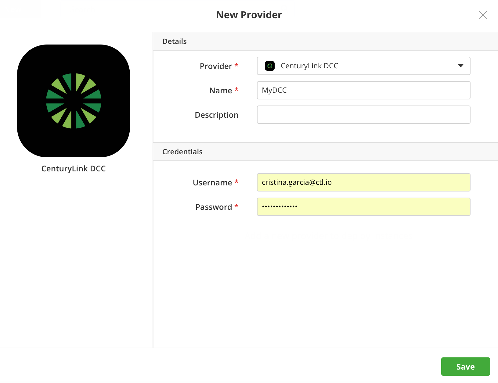
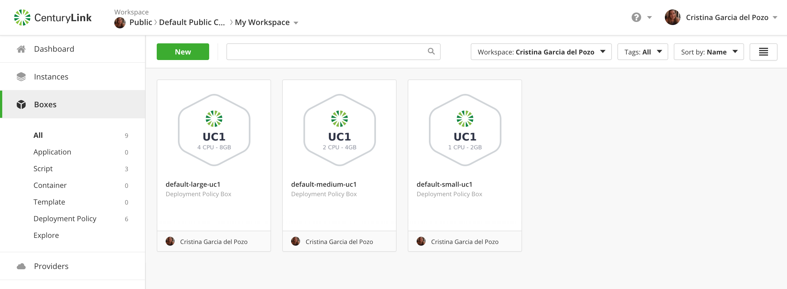
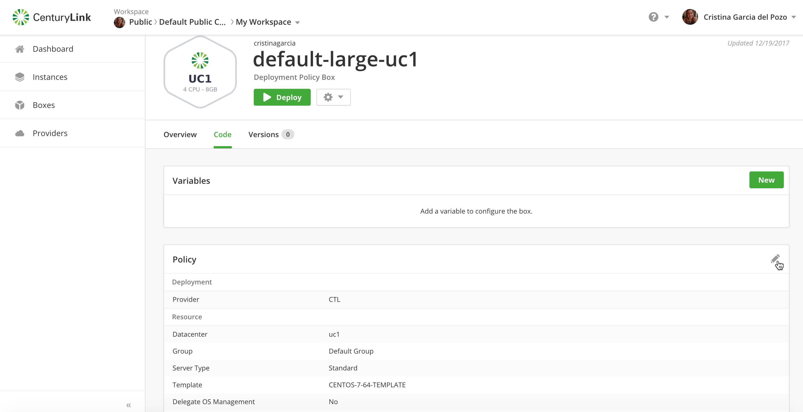

{{{
"title": "Using CenturyLink DCC",
"date": "06-20-2017",
"author": "",
"attachments": [],
"contentIsHTML": false
}}}

### Using CenturyLink DCC

**Creating a provider**

Select CenturyLink DCC from the Provider list and enter a username and password to logon to the CenturyLink DCC Portal.

> The user must have "customer purchase permission" and an associated billing account in CenturyLink DCC to operate in the Cloud Application Manager. 
> If this is not the case, open a ticket [here](https://savvisstation.savvis.com) to get it fixed. 

Once the provider information is saved, Cloud Application Manager starts synchronizing the Provider account. After the synchronization is complete, Cloud Application Manager creates default Deployment Policies with the different deployment options available.

The user account used when creating the Provider is linked to a Company, Billing Site, Clusters, and Domains, etc.

When the synchronization process finishes, the list of Linux and Windows Templates available to deploy on each cluster is available on the provider's "Configuration" tab.

**Editing Policy Boxes on CenturyLink DCC**

In addition to the services list, Cloud Application Manager creates three example Policy Boxes for Linux and Windows. These can be customized any time.

To do this, access the details by selecting "Code", then "Edit", where the following options are available:

| Option | Description |
|--------|-------------|
| Server Type | You can choose the server type: standard or [bare metal](../../servers/bare-metal-faq.md). |
| Datacenter | Clusters are grouped in [Datacenters](../../general/centurylink-cloud-data-center-locations.md). To select a Cluster, Cloud Application Manager needs to know the Datacenter the Cluster belongs to. |
| Group |	You can choose the group in which you want the new instance to be included. |
| Template | The list of templates that we can use to create the VM. |
| Delegate OS Management | Select "on" if you want to [delegate OS management](../../managed-services/managed-operating-system-frequently-asked-questions.md). This option is off by default. |
| Horizontal Autoscale | This option enables the configuration of a horizontal autoscale: minimum instances, metrics,  incremental or decremental scale, threshold period, or cool down period. |
| Instances | Cloud Application Manager can deploy several servers at once, with the restriction that all the operations run on all the instances (start, stop, delete, and script boxes installation). |
| CPUs | The number of CPUs. |
| Memory | The amount of memory assigned to the Virtual Machine. |
| Network | The net segment where the VM is configured. Please note that the IP address is set automatically. The user must select a segment with available IP addresses. |
| Disks | The volume where the OS disk was mounted. The user is responsible for assigning a segment with enough available space. Cloud Application Manager only creates the necessary disks to install the OS. If you need any extra disk, you will need to add it from CenturyLink DCC portal. |

**Deploying Instances from Deployment Policies**

Virtual machines get deployed on clusters. If Cloud Application Manager doesn't have enough information to deploy a cluster, the cluster will not be available as a deployment option for the Policy Boxes. In that case, Cloud Application Manager displays an alert as follows.

Once the Box deploys, Cloud Application Manager shows the traces of what is happening with the provider. At the end of the process it displays a script that has to be executed manually on the newly created Virtual Machine.

Credentials for the Virtual Machine are sent via email which contains the necessary privileges to install the Cloud Application Manager agent using the script shown above.

> To run this script, the user needs access to the new Virtual Machines. This task, as in the creation of the account, needs to be done by CenturyLink DCC. 

Once this is done, the deployment process is complete.
