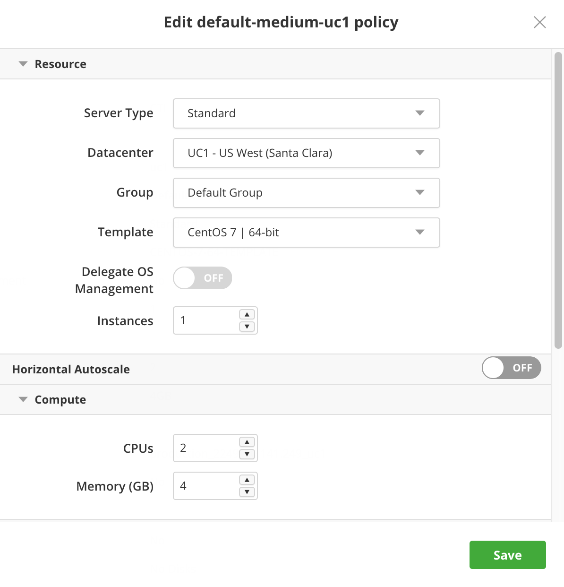
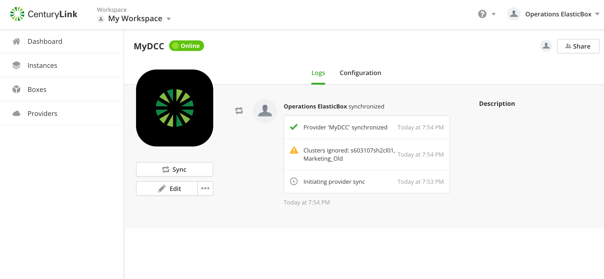

{{{
"title": "Using CenturyLink DCC",
"date": "06-20-2017",
"author": "",
"attachments": [],
"contentIsHTML": false
}}}

### Using CenturyLink DCC

**Creating a provider**

Select CenturyLink DCC from the Provider list and provide the username and password that is used to logon to CenturyLink DCC Portal.

> User must have "customer purchase permission" and an associated billing account in CenturyLink DCC to be able to operate in Cloud Application Manager. 
> If this is not the case open a ticket [Here](https://savvisstation.savvis.com) to get it fixed. 

Once the provider is saved, Cloud Application Manager will start synchronizing the Provider account. Once the synchronization is complete, Cloud Application Manager will create default Deployment Policies with the different deployment options available.

The user account used when creating the Provider, is linked to a Company, Billing Site, Clusters, Domains, etc.

When the synchronization process finishes, the list of Linux and Windows Services available to deploy on each cluster will be available on the provider's "Configuration" tab.

**Editing Policy Boxes on CenturyLink DCC**

Besides the services list, Cloud Application Manager will create two example Policy Boxes for Linux and Windows. These can be customized any time.

To do this, access the details by selecting "Code", then "Edit", where the following options will be available:

| Option | Description |
|--------|-------------|
| Company | A user can be linked to multiple companies (multi-tenant). Cloud Application Manager can select which of them to bill. |
| BillingSite |	The account where the VM creation will be billed. A company can have multiple Billing Sites. |
| Datacenter | Clusters are grouped in Datacenters. To select a Cluster, Cloud Application Manager needs to know the Datacenter the Cluster belongs to. |
| Cluster |	Hardware specifications where the VM will be deployed. Each Cluster has a list of its own associated Machine Configurations, Operative Systems, storages and Network segments. This section will only show those that allows Cloud Application Manager to deploy the VMs when synchronization happens. |
| Machine Configuration | Set of values and restrictions associated with CPU, RAM, Instances and Burn in Period. |
| OS | List of supported Operative System that the Cluster supports. |
| Language | Each Operative System supports multiple installation languages. |
| Instances | Cloud Application Manager can deploy several servers at once, with the restriction that all the operations will run on all the instances (start, stop, delete and script boxes installation). |
| VCPU | Number of CPUs. |
| VRAM | Amount of memory assigned to the Virtual Machine. |
| Storage | Volume where the OS disk will be mounted. The user is responsible for assigning a segment with enough available space. Cloud Application Manager will only create the necessary disks to install the OS, if you need any extra disk you will need to add it from CenturyLink DCC portal. |
| Network | Net segment where the VM is configured. Please note that the IP address is set automatically, so the user must select a segment with available IP addresses. |

**Deploying Instances from Deployment Policies**

Virtual machines get deployed on clusters. If Cloud Application Manager doesn't have enough information to deploy a cluster, then the cluster will not be available as a deployment option for the Policy Boxes. Nonetheless, Cloud Application Manager will display an alert, as you can see on the following screenshot:

Once the Box deploys, Cloud Application Manager will show the traces of what is happening with the provider. At the end of the process it will show us a script that will have to be manually executed on the newly created Virtual Machine.

Credentials for the Virtual Machine are sent over email, and it should have privileges to install the Cloud Application Manager agent using the script shown above.

> To run this script, the user needs access to the new Virtual Machines. This task, as the creation of the account, needs to be done by CenturyLink DCC. 

Once this is done, the deployment process is finished.