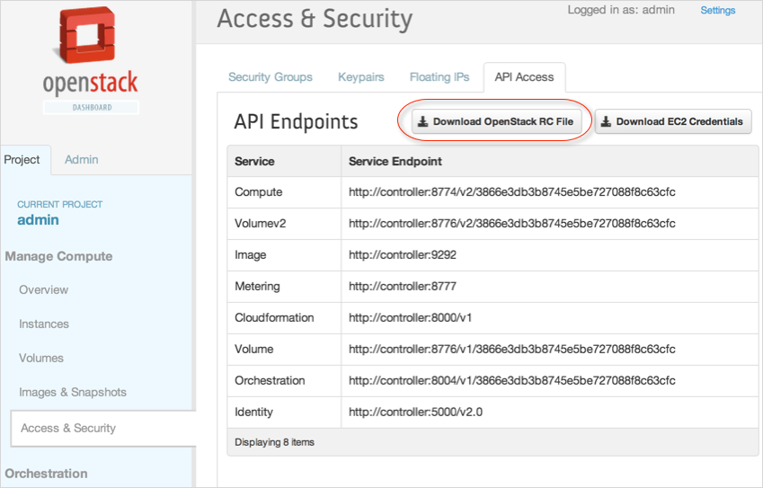
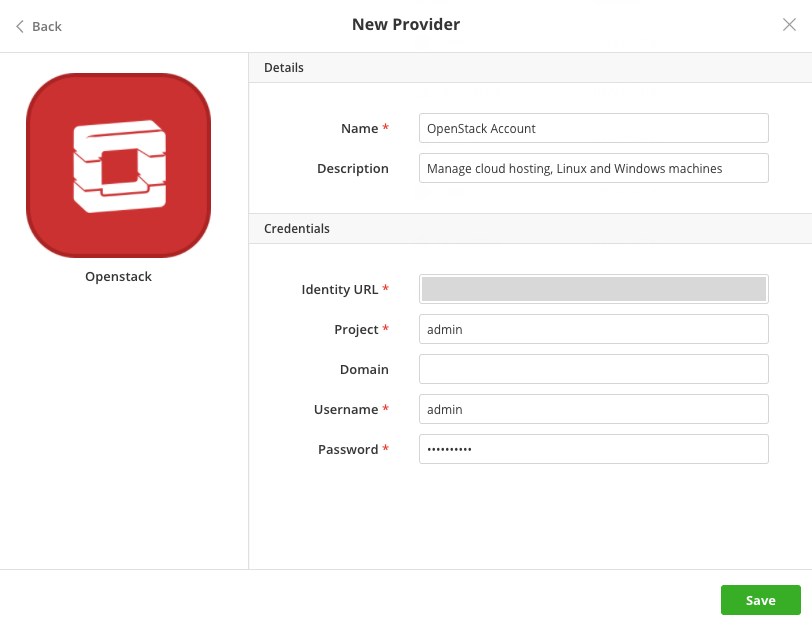

{{{
"title": "Using OpenStack Cloud",
"date": "09-01-2016",
"author": "",
"attachments": [],
"contentIsHTML": false
}}}

### Using OpenStack Cloud

If OpenStack is implemented at your end, you can use Cloud Application Manager to automatically launch configured application instances from boxes onto the cloud. Both the Grizzly and Havana OpenStack releases are supported in the Cloud Application Manager Enterprise Edition.

**In this article:**
* OpenStack prerequisites
* Registering your OpenStack project in Cloud Application Manager
* Deploying in your OpenStack project

### OpenStack Prerequisites

Before you deploy boxes, verify that OpenStack has the required services, and get the credentials to register your OpenStack project in Cloud Application Manager.

### Verify Required OpenStack Services

Cloud Application Manager requires the following services in OpenStack:
* Identity Service (Keystone)
* Compute (Nova)
* Image (Glance)
* Networking (Either Neutron or Nova-network)
* Block storage (Cinder). Although optional, we recommend you install Cinder to boot images from attached disk volumes or increase VM storage.

### Get OpenStack Project Credentials

The credentials are in an OpenStack RC file in the OpenStack dashboard.

**Steps**
1. [Log in to the OpenStack dashboard](http://docs.openstack.org/user-guide/index.html). Choose the project for which you want to download the OpenStack RC file.

2. Under **Access & Security** > **API Access**, click **Download OpenStack RC File**. The filename has an openrc.sh format.

   **Note:** It contains the project (tenant name) and username. You’ll need this to register the project in Cloud Application Manager. The password is what you entered to login to the dashboard.

### Registering Your OpenStack Project in Cloud Application Manager

Enter the OpenStack project credentials you downloaded from the OpenStack dashboard to allow Cloud Application Manager to make API requests.

**Steps**
1. In Cloud Application Manager, click **Providers** > **New Provider.**

2. In the dialog, select **OpenStack.**

3. Provide the credentials for your OpenStack project from the OpenStack RC file:
   * **Identity URL**. This the endpoint URL to access the OpenStack Identity API, which is the entry point to all other service APIs.

   Project. This is the tenant name account that represents an organizational unit. It’s a logical way to group access and share resources with users and instances.

   * **Domain.** (Optional) This is the domain name of the tenant/project for Keystone v3 or greater. Leave it empty for older Keystone servers.

   * **Username.** This is a user in the project with an admin role. All API requests are made as this user to the associated project.

   * **Password.** Enter the password for the user.

### Deploying in Your OpenStack Project

Select these deployment options to [launch an instance](./deploying-managing-instances.md) with or without boxes that contain configured application workloads. Cloud Application Manager provisions the infrastructure in your OpenStack Cloud and installs the workloads from the boxes onto the instances.

**Deployment**

| Option | Description |
|--------|-------------|
| Provider | Select the OpenStack account you registered in Cloud Application Manager. |

**Resource**

| Option | Description |
|--------|-------------|
| Project |	This is the project in which you wish to launch instances. |
| Image | Select the Linux or Windows image on which to launch the box.  OpenStack supports many of the vendor specific [disk and container image formats](http://docs.openstack.org/developer/glance/formats.html). |
| Flavor | Pick an image size as defined in OpenStack for RAM, disk, number of cores, and so on. By default, you can choose from the five default flavors or create custom flavors in OpenStack and then select them here. |
| Keypairs | The keypairs you generated in OpenStack are available in this drop-down. This allows you to SSH into the instance using the private key downloaded to your machine. |
| Instances | Select the number of instances you want to launch for the project. |

**Volumes**

Increase the instance storage and add better I/O performance for your applications by adding volumes. We attach and mount them to the instances through the OpenStack block storage service API.

**Note:** To take snapshots or backup volumes, you have to handle those tasks directly in OpenStack.

* Add volumes as an image and one or more hard volumes by specifying their size.
* An **Image Volume** lets you create a copy of the selected image as a volume and boot the instance from it. Check **Persist** to use to force the use of a Volume. Using a Volume allows you to create snapshots and new images. If you don’t enable persist, the configuration from the Flavor will be used.
* A hard volume lets you add disks for extra storage. We attach and mount the disks to an instance when it goes live and detach and remove them after you terminate the instance. You can make snapshots or create images from the volumes before deleting the instance to reuse them in other instances.

**Network**

| Option | Description |
|--------|-------------|
| Networks | Select the network associated with the project. The network routes traffic to and from the instances based on the security group settings. |
| Security Group | Select a custom or automatic security group. The security group defines the firewall rules to allow traffic to and from the instance. Remember that within a security group all instances can talk to each other. Custom. If you created a custom security group in OpenStack, then select it from the drop-down. You can also choose the default security group that’s available for every project in OpenStack. The default security group blocks all incoming traffic to the instance and allows only outgoing traffic.   **Automatic.** Choose this to let Cloud Application Manager create a firewall rule that allows not only all outgoing traffic but also incoming traffic through the port set on the box:<li>Rule (All TCP). This applies settings from the TCP rule template.</li><li>Remote (CIDR). This allows access by CIDR, a block of IP addresses.</li><li>CIDR (0.0.0.0/0). This limits access to just the block of IP addresses specified.</li> |
| Floating IP Pool | If configured, select a pool of floating IP addresses for the project. When the instance is launched, OpenStack dynamically assigns an IP address from this floating pool to the instance. This allows traffic from the outside world to the instance via the public IP address. For more details, see the OpenStack help on [IP addresses](http://docs.openstack.org/admin-guide/index.html). |

**Variables**

These are dependencies defined on the box. To deploy the box dependencies on the instance, specify their values in the deployment profile. To deploy database boxes (ex: MongoDB) especially, you must set the username, password, and optionally a port to allow database connections. In general, specify the port to allow traffic into the instance.

### Contacting Cloud Application Manager Support

We’re sorry you’re having an issue in [Cloud Application Manager](https://www.ctl.io/cloud-application-manager/). Please review the [troubleshooting tips](..Troubleshooting/troubleshooting-tips.md), or contact [Cloud Application Manager support](mailto:cloudsupport@centurylink.com) with details and screenshots where possible.

For issues related to API calls, send the request body along with details related to the issue.

In the case of a box error, share the box in the workspace that your organization and Cloud Application Manager can access and attach the logs.
* Linux: SSH and locate the log at /var/log/elasticbox/elasticbox-agent.log
* Windows: RDP into the instance to locate the log at ProgramDataElasticBoxLogselasticbox-agent.log
