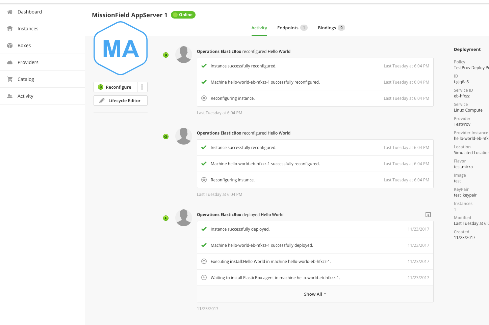
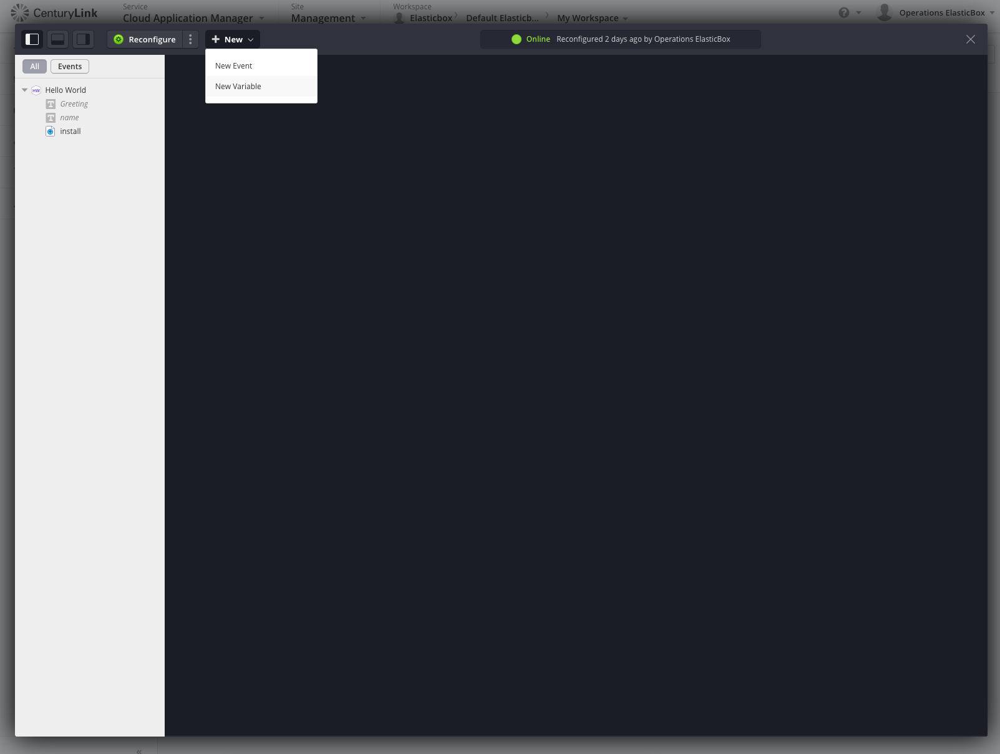
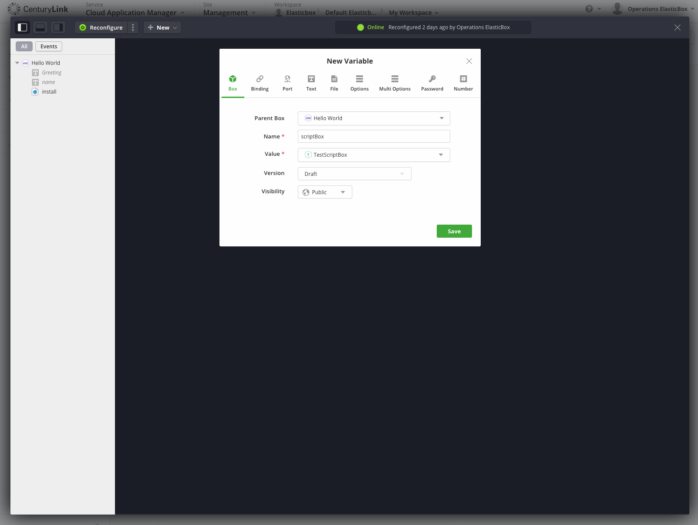
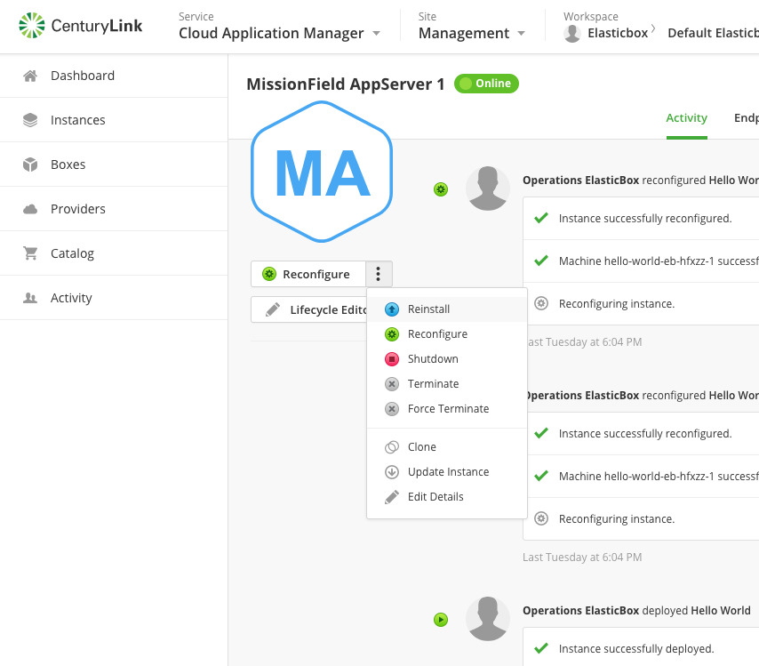
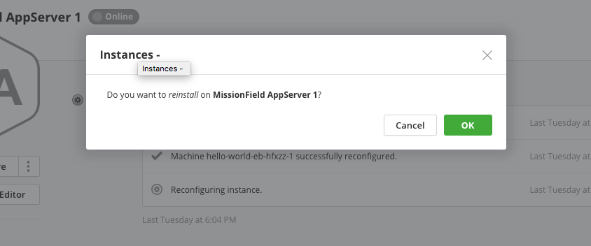

{{{
"title": "Deploy a Script box to a Registered Instance",
"date": "02-08-2018",
"author": "Ignacio Martin",
"attachments": [],
"contentIsHTML": false
}}}

### Introduction

This tutorial will show you how to deploy a script box to a registered instance that was auto-discovered in your AWS provider using [Cloud Application Manager](https://www.ctl.io/cloud-application-manager).

### Register an exisiting AWS Linux Instance

The first step on this tutoria is to follow the steps to [Register an exisiting AWS Linux Instance](https://www.ctl.io/knowledge-base/cloud-application-manager/getting-started/register-existing-aws-linux-instance/#find-an-aws-linux-instance)

Once this part is done you will see your newly registered instance on your list of instances.

### Add a new Box Script Variable

Once inside the instance details, click on **Livecycle Editor**

Open the **New** menu and click on **New Variable**

Give your box variable a name and select the Script Box you want to add from the drop down list. Then you can click **Save**

### Reinstall the instance

After adding the new variable you just need to reinstall the instance and you will have successfully deployed the scipt box variable.

And you will need to select **Ok** on the confirmation dialog.

