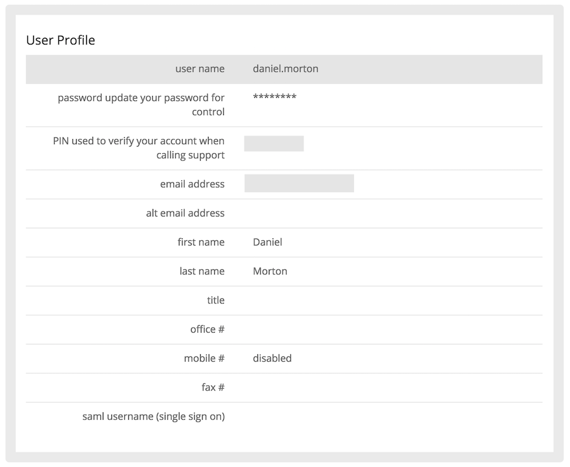
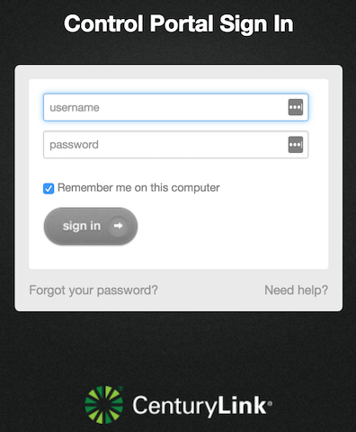

{{{
  "title": "User Credentials and Logging into Control Portal",
  "date": "07-09-2014",
  "author": "Bryan Friedman",
  "attachments": [],
  "contentIsHTML": false
}}}

### Description
There are at least two different types of user credentials that you need to maintain and be aware of as a CenturyLink Cloud Control Portal user. One set of credentials is used for you or other users in your organization to gain access to the Control Portal itself. These are your CenturyLink Cloud Control Portal user credentials. You may also be responsible for maintaining a number of different administrator credentials for servers you have created within your CenturyLink Cloud account. Both credentials should use strong and secure passwords, however *they are not related to each other and should be managed and used separately.* This article discusses how to manage and use both types of credentials independently.

### Audience
CenturyLink Cloud customers

### Control Portal Credentials
1. Control Portal credentials are maintained in your Profile, which can be accessed by clicking your user name drop-down located in the upper right corner of the Dashboard and selecting **Your Profile**.
   

2. You are then directed to your Profile information for the Control Portal.
   

3. Clicking the password line enables you to change your password.
   

4. This is the password you use to login to the Control Portal.
   

**Note:** Your account may have SAML enabled allowing for Single Sign-On capabilities. For more information, refer to this Knowledge Base article about enabling SAML.
* [Control Portal](./using-saml-for-single-sign-on-to-the-centurylink-platform-control-portal.md)
* [Control Portal with Windows 2012 R2 ](./using-saml-for-single-sign-on-to-the-centurylink-platform-control-portal-with-windows-2012r2.md)

Also, if you are an Account Admin, you have the ability to see information for other user accounts that have been created within your sub account. That information is available in Users area under the Account menu. While you cannot see user passwords, your credential enable you to perform the following:
* View username and information.
* Lock the account.
* Set permissions.
* Delete the account.
* Generate a password reset email.

### Server Admin Credentials
These credentials are different from your Control Portal user credentials. Server Admin credentials are used to gain access to a server you have created within your account. These credentials are typically set at the time when you create the server and can be changed from the server details page. **Note:** The password should be secure and strong, particularly if your server is accessible via the public Internet.

For more information on changing or retrieving server administrator passwords, please reference the following two Knowledge Base articles:
* [How to Change a Server Administrator Password](../Servers/how-to-change-a-server-administrator-password.md)
* [How to Retrieve a Root/Administrator Password](../Servers/how-to-retrieve-rootadministrator-password.md)
