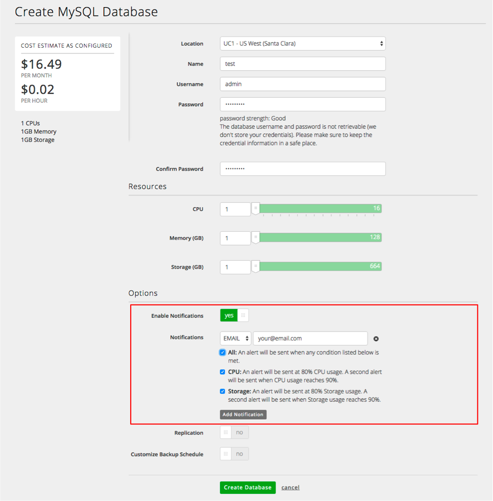
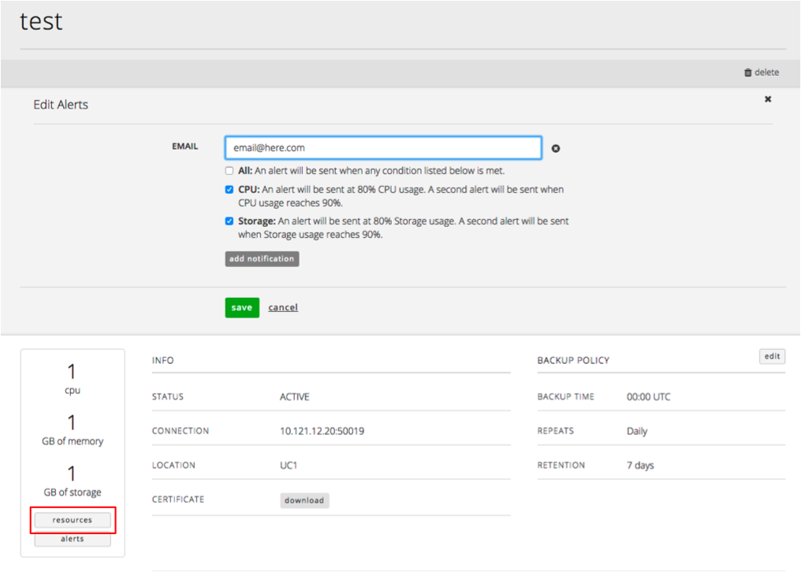

{{{
  "title": "Sign Up for Usage Alerts",
  "date": "01-25-2016",
  "author": "Christine Parr",
  "attachments": [],
  "related-products" : [],
  "contentIsHTML": false,
  "sticky": true
}}}

#### Audience

This article is to support customers of Relational DB Service, CenturyLink's MySQL-compatible database-as-a-service product.  Additionally, these instructions are specific to provisioning service directly through Control Portal.

## Overview

CenturyLink's Relational DB Service is a MySQL-compatible database-as-a-service that provides instant access to a database instance with SSL support, daily backups held for 7 days, basic monitoring and a replication option.  Users can configure the amount of CPU, Memory and Storage based on their database needs and can choose to replicate their instance in datacenter for a more highly available solution.  As customers' capacity needs grown, they can easily scale their CPU, RAM and/or Storage through the click of a button.  

#### Prerequisites

- Access to the CenturyLink Cloud Platform as an authorized user.

## Signing up for Usage Notifications when Creating Database Instance

1.	Browse to CenturyLink Cloud’s Relational DB UI through the Control Portal or directly at [rdbs.ctl.io](https://rdbs.ctl.io).

2.  Click on the "Create Database" button from the Database Instances screen to provision your database instance.

3.  After making your provisioning selections, you may choose to receive usage alerts by toggling the "Notifications" toggle to 'yes'.  Enter the email address where you would like to receive alerts, before clicking on "Create Database".

4.  To subscribe more than one email address, click on "Add Notification".  This will allow you to enter an additional email.  

5.  Email verification is required for each notification request.  An email will be sent to the email address entered, which will provide a link to verify your address.

## Adding or Removing Usage Notifications for an Existing Instance

1.	Browse to CenturyLink Cloud’s Relational DB UI through the Control Portal or directly at [rdbs.ctl.io](https://rdbs.ctl.io).

2.	Navigate to the “Database Instances” screen, identify and click on the database subscription of which you would like to change usage notifications. This will take you to a details screen specific to that subscription.

3.  Click on the "alerts" button which will bring up a new section of the screen that will pre-populate any existing notification subscriptions that exist.  

4.  To delete a notification, simply click on the small 'x' next to the email address field that you no longer want to receive notifications.

5.  To create an additional notification, click on "add notification" which will allow you to enter another email address.  You can also change which items you want to be notified on by selecting or un-selecting CPU or Storage.  

6.  After each change, be sure to hit the "save" button.  

7. Email verification is required for each notification subscription.  An email will be sent to the email address entered, which will provide a link to verify your address.

8. If you have questions or feedback, please submit them to our team by emailing <a href="mailto:rdbs-help@ctl.io">rdbs-help@ctl.io</a>.
