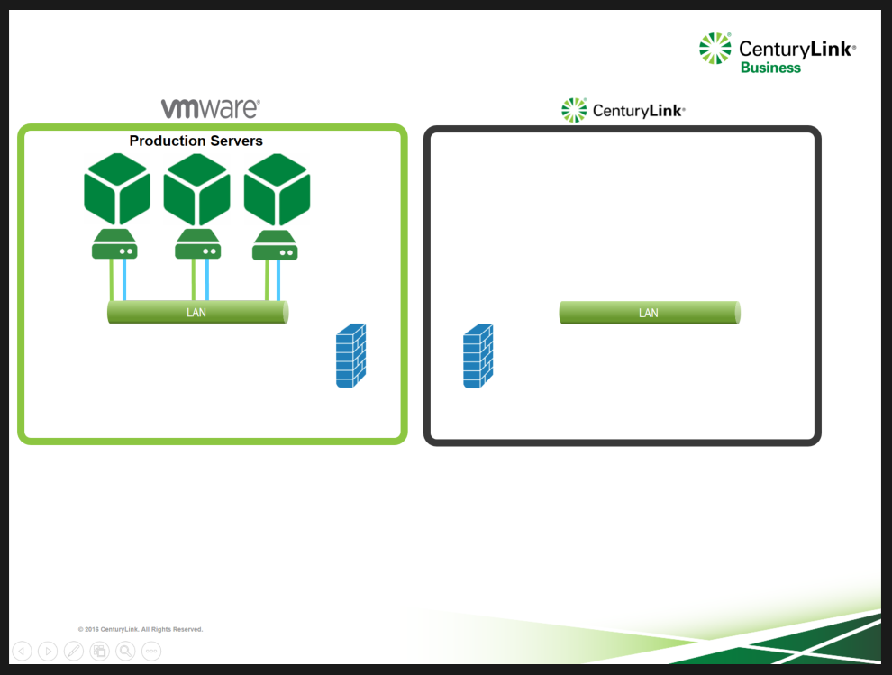
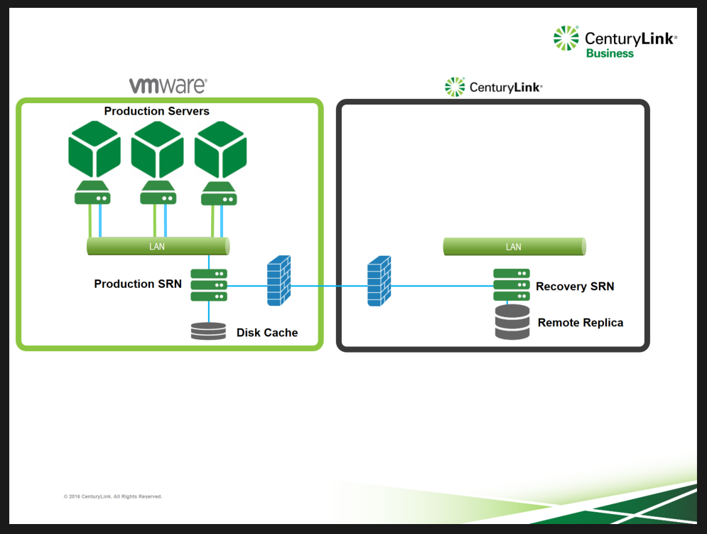
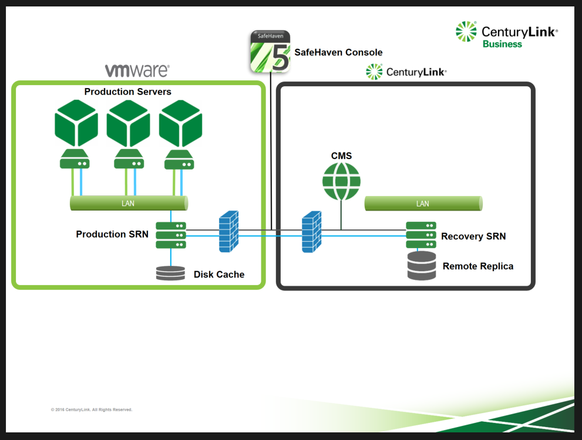
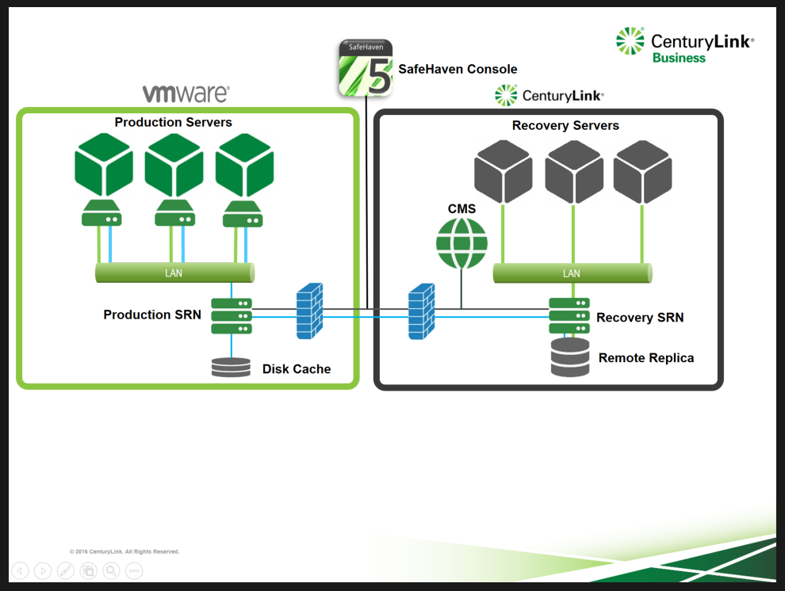
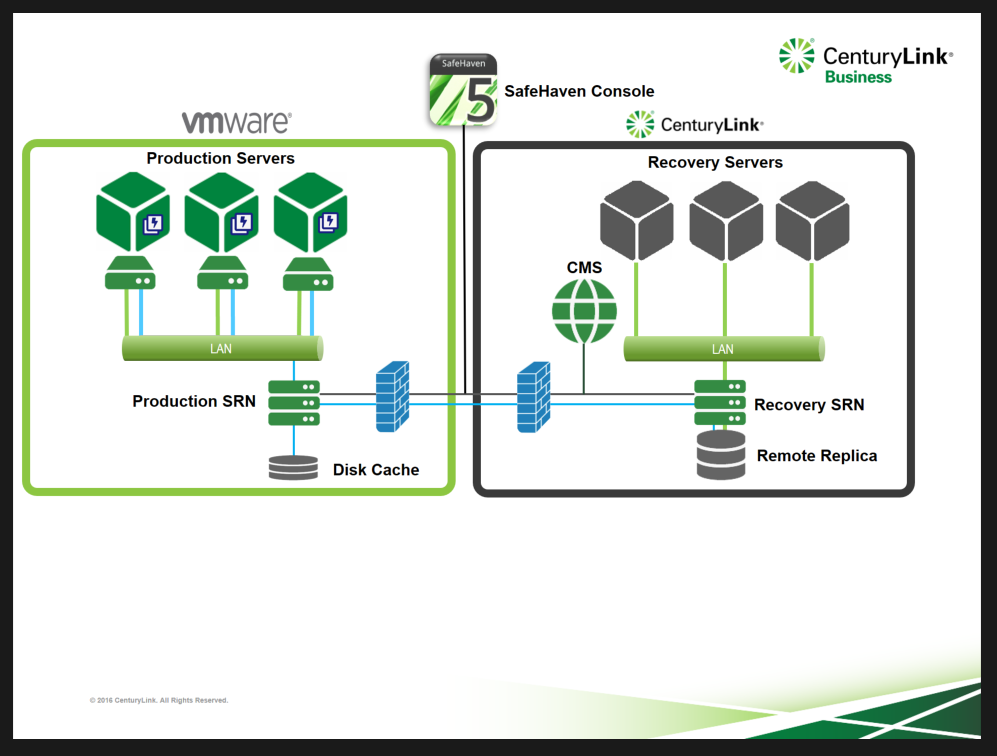
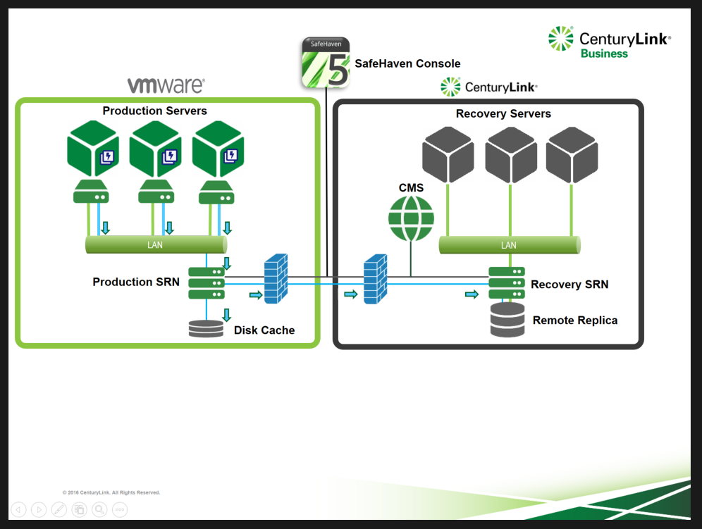
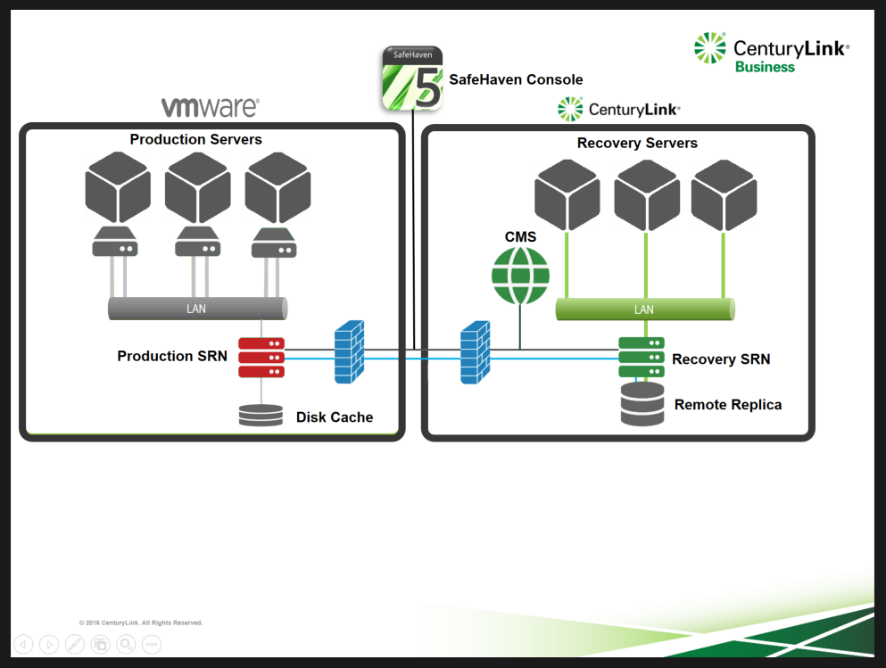
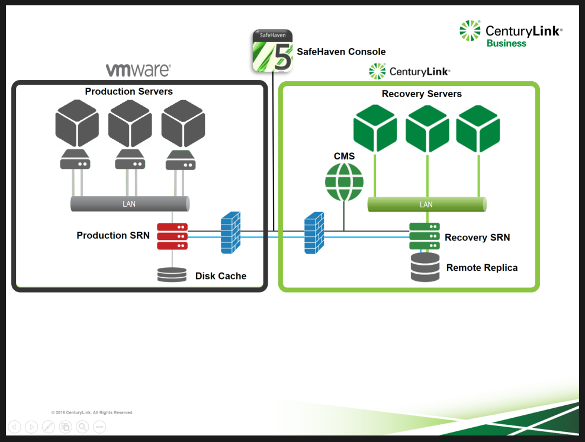

{{{
  "title": "Disaster Recovery with SafeHaven in CenturyLink Cloud",
  "date": "12-27-2017",
  "author": "Mahima Kumar",
  "attachments": [],
  "contentIsHTML": false
}}}

### Article Overview
This article explains how SafeHaven performs Disaster Recovery in CenturyLink Cloud and how a complete image level recovery is performed incase a disaster event is declared.

### Assumptions
1. The Production Datacenter has network connectivity to the CenturyLink Cloud Recovery Datacenter (VPN or MPLS).
2. User has network connectivity to the CenturyLink Cloud Recovery Datacenter in order to access the SafeHaven Console to manage the DR setup (direct VPN connection).

### Production Datacenter Site Type
Production Datacenter Site type in this scenario can be:

1. On-Prem VMware
2. Any CenturyLink Cloud Datacenter
3. DCC-Core

### Recovery Datacenter Site Type
Any CenturyLink Cloud Datacenter can be used as the Recovery Site type in this scenario.

### Production Servers
In this scenario there are three Production Servers that a user wants to protect. Each Production Server has a Local Disk attached to it which has to be replicated over to the Recovery Datacenter. Production Servers can either be Windows or Linux. Please refer to [SafeHaven 5.0 Use Case and Support Matrix](../SafeHaven 5/General/SafeHaven-5.0-Use-Case-and-Support-Matrix.md) for more information.

Gather the following information for the servers you want to protect:)

1. O.S. Type
2. Number of vCPU
3. RAM
4. Production Server Size (Storage) that has to be protected
5. NIC Type and PCI Slot Information(incase of Windows Production Server)
6. Network Info./I.P. Address

### SafeHaven Replication Node(SRN)
SafeHaven Replication Node(SRN) is an Ubuntu 16 based lightweight virtual appliance(virtual machine)which transfers and retains production data.

If the Production Datacenter is an On-prem VMware site or DCC-Core, CenturyLink team provides an OVF for spinning up SRN appliances. If the Production/Recovery Datacenter is a CenuryLink Cloud Datacenter, simply use the standard Ubuntu 16 template that CenturyLink Portal provides.

Production Servers typically resides in the same VLAN as that of the Production SRN. Once connectivity is setup between the Production Server and Production SRN, the next step is to setup a sister SRN in CenturyLink Cloud Recovery Datacenter. SRN appliances work in pairs and once a the Recovery SRN is spun up, a peering relationship is established between the Production and Recovery SRN appliances.

### Attach Storage to SafeHaven Replication Nodes(SRN)
Depending on the O.S. Type of servers being protected and the mode of replication(Local Cache or Local Replica) selected, required amount of storage is attached on both the Production and Recovery SRN appliances.

#### Production SRN
For Windows Production Servers, users typically select the Local Cache mode where they only require storage amounting to "10% of the total provisioned storage on the Production Server" and attach it to the Production SRN. This Local Cache attached to the Production SRN acts as a buffer and transfers the production data coming from the Production Servers over to the Recovery SRN in CenturyLink Cloud Recovery Datacenter. This mode of replication saves storage related costs as the users do not have to pay for an additonal full copy of data on the Production SRN.

For Linux Production Servers, Local Replica mode is selected where storage amounting to "100% of the total used storage(full copy of data) + an additional 25% of the total used storage(for Checkpoints)" on the Production Server = 125% of the total used storage on the Production Server" is attached to the Production SRN. In this case a full copy of the production data is stored on the Production SRN as well for faster failback.
(Local Replica mode of replication is also available for Windows)

#### Recovery SRN
As the Recovery SRN retains a full copy of the production data called "Remote Replica" as well as a scrolling log of checkpoints, storage amounting to "100% of the total used storage(full copy of data) + 25% of the total used storage(for Checkpoints)" on the Production Server = 125% of the total used storage on the Production Server" is attached to the Recovery SRN.

### Central Management Server(CMS) and SafeHaven Console(GUI)
Central Management Server(CMS) is an Ubuntu 16 based lightweight virtual appliance(virtual machine) in CenturyLink Cloud Recovery Datacenter that binds all the datacenters/appliances together and provides access to the DR environment via a SafeHaven Console(GUI).

A standalone java client(provided by CenturyLink) is used to access the SafeHaven Console/Cluster so that users can manage their DR environment and intiate recovery operations.

### Pre-configure Proxy Recovery Servers
For each protected server, we need to pre-configure and reserve proxy recovery server in CenturyLink Cloud Recovery Datacenter. In this case three recovery servers are spun up and configured with matching specifications to the production servers and these remain powered off at all times, unless the user wants to bring up these Recovery Servers for testing purposes or when a disaster scenario is declared. Proxy Recovery Servers do not actually store the production data directly but instead performs an iSCSI boot off of the Recovery SRN to perform the production image level recovery.

### Create Protection Groups
Protection Groups are logical mappings between the Production and Recovery Servers. Protection Groups are created from within the SafeHaven Console and users have the choice to either include one or multiple servers inside a single protection group. All the recovery operations are intiated from a Protection Group level.

### Install Local Replication Agent(LRA)/Scripts on the Production Servers
For Windows Production Servers, users can automatically/manually install the Local Replication Agent(LRA) provided by the CenturyLink Team to replicate production data. For Windows, SafeHaven performs block level replication.

For Linux Production Servers, users will install certain scripts provided by the CenturyLink team to replicate production data. For Linux, SafeHaven performs file level replication using Rsync.

### Initial Replication and Enable Checkpoints
Intial replication is started and data is replicated over the WAN(Production Server sends all the data to the Production SRN, which simultaneously transfers it to the Recovery SRN. Recovery SRN retains a full copy of production data called the "Remote Replica"). Upon completion of the initial replication, periodic as well as scheduled checkpoints are enabled and the user can set the checkpointing interval as per the RPO/RTO requirements. After enabling periodic checkpoints, only the deltas/changes made on the production servers are replicated automatically over to the Recovery SRN. User has the choice to retain VSS and Non-VSS (Crash) Consistent Checkpoints for recovery.

### Production Site Outage-Declare Disaster
The cause of a production site outage could be anything from a human error to a natural disaster. Incase there is an outage and the user declares a disaster event,  the users might not be able to access the production servers in the Production Datacenter. The users will get notified via email incase the production server replication stops, checkpoints become unclean or if the Production SRN goes down.

### Failover to CenturyLink Cloud Recovery Datacenter
Incase of a disaster event, users can login to the SafeHaven Console and with a few clicks, user selects the latest clean checkpoint and can Failover the entire Production Datacenter over to the CenturyLink Cloud Recovery Datacenter.

#### Activate Proxy Recovery Servers
Once the checkpoints are selected for Failover, SafeHaven automatically activates the pre-configured Proxy Recovery Servers in CenturyLink Cloud. These recovery servers then perform an iSCSI boot off of the Recovery SRN. Production Server Image is presented in CenturyLink Cloud Recovery Datacenter with all the data intact and the user can login to ensure business continuity. In this case CenturyLink Cloud Recovery Datacenter becomes the primary site to run business applications until a Failback is performed.

**NOTE**: Test-Failover can be performed in an isolated network so that the user can test the recovery instances prior to an actual Failover.
