{{{
  "title": "SafeHaven 3.1: Cluster Configuration",
  "date": "11-16-2015",
  "author": "Josh Leporati",
  "attachments": [],
  "contentIsHTML": false
}}}

## Article Overview
This article walks you through the configuration of the SafeHaven Cluster. This process configures your CMS (Central Management Server) and SRN (SafeHaven Replication Node) roles within your environment. This should be followed by an engineer-level employee looking to deploy a new cluster.

You should already have deployed your SafeHaven nodes to run this process against. If you have not yet completed that step, please see the [SafeHaven 3.0/3.1 - Build a base-image template from scratch using Ubuntu 14](../Disaster Recovery/build-safehaven-base-image-template-from-ubuntu.md))

## Requirements

* CenturyLink Cloud Control Portal ID
  * Deployed SafeHaven Templates
  * API v1 User
* SafeHaven Components (Downloadable)
  * [Console & Cluster Configurator Software - SAHA 3.1.1GA/u1](https://www.dropbox.com/sh/7837hqfwe31wzrh/AACJZHZDFLDo9FrauRIN8cm2a/SH3.1.1-GA-Dec15-2015/SafeHavenConsole-3.1.1-GA.zip?dl=0)
* Windows OS w/access to both Production and DR SafeHaven environments

## Cluster Configuration
During these steps you configure your SafeHaven Cluster environment (SRN and CMS nodes) via the SafeHaven Cluster Configurator.

### Obtaining SafeHaven Install Software
The cluster configuration software needs to be run off of a Windows machine - with network access to your production SRN ,your DR SRN, and CMS.

Download and extract the following software to a known location on the Windows machine.

[Cluster Configurator Software - SAHA 3.1.1](https://www.dropbox.com/sh/7837hqfwe31wzrh/AACJZHZDFLDo9FrauRIN8cm2a/SH3.1.1-GA-Dec15-2015/SafeHavenConsole-3.1.1-GA.zip?dl=0)

**The Cluster Configurator is currently running 3.1.1 code. When working in your SafeHaven Console make sure to use the correct GUI version related to your SafeHaven Environment.**

### Installing and Configuration Steps
1. Execute `SafeHavenClusterConfigurator.exe`.
   * Accept EULA.
   * Enter Licensing information.
   * Select correct the deployment type.
   * We will always select **Configure Safe Haven cluster by selecting pre-installed SafeHaven Nodes**.

   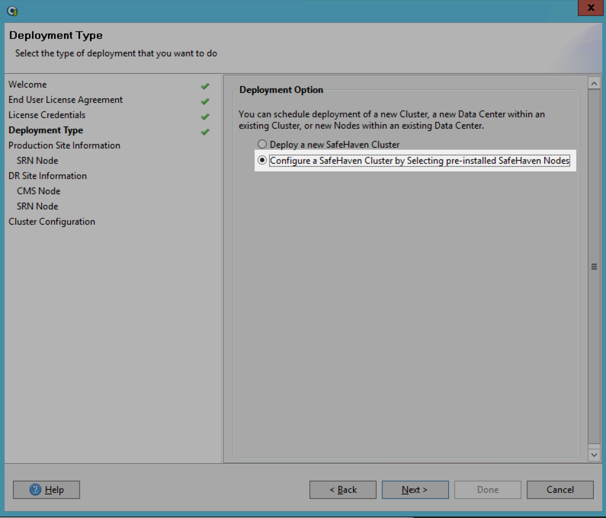

2. Enter a **name** for the Production Site Information. (This should be something descriptive - like ProductionDATACENTERALIAS.)
   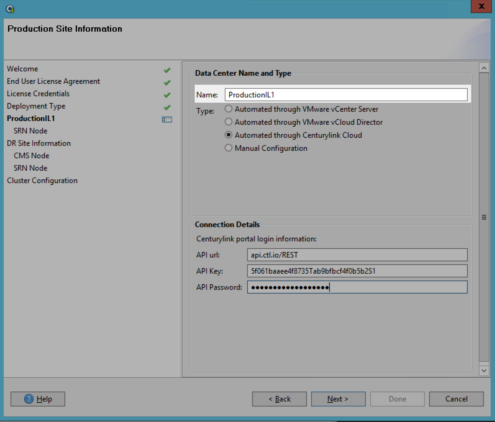

3. Select the correct Production side **type**.
   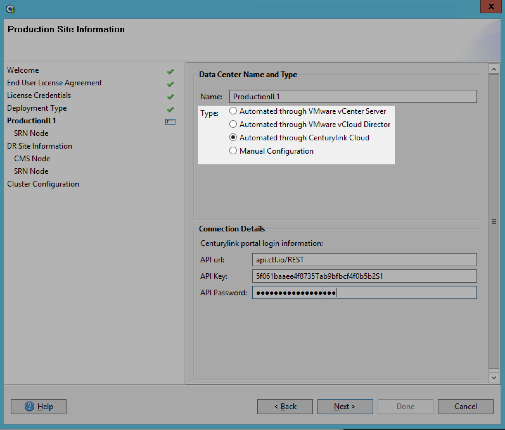

   * If your production environment is in the CenturyLink Cloud, then you would select  `Automated through CenturyLink Cloud`
   * If your production environment is on your premise then you would select `Automated through VMWare vCenter Server`

4. Update the Connection Details with the correct **API information**.
   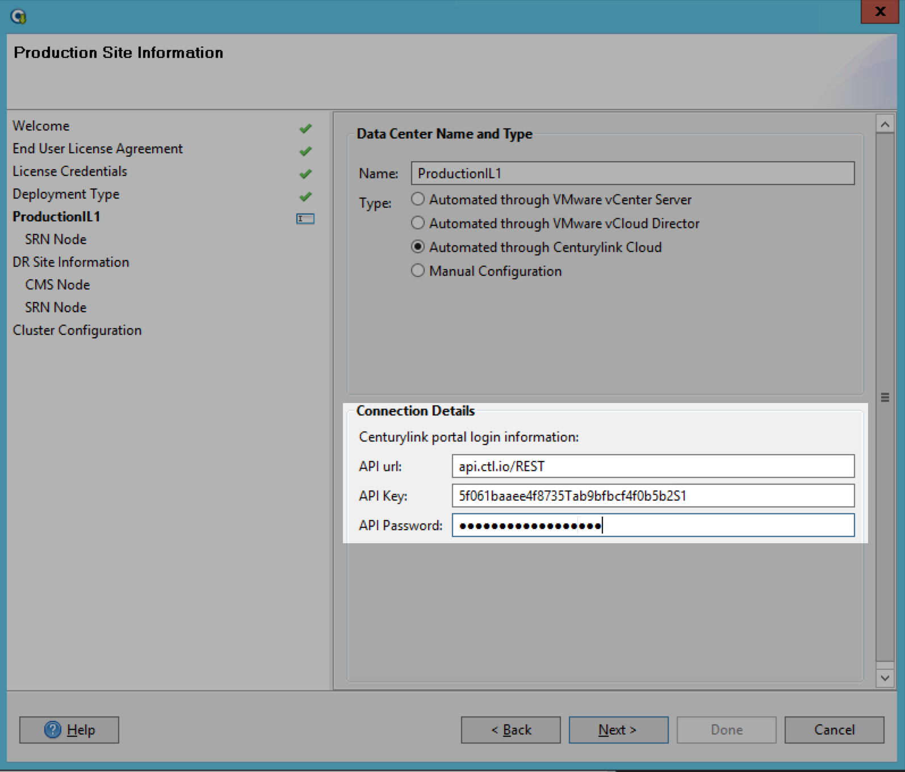

   * For CenturyLink Cloud Connection types, enter in your API v1 User Information. (You may want to create a special user just for this.)
   * For On-Prem types, you enter in a VMWare vCenter user.

5. Select the correct Production SRN from the environment servers listed. Select the correct Production Datacenter from the Locations list, followed by the **SRN** contained in that location.
   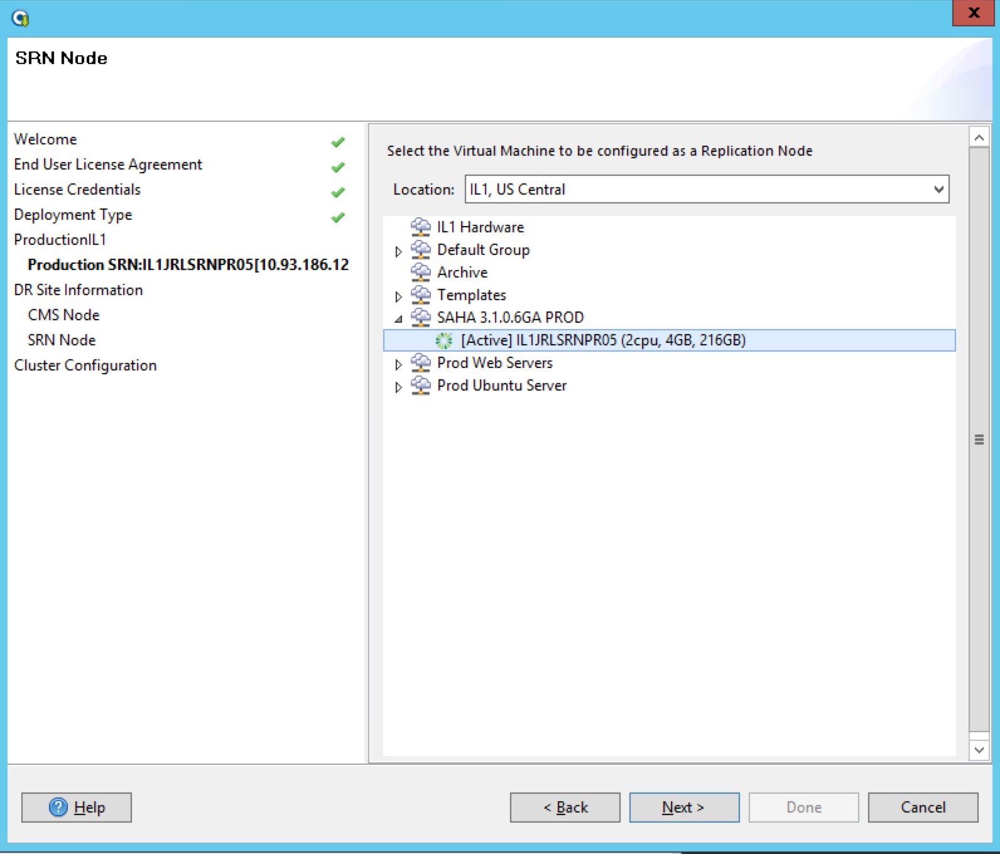

   * Note that if your API / VMWare information is wrong on the previous screen, you will not see the correct infrastructure to select from.

6. Enter a **name** for the DR Site Information. (This should be something descriptive - like DRDATACENTERALIAS.)

7. Select the correct DR side **type**.

8. Update the Connection Details with the correct **API information**.
   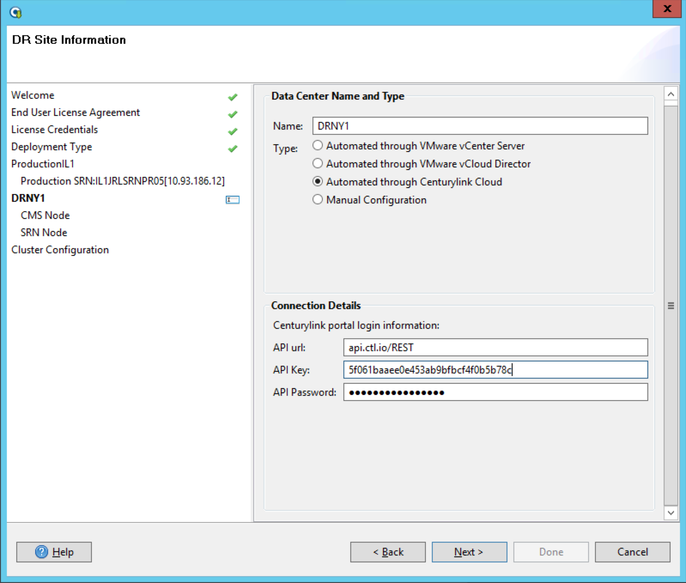

9. Select the correct **CMS** from the environment servers listed. Select the correct DR Datacenter from the Locations list, followed by the **CMS** contained within that location.
   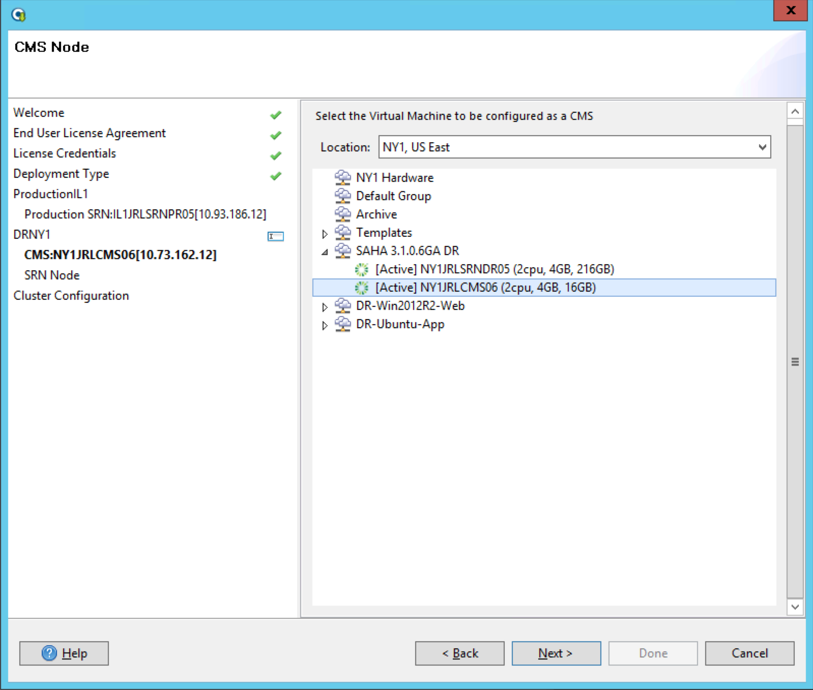

10. Select the correct **DR SRN** from the environment servers listed. Select the correct DR Datacenter from the Locations list, followed by the **SRN** contained within that location.
   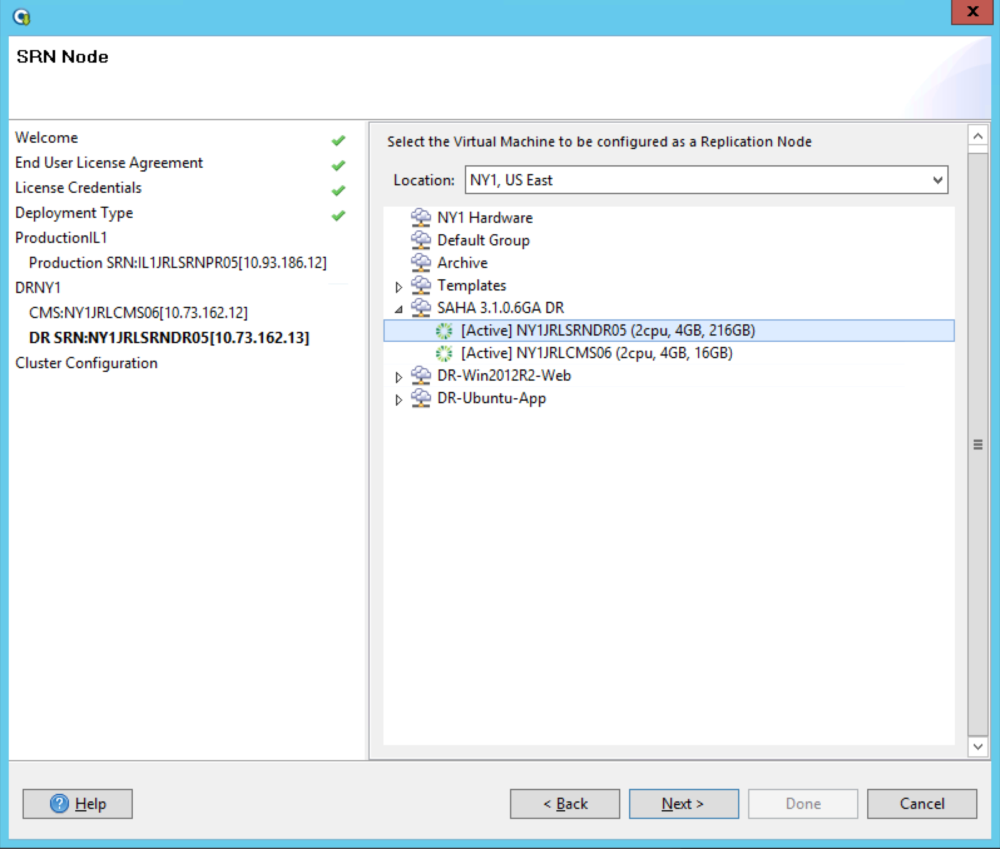

11. Complete the required sections for the Custer Configuration section. Provide passwords, the SafeHaven distribution URL, and confirming other predefined settings.
   * **CMS Section**
     * **Administrator Password** - Specify an administrative password that is used by the user **Administrator** on the CMS. This will be the account you connect to the CMS with.
     * **Root Password** - This is the root password for the CMS node that was previously defined during the build process.
     * **SafeHaven distribution URL** - This is the NO SBD link for the current code level of your SafeHaven Environment.
     * ***3.1.1*** - https://www.dropbox.com/sh/7837hqfwe31wzrh/AACryIOIhfFGw4kMBINDkIGUa/SH3.1.1-GA-Dec15-2015/SafeHaven3.1.1-GA_nosbd_12-16-2015_bin.tar.gz?dl=0

   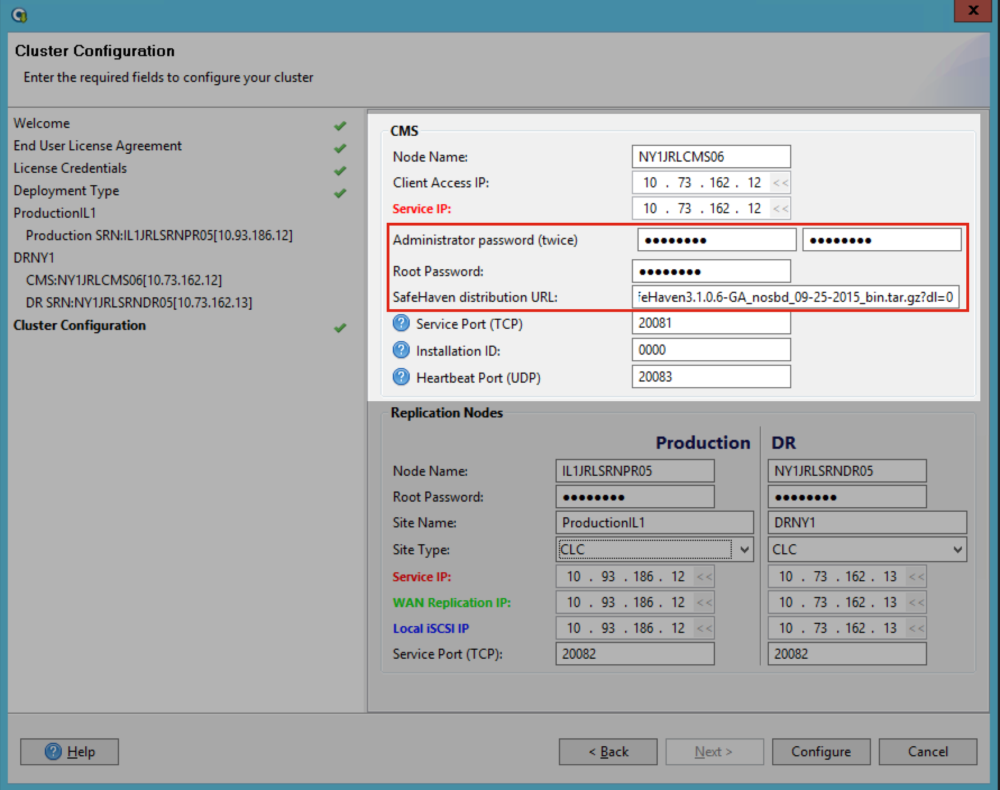

   * **Replication Nodes Section**
     * **Root Password** - This is the root password for the SRN node that was previously defined during the build process. Specify a password for both the Production side and the DR side.

   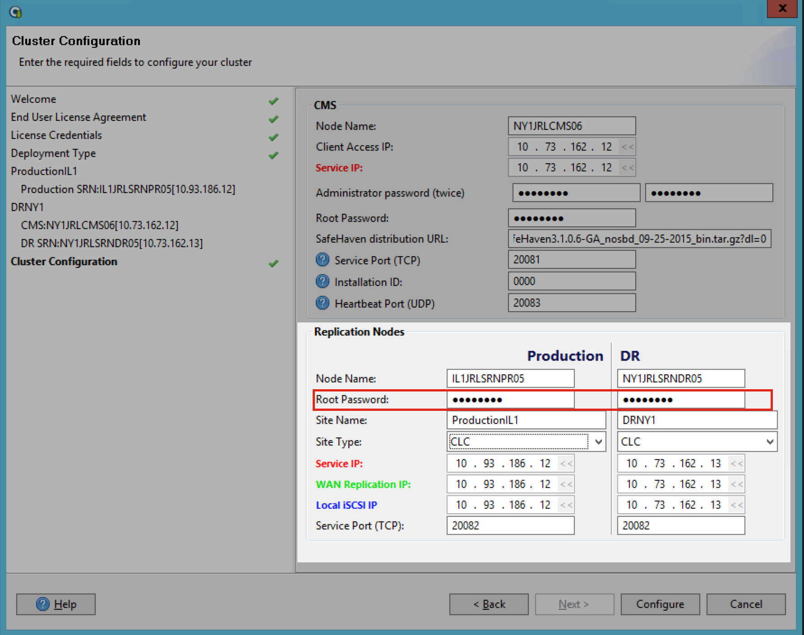

     * **Confirm other settings. However, do not modify any port information.**

12. Click **Configure** to begin the configuration process. Once the process has completed successfully the following window is displayed indicating the configuration was successful.
   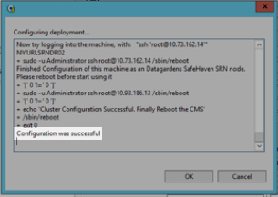

You should now be able to connect to your cluster by using the correct GUI version of the Console software. Note that you'll connect to the CMS from here.
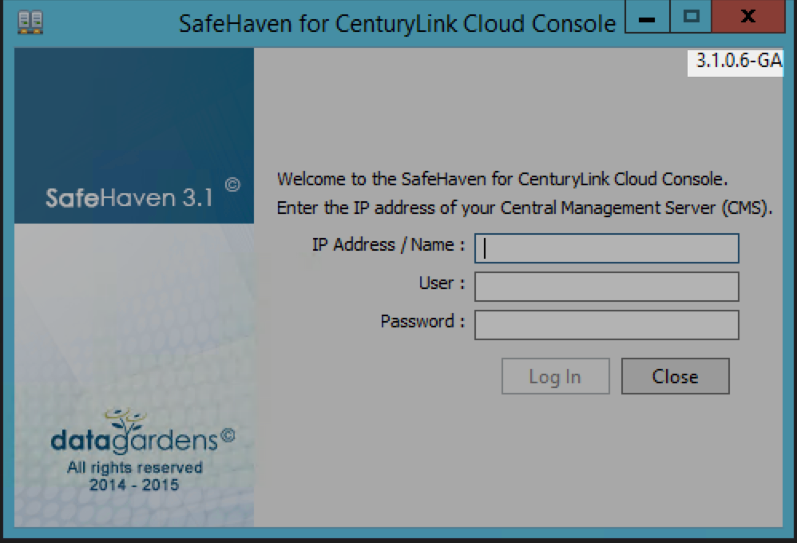
