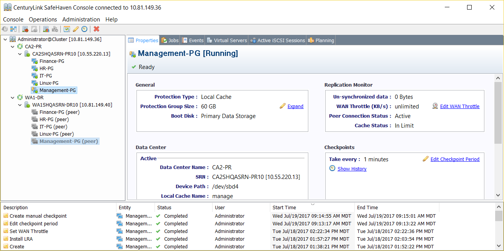
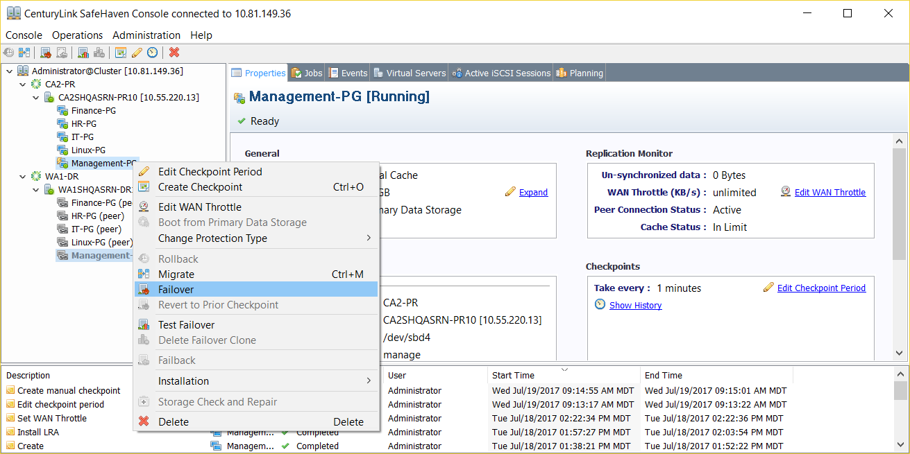
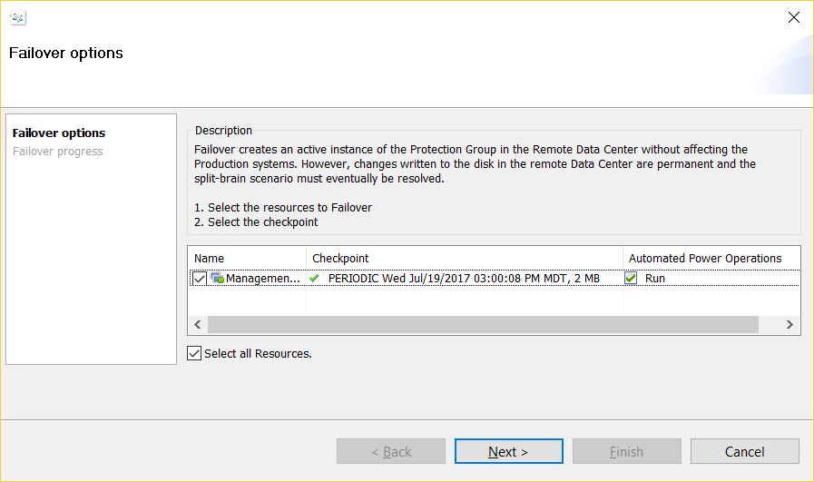
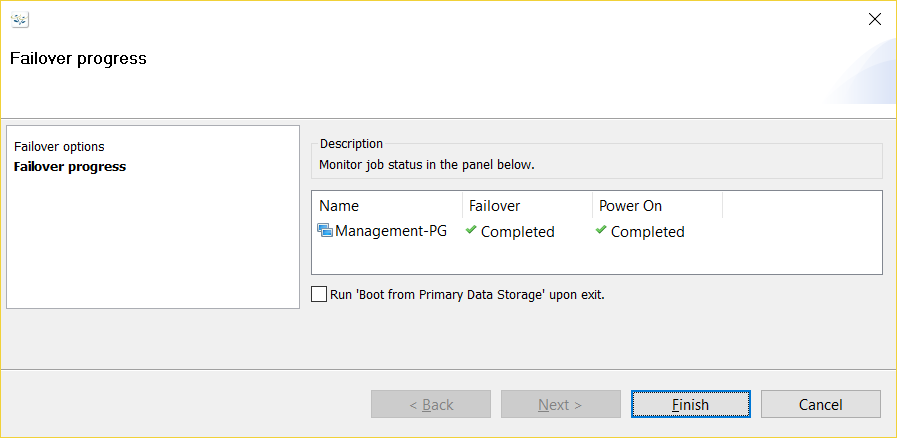
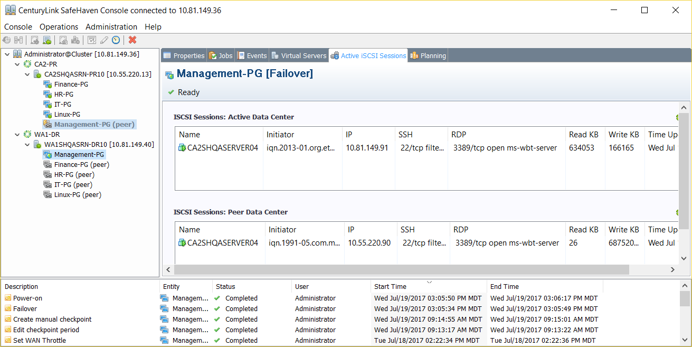

{{{
  "title": "Failover a Windows Protection Group",
  "date": "08-31-2017",
  "author": "Sharon Wang",
  "attachments": [],
  "contentIsHTML": false
}}}

### Article Overview

This article explains how to Failover a Windows Local Cache Protection Group from a production datacenter to a recovery datacenter.

**NOTE**: Unlike Test-Failover, Failover is a disruptive operation and the user must understand the consequences of intiating a failover beforehand.

**NOTE**: Once a protection group is in a failed over state, the recovery server sitting in the recovery(DR) datacenter becomes the active primary production site to which the users can connect and use for business continuity, until Failback is performed.

**NOTE**: It is highly recommended that a user performs Test Failover before intiating a permanent Failover to confirm that the recovery instance boots correctly and the user can access it.

**NOTE**: Typically network isolation is not required during Failover. If the user wants to isolate the network during Failover (like Test-Failover), please follow the network isolation procedures stated in the SafeHaven Guides.

### Requirements

1. A SafeHaven cluster has already been setup and all the datacenters have been registered.
2. Both production and recovery SRNs have been registered and peered along with the storage pools claimed.
3. Windows protection group has been created and initial sync has completed and periodic checkpoints have been enabled.
4. User has confirmed that Test Failover for the Windows Protection Group works successfully.

### Assumptions

This article assumes that the user has successfully completed the setup of a Windows Local Cache Protection Group and has already performed a non-disruptive Test Failover successfully to confirm the recovery instance boots correctly and presents the production data in the recovery datacenter. Assumption is that now the user wants to Failover to the recovery site and make the recovery instance in the recovery(DR) datacenter, an active production instance for business continuity.

For the purpose of this article, we have used **Windows 2012 R2 DataCenter** as the Operating System type for the Windows production server in CenturyLink's CA2(Toronto) production datacenter. The recovery datacenter being used is CenturyLink's WA1(Seattle) datacenter.

### Failover

Here is a Windows Local Cache Protection Group called **Management-PG** which is currently active in CA2 datacenter (booting from local storage) and is ready for Failover.

To intiate a Failover, right-click on Windows Protection Group **Management-PG** and select **Failover** from the drop down list.

Select a **clean checkpoint** for Windows recovery and click ** Next**.

When Failover is intiated, firstly the iSCSI targets in the recovery datacenter get activated. Then the recovery server (stub) gets powered on and boots from the DR-SRN's iSCSI disks in the recovery datacenter. A power on job can be seen in CLC-WA1 datacenter's queue from the CenturyLink Portal.

Click **Finish** to complete Failover.

**NOTE**: DO NOT CHECK Run 'Boot from Primary Data Storage' upon exit.

Note that the Management-PG is now active under WA1-DR datacenter instead of CA2-PR. Select the Windows Protection Group **Management-PG** and go to the **Active iSCSI Sessions** tab to monitor the boot process of the failed over instance under **ISCSI Sessions: Active Data Center**. Wait for the **RDP 3389/tcp** to go to an **OPEN** state(this may take 5-6 minutes) and then proceed to login to the failover instance in WA1 via RDP.

**NOTE**: As the failed over instance is a copy of the original production server, please use the original production server's credentials(username and password)to login to the failed over instance.

This concludes the failover of a Windows Protection Group. To failback a Windows Protection Group, please see [Failback a Windows Protection Group](//www.ctl.io/knowledge-base/disaster-recovery/safehaven-4/failback-a-windows-protection-group/) KB Article.