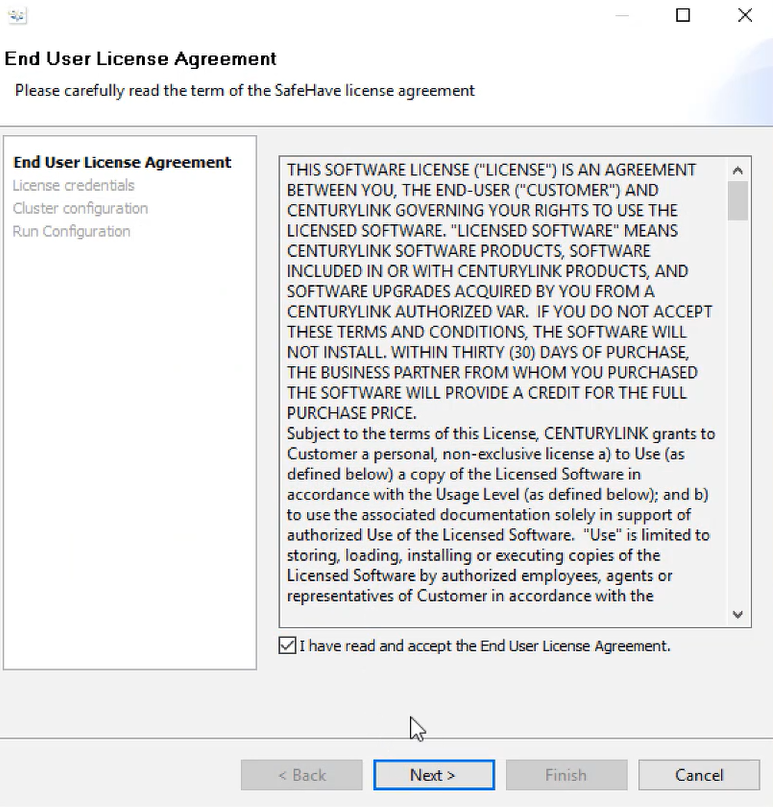
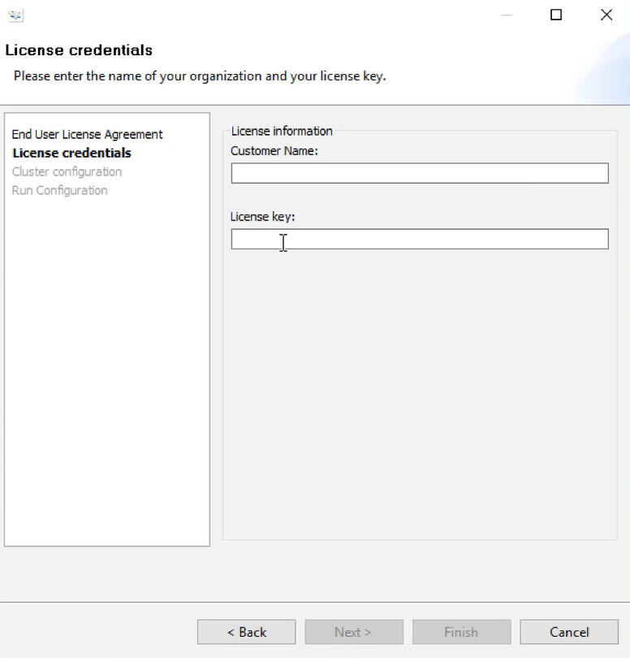
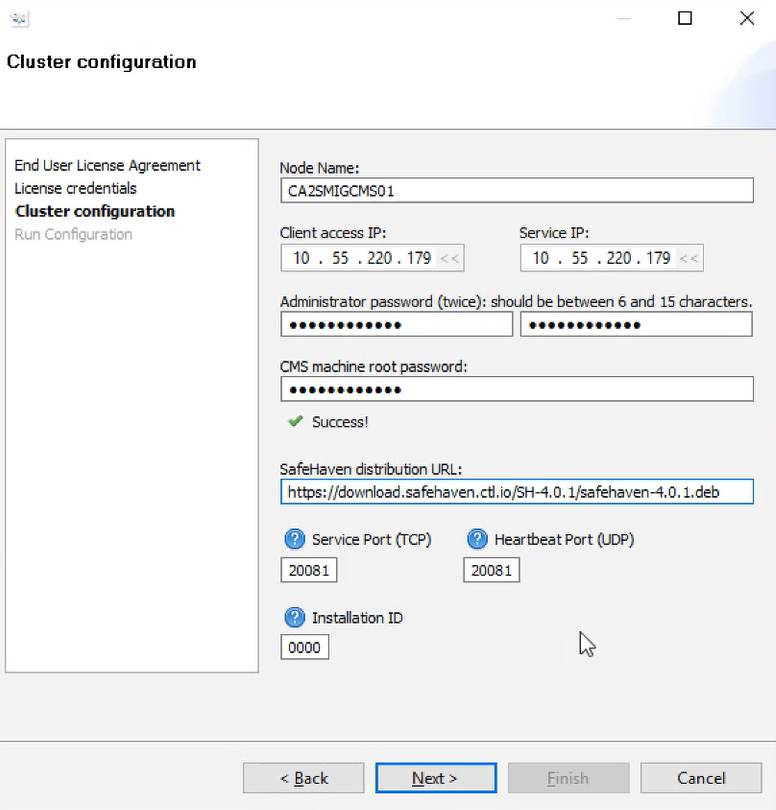
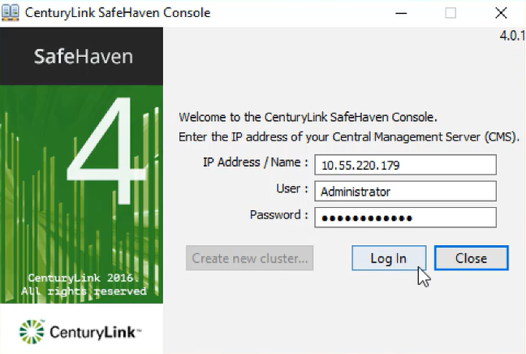

{{{
  "title": "SafeHaven-4-Create a SafeHaven Cluster",
  "date": "05-01-2016",
  "author": "Sharon Wang",
  "attachments": [],
  "contentIsHTML": false
}}}
## Article Overview
This article explains how to create a SafeHaven Cluster.

### Requirements
Pre-deployed CMS server in CenturyLink Cloud.

### Assumption
This article assumes that the user has already deployed the CMS server in CenturyLink Cloud.

To create CMS and SRN, please refer to [SafeHaven-4-Deploy CMS and SRN in CenturyLink Cloud](SafeHaven-4-Deploy%20CMS%20and%20SRN%20in%20CenturyLink%20Cloud.md)

### Deploy SafeHaven Console 

Begin by downloading the latest compatible SafeHaven Console (GUI) from the GUI Package download link (https://download.safehaven.ctl.io/SH-4.0.1/SafeHavenConsole-4.0.1.zip) under the Download Links section of the SafeHaven 4.0.1 release notes : https://www.ctl.io/knowledge-base/disaster-recovery/safehaven-4/safehaven-4.0.1-release/

After the download completes, launch the Console by clicking on its icon. Select Create New Cluster, accept the license agreement, and select Next.

Enter the name of your organization and the license key provided to you by your Onboarding Engineer.

Enter the name you selected for the CMS along with the client and service access IP addresses and the administrator password. Enter the CMS root password and the SafeHaven distribution URL provided to you by your account manager. Enter 20081 for the Service Port, 20081 for the Heartbeat Port and 0000 for the installation ID. 

You will need to wait a few moments while the SafeHaven software is downloaded, installed, and configured. When this process is complete, a pop-up window appears to let you know that the installation was successful. Select OK and then Finish. Note that the CMS will reboot as part of the installation procedure. After the CMS reboot, log in to the SafeHaven Console using the IP address for the CMS server and the administrator credentials.

A pop-up panel appears requesting installation of an SSL certificate. Select Install.This will require Administrator right

The SafeHaven Console will appear. You have now completed the installation of the software for the SafeHaven nodes.

### Register the production and recovery data centers

Within the SafeHaven Console, right-click on the CMS in the Navigation Tree and select Register Data Center from the drop-down menu. First, we will register the recovery data center.

Enter a name for the data center and the data center type. In this case, we assume you will recover in the CenturyLink Cloud so the data center type is CenturyLink Cloud. Select Register.

Next register the production data center by following a similar procedure. If your production data center is at your premises or at co-location facility and managed directly through VMware vCenter Server, select VMware vSphere as the data center type. If your private data center does not have access to VMware vCenter Server, select Manual as the data center type.

Now select the recovery data center in the Navigation Tree and select Change Credentials in the main data panel.

A pop-up panel appears. Enter your user name and password for CenturyLink Cloud administration.

Enter your account alias, identify the data center with one of the CenturyLink data centers and select Finish.

Now perform the same tasks for the production data center. You have now registered the production and recovery data center with the SafeHaven Cluster.

### Register the SRNs

Right-click on the recovery data center within the Navigation Tree and select Register SRN from the drop-down menu.

A pop-up panel appears. Provide a name for the SRN. You may want to match the name already provided for the SRN by the CenturyLink Cloud. Next provide the root password, the Service IP, WAN Replication IP, and local iSCSI IP along with the service ports for TCP and UDP (both have default values of 20082). Select Register.

If you need additional SRNs in the recovery data center, use a similar procedure to register them as well.

Using a similar procedure, register the SRNs in the production data center.

### Establish peering between SRNs and claim storage

Next we must establish peering relationships between SRNs in the production and recovery data centers. Select an SRN in the recovery data center. Select the Peers tab in the main data panel, then select Add peer.

A pop-up panel appears. Provide the root password for the recovery SRN. Next, identify the SRN in the production data center which needs to act as a peer. Provide its root password as well. Select Register.

Finally, you need to claim storage pools for each SRN. In the Navigation Tree, select an SRN in the recovery data center. In the main data panel under the Properties tab, select Claim Storage Pool.

A pop-up panel appears. Select the radio button to Claim a New Storage Pool. Provide the new pool a name. Select Claim.

Perform a similar task for all other SRNs in the recovery data center and also for the SRNs in the production data center. 

