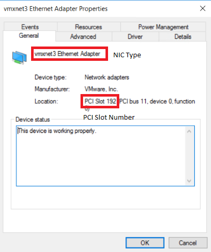

{{{
  "title": "Prepare a Recovery Server Template",
  "date": "04-30-2018",
  "author": "Anshul Arora",
  "attachments": [],
  "contentIsHTML": false
}}}

### Article Overview
* A **Recovery Server** is the server that runs the image of the production server at the time of a disaster, when a user clicks the test-failover/failover button.  
* **Matching NIC and PCI Slot**: For Windows Production Server, if the DR-Site is CLC/DCC/VMWare, the **NIC and PCI slots** of the Recovery VM should be exactly same as that of the Production Server. This is a requirement for iSCSI boot on the DR Side.   
**Note** : Matching NIC/PCI is not needed for a Linux Production VM.  
* For ease of deployment, it is highly recommended to have a Recovery instance template in advance before creating a protection group. It is mostly benefitial when there are multiple production VMs similar PCI slots  
**Note** : If the production server's NIC and PCI slots are VMXNET3 and 160, respectively , then a template is not required because Centurylink Cloud's default Ubuntu 14 template can be used to deploy a recovery instance.  

This article explains how to create a template for recovery server in CLC.  

### Find out NIC and PCI of the Production Server.
1. Log into the Windows Production VM.
2. Go to **Device Manager**.
3. Expand **Network Adapters**.
4. Right click the Network Adapter, and click **Properties**.
5. Take a note of the **NIC Type** and **PCI slot number**.  

### Create an instance with matching NIC and PCI.
1. Login to Centurylink cloud portal. https://control.ctl.io/
2. Click on the Datacenter that is required to be the DR Datacenter.
3. Click **Create** button on the right to expand it.  
  a. Click **Server**.  
  b. Make sure that correct **Datacenter** and **Group** is selected.    
     Select **Server Type** : **Standard**  
     Select **Operating System** : **Ubuntu 14|64-bit**  
     
     **Note**: Ubuntu 14 VM is being used intentionally to protect a windows production server. The cost of an Ubuntu recovery server is very less compared to a Windows Recovery Server. Windows Recovery server should be used in case of **Migration**  
     
     Enter **Server Name**. Just 6 characters are allowed.  
     Enter **admin/root password**
     Give the server **1 CPUs** and **1 GB Memory**.  
     **Note**: No need to add any additional storage at this point.  
     Select a **Network**. This is the network where the Recovery Servers will be deployed.
     Click **Create Server**.
     **Note**: It may take a few minutes for the deployment to finish
 4. Once the VM has been created, send a request to **help@ctl.io** to change the NIC and PCI slot of the VM to match the Production Server. The request can also be submitted through **chat with support** button from Centurylink control portal.

### Convert a VM into Template
Once the NIC and PCI of the VM matches the production server, it can be converted into a template to be used multiple Protection Group Deployments.  
**Note**: Do not convert a Production Server into a template. It can cause downtime.
1. In Centurylink control portal, click on the VM that is to be converted into a template in DR Datacenter.
2. Click **convert to template** button.
   a. Make sure the **template location** is in DR Datacenter.
   b. Enter the **admin or root password** of the VM that is being converted into a template.
   c. Under **publish settings**, select **Private shared**.
   d. Click **convert server to template**.
 **Note**: It may take a few minutes to convert a VM into a template. All the templates are stored in **Templates** group.
 
 
