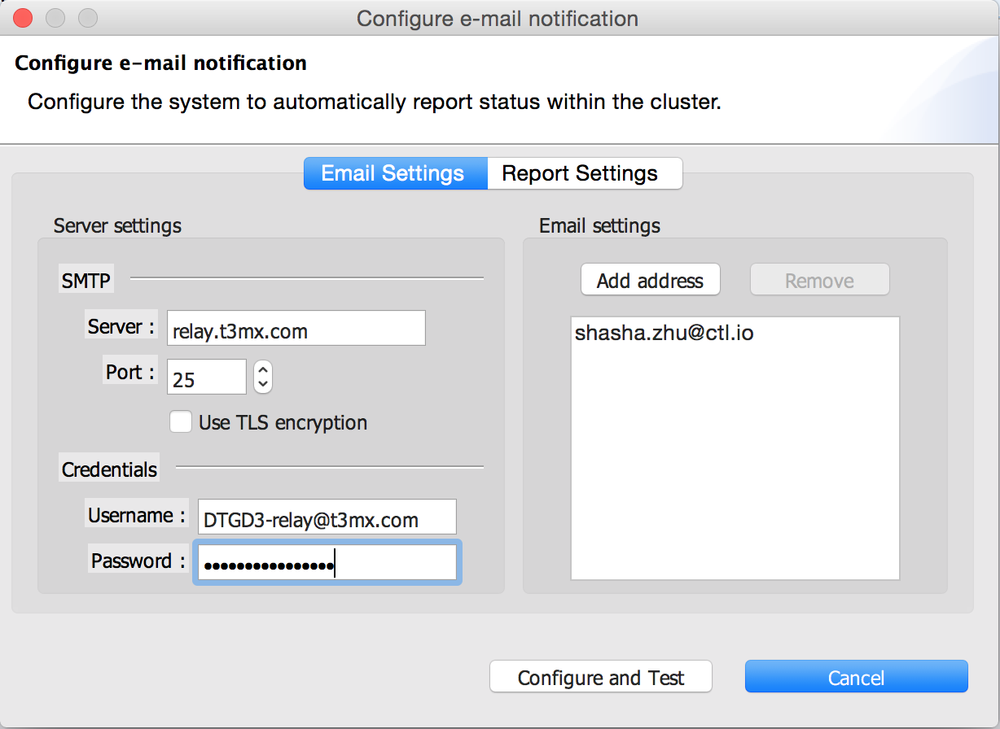
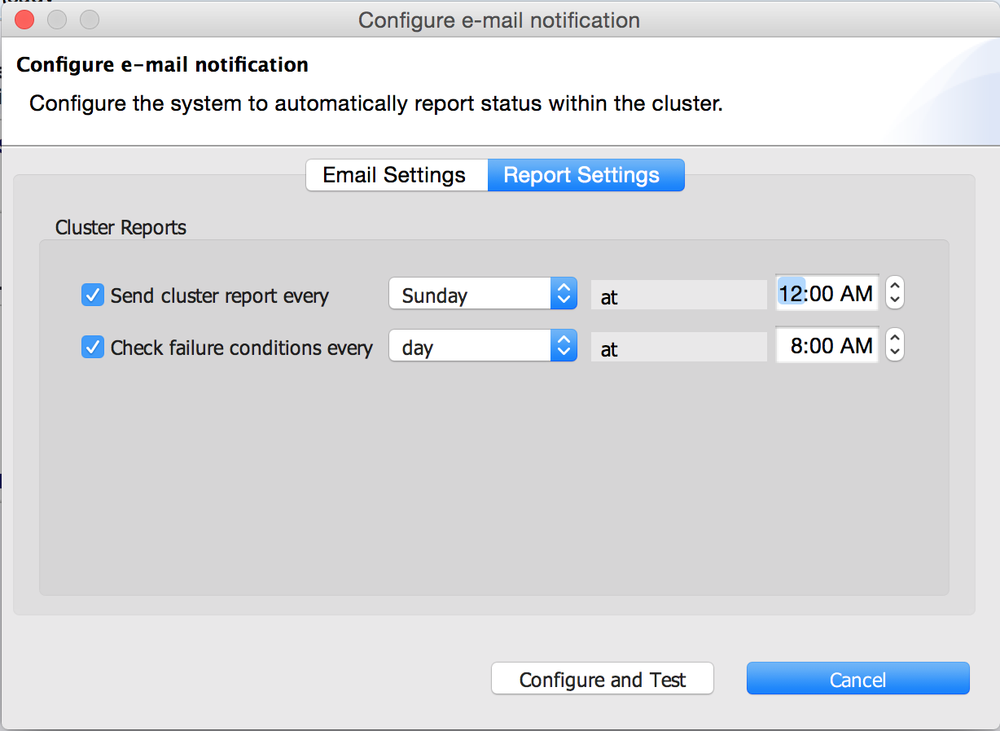

{{{
  "title": "SafeHaven: Configure Email Alerts",
  "date": "9-22-2015",
  "author": "Jake Malmad",
  "attachments": [],
  "contentIsHTML": false
}}}

### Overview:

SafeHaven provides automatic reports on the cluster health and performance. If, for instance, the allocated bandwidth is inadequate and a protection group is at risk of not meeting its target RPO, SafeHaven flags the problem and will send notifications if configured to do so. Enabling and configuring email alerts is quite simple, especially when leveraging the [CenturyLink Cloud SMTP Relay service](../Mail/smtp-relay-services-simple.md), though the process is the same from a SafeHaven configuration perspective.

### Walkthrough:

1. Navigate to the "SMTP Relay" section of the portal. Create a new SMTP relay, if one does not already exist. If a relay exists, note the credentials and URL (relay@t3mx.com)

2. Open a console connection to the cluster's CMS server. Open the "Administration" tab and select "Configure Email Notification"

3. Enter the relevant information for your SMTP relay server:

 

**PLEASE NOTE THAT CERTAIN SPECIAL CHARACTERS ARE NOT SUPPORTED IN THE PASSWORD FIELD AND WILL CAUSE ALERTING TO FAIL. THE CHARACTERS ARE:** ``` #, =, : and space```

4. Verify that the "Report Settings" configuration and timing is correct:

 

5. Click "Configure and Test" when finished. The task should run successfully and show as such in the logs.

6. Verify that the SMTP.conf file has been created successfully: first, SSH into the CMS as Administrator.

7. View the file /etc/ssmtp/ssmtp.conf, the entries should match the information input in the previous step 3:

 

8. If the file is blank, then the contents must be manually specified. Two example entries follow, one commented and one simple, both of which provide the same core pieces of information. Once the ssmtp.conf entry has been created, SafeHaven reports should then start being sent to address specified during configuration.

Sample .conf file with comments:

```
#
# Config file for SSMTP sendmail
#
# The person who gets all mail for userids < 1000
# Leave this empty to disable rewriting.
root=postmaster
# The place where the mail goes. The actual machine name # is required no MX records are consulted. Commonly     # mailhosts are named mail.mycompany.com
mailhub=mail.mycompany.com:1025
# If the mail server needs username and password,         # comment out the following entries with "#"
AuthUser=no_reply@mycompany.com
AuthPass=************
# UseSTARTTLS=YES
# Where will the mail seem to come from?
#rewriteDomain=
# The full hostname
hostname=mycompany.com
# Are users allowed to set their own From: address?
# YES - Allow the user to specify their own From:address
# NO - Use the system generated From: address
FromLineOverride=NO
```

The more concise version is as follows:
/
```
root=postmaster
mailhub=relay.t3mx.com:25
FromLineOverride=NO
AuthUser=UserName@t3mx.com
AuthPass=*****************
UseSTARTTLS=no
```

### Connecting to the SMTP Relay Service:

Connecting to the SMTP service is very easy as it is done via port 25 from inside the CenturyLink Cloud. Here are the settings:
•SMTP Host: relay.t3mx.com
•SMTP Host Port: 25
•User: (what is provided in your control portal as the alias)
•Password: (what is provided in your control portal)

You will also need to add SPF record as follows: v=spf1 ip4:66.150.160.0/24
