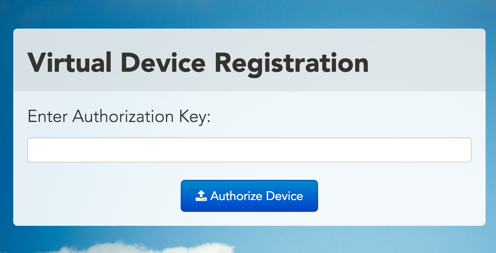
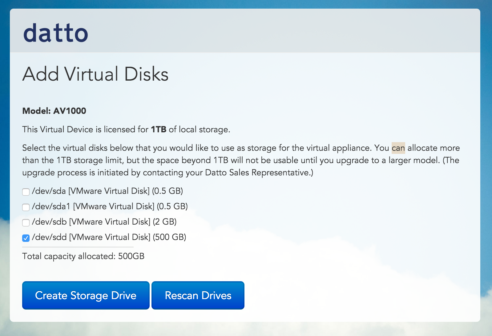
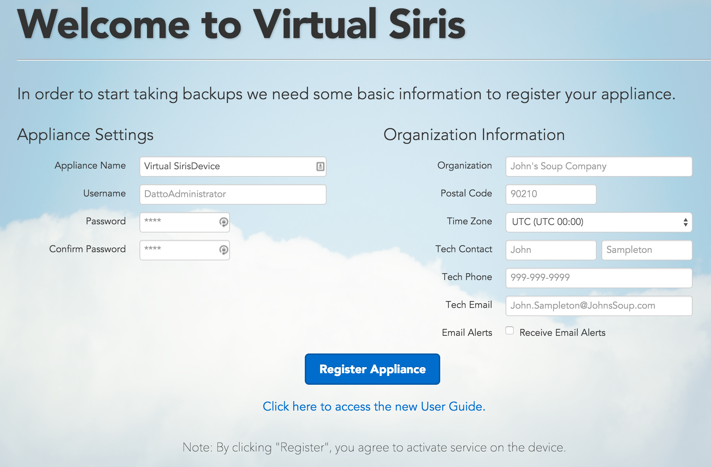

{{{
  "title": "Getting Started with datto Alto - Blueprint",
  "date": "12-18-2015",
  "author": "<a href='https://twitter.com/KeithResar'>@KeithResar</a>",
  "attachments": [],
  "contentIsHTML": false
}}}

### Overview

After reading this article, the reader should feel comfortable deploying the datto Virtual Alto to protect server
data residing on CenturyLink Cloud.

### Partner Profile

datto Alto – “Protecting business data no matter where it lives”

http://www.datto.com/

##### Customer Support

|Sales Contact   	| Support Contact	|
|:-	|	:-	|
|Brian Buckman bbuckman@datto.com (312) 638-2742   	| 24x7 Customer Support  [www.datto.com/support](http://www.datto.com/support) (877) 455-6015	|

### Description

Datto has integrated their technology with the CenturyLink Cloud platform. The purpose of this knowledge base article is to help the reader
take advantage of this integration to achieve rapid time-to-value for this data protection solution.

Technology from Datto helps CenturyLink Cloud customers address the business challenge of data protection and eliminates downtime by
virtualizing systems instantly and is now available as part of the CenturyLink Cloud Blueprint Engine.

Customers can protect Windows and Linux operating systems and replicate data every 5 minutes to 60 minutes within the CenturyLink Cloud.
Additionally, data can be replicated to the Datto cloud where customers can store data for long-term retention or failover and instantly virtualize.

### Audience

CenturyLink Cloud Users

### Impact

After reading this article, the user should feel comfortable getting started using datto technology on CenturyLink Cloud.

After executing the steps in this Getting Started document, the users will have a functioning Virtual Alto upon which they
can start protecting data and virtualizing systems.

### Deploying datto Virtual Alto

1. **Locate the Blueprint in the Blueprint Library**

  Starting from the CenturyLink Control Panel, navigate to the Blueprints Library. Search for "datto Alto" in the keyword search on the right side of the page.

  

2. **Click the Deploy Blueprint button.**

3. **Set Optional Parameters**

  Password/Confirm Password (This is the root password for the server. Keep this in a secure place).  

  Set DNS to “Manually Specify” and use “8.8.8.8” (or any other public DNS server of your choice).

  Optionally set the server name prefix.

  The default values are fine for every other option.

4. **Review and Confirm the Blueprint**

5. **Deploy the Blueprint**

  Once verified, click on the `deploy blueprint` button. You will see the deployment details stating the Blueprint is queued for execution.

  This will kick off the Blueprint deploy process and load a page where you can track the deployment progress. Deployment will typically complete within five minutes.

7. **Add Additional Storage**

  The Blueprint delivers your server with no data storage configured.  Login to [control.ctl.io](https://control.ctl.io) and
  add **raw disks** for your server

8. **Access Alto**

  *Note if accessing via a public IP address some of these steps may refresh and direct you towards the private IP causing timeouts.*

  * Access the device's web UI by entering the IP address into your browser

  * Apply registration code.  If you have not yet received a registration code please email bbuckman@datto.com.

    

  * Select disks added in step (7) and click *Create Storage Drive*

    

  * Configure appliance access details and set owner contact information the click *Register Appliance*

    

### Pricing

The costs listed above in the above steps are for the infrastructure only.

After deploying this Blueprint, you may secure entitlements to the technology by emailing your datto
Account Executive or if you don’t have one, Brian Buckman at bbuckman@datto.com.

### Frequently Asked Questions

**Where do I get my datto registration code?**

Email your Datto Account Manager bbuckman@datto.com

**Who should I contact for support?**

* For issues related to cloud infrastructure, please open a ticket using the [CenturyLink Cloud Support Process](../../Support/how-do-i-report-a-support-issue.md).
* For issues related to deploying the Alto Blueprints and application operation on CenturyLink Cloud, please contact bbuckman@datto.com or follow your existing datto support process if known.
