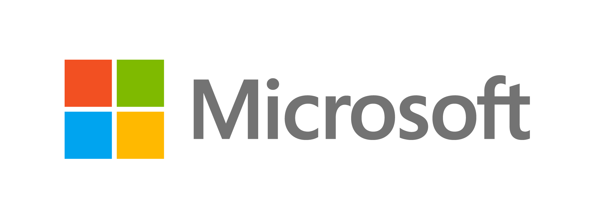
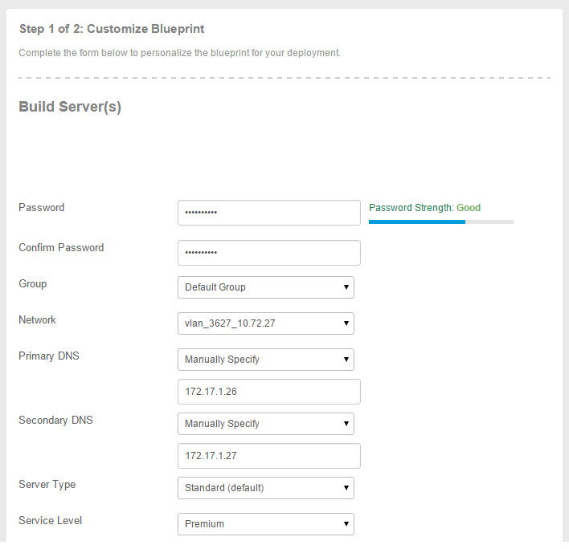
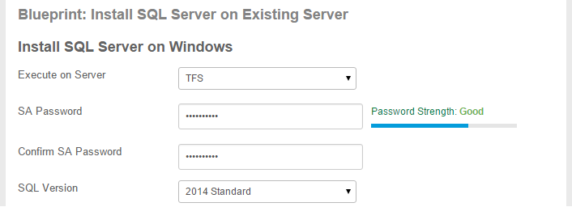
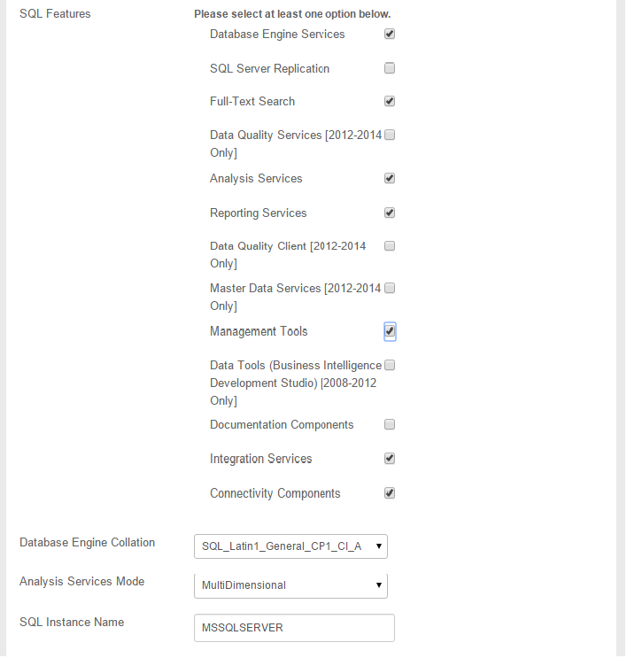

{{{
  "title": "Getting started with Microsoft Team Foundation Server (TFS) 2013",
  "date": "9/9/2015",
  "author": "Terawe",
  "attachments": [],
  "contentIsHTML": false
}}}

### Technology Profile

Microsoft Team Foundation Server 2013 (TFS 2013) provides the collaboration hub at the center of the Application Lifecycle Management (ALM) solution. By automating the software delivery process, entire teams can collaborate across roles and track team actions and project artifacts such as requirements, tasks, bugs, source code, build results, and test results. Team Foundation Server 2013 enables team rooms, comprehensive reporting, and dashboards that provide historical trending, full traceability, and real-time visibility into software quality. 

### Description

This KB article describes the options for installing and configuring TFS 2013 on the CenturyLink Cloud using blueprints.

Due to the complexities of the possible TFS 2013 configurations there are several TFS 2013 blueprints available to allow you to achieve your required scenario.

- Team Foundation Server 2013 Standalone Small
- Team Foundation Server 2013 Standalone Medium
- Team Foundation Server 2013 Standalone Large
- Team Foundation Server 2013 Basic with SQL Server Express
- Team Foundation Server 2013 with SQL Server

The following software is installed by all TFS 2013 blueprints -

Microsoft Windows Server 2008 R2 Standard 64-bit

Microsoft Visual Studio Team Foundation Server 2013 with Update 5

Team Explorer for Microsoft Visual Studio 2013

*Team Explorer is the client software that you use to access Team Foundation Server 2013 functionality from Visual Studio.*

#### Microsoft Documentation ###

For more information about configuring TFS 2013 please see the following Microsoft documentation -

[Set up TFS on a server](https://msdn.microsoft.com/en-us/library/hh561426(v=vs.120).aspx)

#### Blueprint - Team Foundation Server 2013 Standalone

There are three variations on this blueprint - Small, Medium and Large. 

- Small - 2 CPU 8 GB memory
- Medium - 4 CPU 16 GB memory
- Large - 4 CPU 32 GB memory

These blueprints provide a Windows 2008 R2 Standard server with TFS 2013 installed - but not configured. They do not install SQL Server. You can then configure any of the possible TFS 2013 configurations using the "Team Foundation Server Administration Console". 

If SQL Server is required for the TFS configuration (Basic or Standard) you can install SQL Server either locally or remotely, and you can select the SQL Server you require. You can use the "Install SQL Server on Existing Server" blueprint to install SQL Server. The user should select either SQL Server 2014 Standard or Enterprise.

#### Blueprint - Team Foundation Server 2013 Basic with SQL Server Express

This blueprint installs TFS 2013 and performs the Basic configuration, which installs SQL Server Express 2012.

#### Blueprint - Team Foundation Server 2013 with SQL Server

This blueprint installs (a full edition of) SQL Server and TFS 2013.

The user should select either SQL Server 2014 Standard or Enterprise.

### Audience

CenturyLink Cloud Users

### Impact

After reading this article, the user should be able to deploy a TFS 2013 blueprint to create a TFS 2013 server.

### Prerequisite

Access to the CenturyLink Cloud platform as an authorized user.

#### Steps to Deploy Blueprint

1. **Locate the "Team Foundation Server" Blueprint**

  1. Starting from the CenturyLink Control Panel, navigate to the Blueprints Library.
  2. Search for “TFS” in the keyword search on the right side of the page.
  3. Locate the specific "Team Foundation Server" Blueprint that you require (see below)

2. **Choose and Deploy the Blueprint.**

  1. Click the "Team Foundation Server" Blueprint that you require.

3. **Customize the Blueprint**

  1. **Build Server**

        1. Set server options including password.

		

  2. **Set Server Name**
  
        1. Set the required server name.
		

  3. **Specify Credentials**
  
        1. If required, set the server credentials.

  4. **Select SQL Version ("TFS with SQL Server" only)**
  
        1. Select either 2014 Standard or 2014 Enterprise.

  5. **Select SQL Features ("TFS with SQL Server" only)**
  
        1. Select the options as shown.

4. **Review and Confirm the Blueprint**
  1. Click “next: step 2”
  2. Verify your configuration details.

5. **Deploy the Blueprint**
  1. Once verified, click on the ‘deploy blueprint’ button. You will see the deployment details along with an email stating the Blueprint is queued for execution.
  2. This will kick off the blueprint deploy process and load a page to allow you to track the progress of the deployment.

6. **Monitor the Activity Queue**
  1. Monitor the Deployment Queue to view the progress of the blueprint.
  2. You can access the queue at any time by clicking the Queue link under the Blueprints menu on the main navigation drop-down.
  3. Once the blueprint completes successfully, you will receive an email stating that the blueprint build is complete. Please do not use the application until you have received this email notification

### Access your TFS 2013 server

To access your TFS 2013 server from a computer outside the CenturyLink Cloud network use the OpenVPN client as specified here: [How To Configure Client VPN](https://www.ctl.io/knowledge-base/network/how-to-configure-client-vpn/)

### Pricing

The costs associated with this blueprint deployment include CenturyLink Cloud infrastructure usage.  

Additional licensing costs will apply for Microsoft software, including TFS 2013 and SQL Server. If you deploy with SQL Server, charges will apply for SQL Server.  These will be shown in the indicated cost for the blueprint when you deploy it.  

The TFS 2013 license is not included. You can choose to configure TFS 2013 on first use with a 90-day trial license, or you can enter your license key. A trial license can be upgraded to a full license at a later time by providing your license key. **You must obtain an appropriate license for TFS from Microsoft and enter the license key.  TFS is not purchased through installing this blueprint.**

[Locate or Change the Product Key for Team Foundation Server](https://msdn.microsoft.com/en-us/library/Cc668758.aspx)

### Terawe

CenturyLink Cloud works with [Terawe](http://terawe.com), a Microsoft Cloud and Hosting partner, to provide new  cloud offerings to our customers for various Microsoft products.

Terawe is a software technology company that provides world-class sustainable solutions and services for customers. With key initiatives spanning industry verticals in education and hosting, along with in-depth expertise including Cloud, Data Platform, Mobility, Big Data and Business Intelligence, we create compelling solutions for customers at the highest efficiency and quality. 

### Frequently Asked Questions

#### Who should I contact for support?

* For issues related to cloud infrastructure (VM's, network, etc), or if you experience a problem deploying the Blueprint or Script Package, please open a CenturyLink Cloud Support ticket by emailing [noc@ctl.io](mailto:noc@ctl.io) or [through the CenturyLink Cloud Support website](https://t3n.zendesk.com/tickets/new).

* For issues related to deploying the Terawe TFS blueprints on CenturyLink Cloud please email
[support@terawe.com](mailto:support@terawe.com) 

