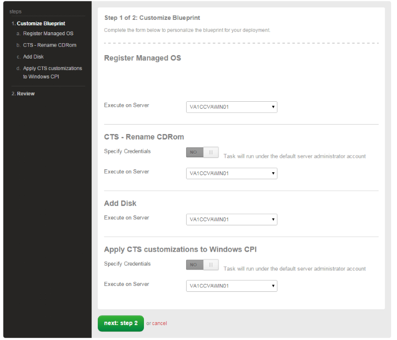
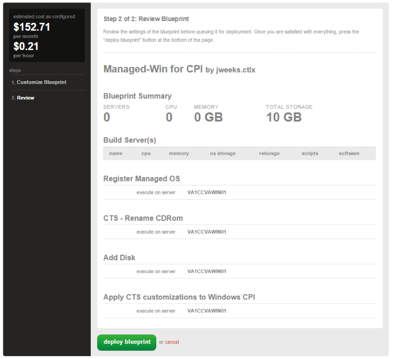
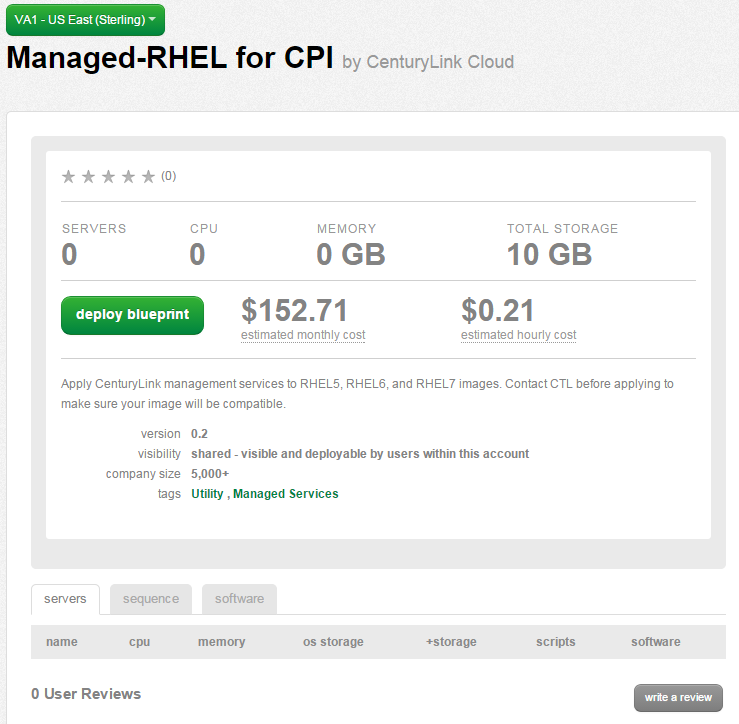
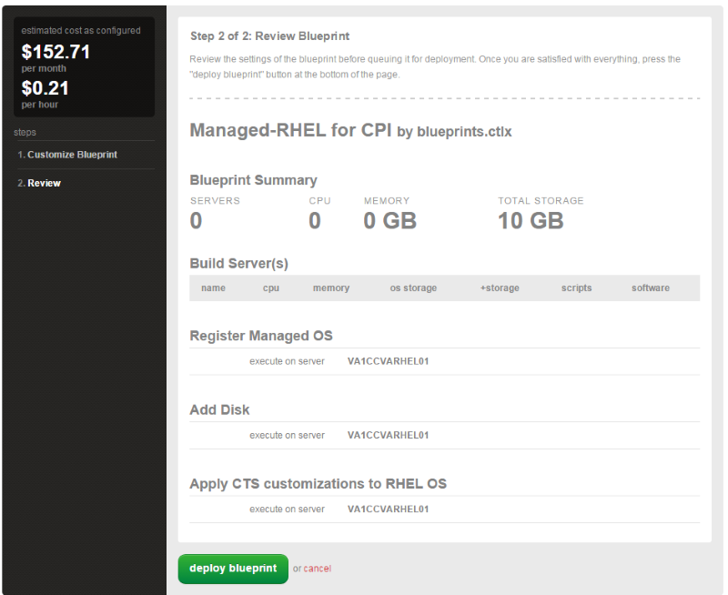

{{{
  "title": "Converting unmanaged virtual machines to managed",
  "date": "4-16-2015",
  "author": "Chris Little",
  "attachments": [],
  "contentIsHTML": false
}}}

### Overview
[CenturyLink Cloud Managed Operating System Services](//www.centurylinkcloud.com/managed-services/operating-system/) provide maintenance and management of your Windows & Red Hat cloud servers, 24x7.  For a flat hourly fee, our engineers will perform common administrative functions on your behalf. Don’t worry about applying the latest patches, updating servers with the latest anti-virus tools, or keeping servers compliant with corporate access policies - we’ll do it for you!

Customers may wish to enable [Managed Operating System Services](//www.centurylinkcloud.com/managed-services/operating-system/) on virtual machines already deployed in an **unmanaged** state to offload critical IT functions.  In order to facilitate this process the CenturyLink Cloud platform provides an automated [Blueprint](//www.centurylinkcloud.com/blueprints/) to convert unmanaged virtual machines into a managed operating system.

### Important Information
* Conversion from **Managed** to **Unmanaged** Operating System Services is not currently a supported feature.
* It is advised that customers perform the conversion during a maintenance window due to potential impact on running services.

### Compatibility Matrix
The table below provides a matrix of the supported locations and Operating Systems for conversion.

**Cloud Location**|**Operating System**
------------------|--------------------
GB1 - Great Britain (Slough)<p>VA1 - US East (Sterling)<p>UC1 - US West (Santa Clara)|Red Hat Enterprise Linux 5 - 64-bit<p>Red Hat Enterprise Linux 6 - 64-bit<p>Red Hat Enterprise Linux 7 - 64-bit<p>Windows 2008 R2 Standard - 64-bit<p>Windows 2008 R2 Enterprise - 64-bit<p>Windows 2008 R2 DataCenter Edition - 64-bit<p>Windows 2012 DataCenter Edition - 64-bit<p>Windows 2012 R2 DataCenter Edition - 64-bit<p>

### Converting Unmanaged Windows Virtual Machines to Managed
1. In the Control Portal, navigate to the Blueprint Library and select a Cloud location that supported managed operating system services.

    

2. Using the search feature, input **CPI** to filter the blueprints.

    

3. Choose the **Managed-Win for CPI** blueprint and select the deploy blueprint icon.

    

4. In Step 1 (customize blueprint) select the Windows Virtual Machine you wish to convert to a managed server.  Each of the 4 customization areas **require** the user to select the virtual machine you wish to convert and all of them should be set to the same instance.

    

5. In Step 2 validate your inputs and select the deploy blueprint button.

    

6. Validate the Job completes in the queue

    

### Converting Unmanaged Linux Virtual Machines to Managed
1. In the Control Portal, navigate to the Blueprint Library and select a Cloud location that supported managed operating system services.

    

2. Using the search feature, input **CPI** to filter the blueprints.

    

3. Choose the **Managed-RHEL for CPI** blueprint and select the deploy blueprint icon.

    

4. In Step 1 (customize blueprint) select the Linux Virtual Machine you wish to convert to a managed server.  Each of the 3 customization areas **require** the user to select the virtual machine you wish to convert and all of them should be set to the same instance.

    

5. In Step 2 validate your inputs and select the deploy blueprint button.

    

6. Validate the Job completes in the queue

    

### Validation
Customers will receive a notification email once the virtual machine is successfully converted to Managed.  
```
Your request "Managed server build VA1CCVARHEL01" has successfully completed.
```

Validation can also be confirmed by looking for an asterisk (*) next to the name of the server in the Control Portal.


