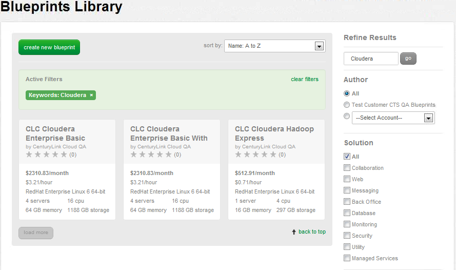
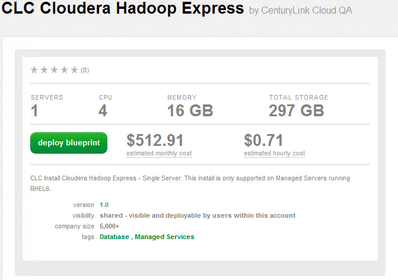
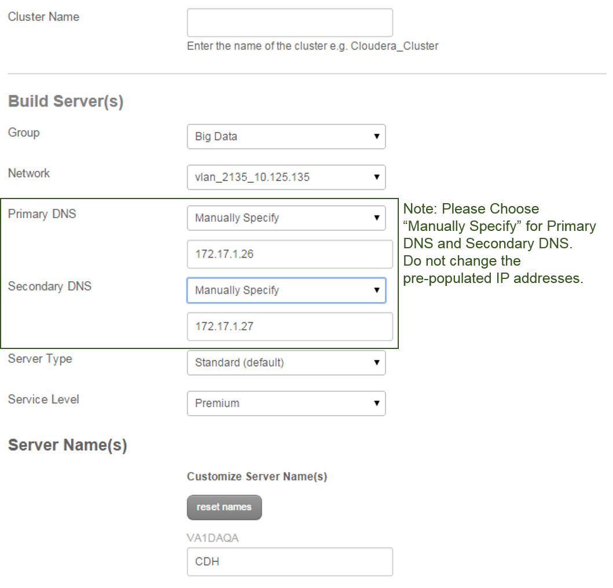
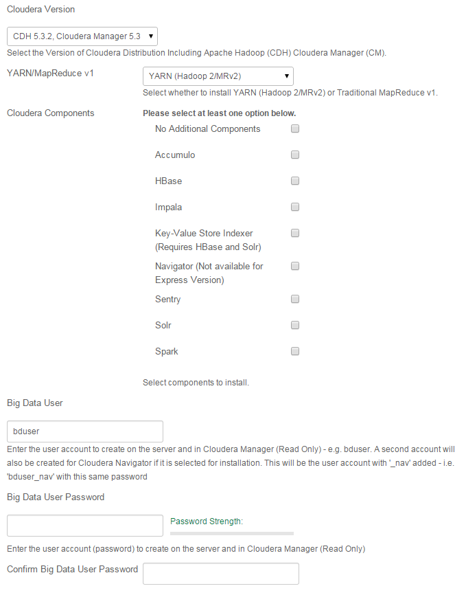
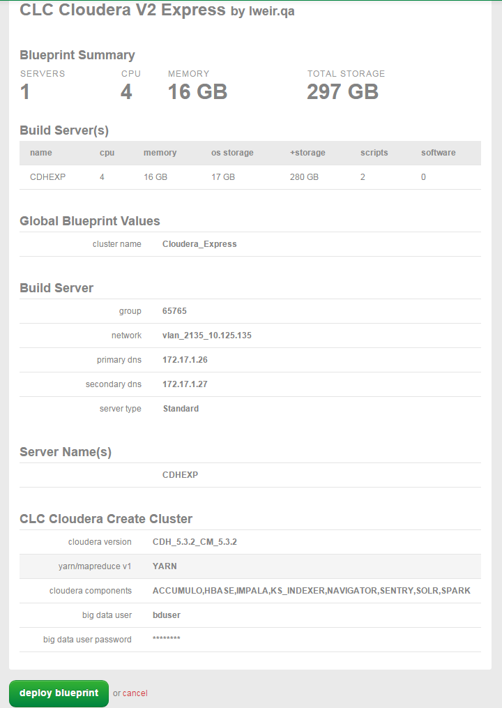
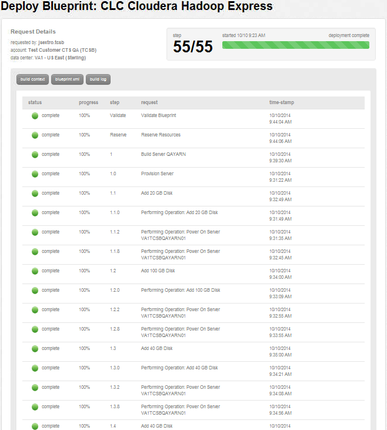

{{{
  "title": "Getting Started with Cloudera on CenturyLink Cloud",
  "date": "04-28-2015",
  "author": "Tim Baumgartner",
  "attachments": [],
  "contentIsHTML": false
}}}

## Overview

Cloudera Hadoop combines Apache Hadoop with a number of other open source projects to create a single, massively scalable system where you can unite storage with an array of powerful processing and analytic frameworks.

### Create a managed Cloudera Hadoop environment in CenturyLink Cloud.

1\. Search for “Cloudera” in the Blueprints library. Then, click the version and cluster configuration Blueprint that suits your needs.

2\. Click on the "Deploy Blueprint" button.

3\. Fill out the appropriate details for the CLC Managed Cloudera Hadoop Blueprint.

4\. Select your Cloudera Version and Components.
The User name and Password you set here will be your login for Cloudera Manager, Hue and, if installed, Navigator.

5\. Verify your configuration details.

6\. Once verified, click on the ‘deploy blueprint’ button.
You will see the deployment details along with an email stating the Blueprint is queued for execution.

You will receive emails as each server is being built and then you will receive an additional email stating that the entire Cloudera cluster build is complete. Please do not use the servers until you have received this final email.
**NOTE:The server now has the Cloudera Hadoop software installed and activated - your instances will be unmanaged or managed, based on the Blueprint deployed.**

### FREQUENTLY ASKED QUESTIONS

**Q: How do I create more nodes?**

A: You can create additional nodes for your CenturyLink Cloud Managed Cloudera Hadoop cluster by running the “Add Node” Blueprint.

**Q: How is the CenturyLink Cloud for Managed Cloudera Hadoop priced?**

A: CenturyLink Cloud Managed Cloudera Hadoop is priced by [the instance, billed hourly].

**Q: What Versions of Cloudera Hadoop does CenturyLink Cloud support?**

A: CDH5 Express (unmanaged), CDH5 Basic (managed), CDH5 Basic + HBase (managed), CDH5 Enterprise Data Hub (managed).

**Q: Which additional Hadoop components are available?**

A: Currently the following components are availabe and are pre-configured based on industry best practices when the cluster builds:

* Accumulo
* HBase
* Impala
* Key-Value Store Indexer (Requires HBase and Solr)
* Navigator (Not available for the Express Version)
* Sentry
* Solr
* Spark

For a description of each component visit the [Cloudera Add-On Services Available on CenturyLink Cloud](cloudera-add-on-services-available-on-centurylink-cloud.md) article.

**Q: How do I access Cloudera Manager, Hue or Navigator?**

A: Cloudera Manager, Hue or Navigator can be accessed on the first Node, port 7180 for Cloudera Manager, port 8888 for Hue and port 7187 for Navigator via an SSH port on a public IP or by using [VPN](../Network/how-to-configure-client-vpn.md).

For a detailed guide of Cloudera Manager on CenturyLink Cloud, download the [CenturyLink Cloud Cloudera Manager Guide](https://www.ctl.io/knowledge-base/attachments/CenturyLink_Cloudera_Manager_Guide_11032014.pdf/).

**Q: What cluster options are available on CenturyLink Cloud?**

A: The Blueprints come in 1 and 4 server configurations. You can use the “Add Node” Blueprint to scale the cluster to meet your needs.

**Q: Can the customer provide their own Cloudera Hadoop License?**

A: Not at this time.

**Q: Can *un-managed* Cloudera Hadoop Environment be converted to *Managed* (or vice versa)?**

A: This capability is not available at this time.
