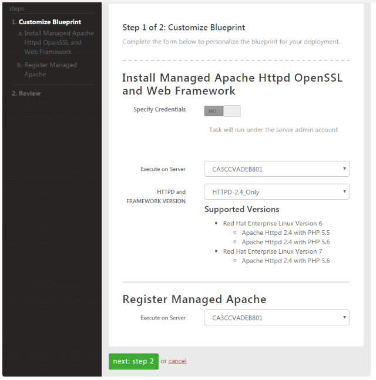
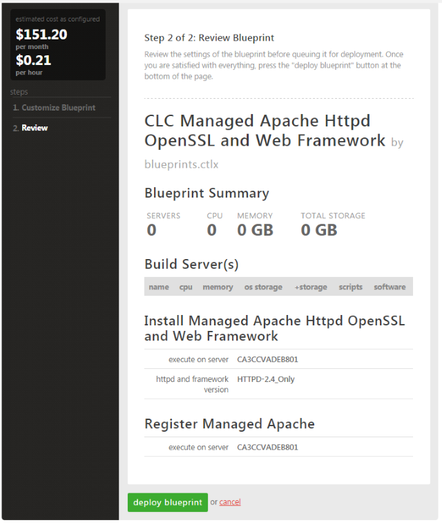

{{{
  "title": "Getting Started with Managed Apache",
  "date": "1-19-2017",
  "author": "",
  "attachments": [],
  "contentIsHTML": false
}}}

### Overview
CenturyLink Cloud Web server application offers a reliable, high-performance, and secure vehicle for delivery HTTP content to end users. Here's how to create a managed Apache environment in CenturyLink Cloud.

### Prerequisites
* Managed Red Hat Enterprise Linux

### Supported Operating systems
* Managed Red Hat Enterprise Linux 5
* Managed Red Hat Enterprise Linux 6
* Managed Red Hat Enterprise Linux 7

### Supported HTTPD and Framework Versions

* HTTPD-2.4_Only
* HTTPD-2.4_PHP-5.6
* HTTPD-2.4_PHP-5.5
* HTTPD-2.4_PHP-5.4
* HTTPD-2.2_PHP-5.3_Prefork
* HTTPD-2.2_PHP-5.3_Worker

### Steps to Deploy Managed Apache
1. Log on to the [Control Portal](//control.ctl.io/).

2. Using the left side navigation bar, click on **Orchestration**, **Blueprints Library**.

3. Select on the “CLC Managed Apache Httpd” Blueprint. **Tip: you may use the search term apache to narrow the list.**

    

4. Click on the "Deploy Blueprint" button.

5. Fill out the appropriate details for the CLC Managed Apache Httpd OpenSSL and Web Blueprint. Please choose the same server for both the Installation and Registration of Managed Apache otherwise the Blueprint will fail.

    

6. Verify the information is correct and select deploy blueprint.

    

7. Monitor the job queue for progress and you will receive an email that your Blueprint has been installed when the Blueprint is complete.

### FAQ

**Q: How is the CenturyLink Cloud for Managed Apache HTTP priced?**

A: CenturyLink Cloud Web Software for Apache is priced by the VM, billed hourly. Refer to our [pricing catalog](//www.ctl.io/pricing) for detailed pricing.

**Q: Can the customer have multiple Apache Instances installed on the same server?**

A: No, Apache can only be installed once per server, but Apache is capable of hosting many web sites per server.

**Q: Can *un-managed* Apache Web Services be converted to *Managed* (or vice versa)?**

A: This capability is not available at this time.
