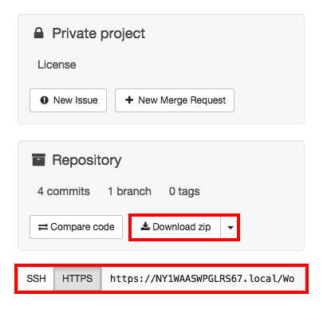

{{{
  "title": "WordPress Clone/Push to GitLab",
  "date": "06-23-2015",
  "author": "Gregory McWilliams",
  "attachments": [],
  "contentIsHTML": false
}}}

**NOTE:** This KB articles purpose is to guide you through the process of cloning from and pushing changes to GitLab. It assumes that you have already created a WordPress site through the WordPress Control Portal and have access to your GitLab repository. If you haven’t done that yet you can head over [here](https://github.com/EasiGregory/PublicKB/blob/master/Managed%20Services/getting-started-with-managed-wordpress.md "Getting Started with Managed WordPress").

  - You have created a WordPress site

  - You have your CLC username and password

How to clone/push from GitLab
===

1. First we need to head out to GitLab and login using the CLC Control portal username of the user that created the site along with the WordPress admin password that they provided on creation. CLC users other than the one that created the site will not be able to view/edit the repository.

  

  Once you're logged in, select the project you would like to clone from within the UI.

  

2. Now we need to clone the repository to your local machine; currently we only support users going with the HTTPS solution for now.

  

3. Now type the command to clone the repo:

    *git clone URL*

  - The repositories hosted in GitLab are private, and you will be prompted to enter your username and password for the repo. You now have a clean clone of the repository and are free to make changes as you see fit.

4. Once the changes you desired are made we now need to add those changes for git to commit. This will stage the changed files for the commit. We can do this by entering the command:

  *git add NAMEOFCHANGEDFILE*

  Or if you want to add all changes:

  *git add .*

5. Now that we have our changed files added, we can now commit and push our changes back up to our GitLab repository. First we start by committing our changes and a message to let others know what we have changed:

  *git –m “Your message letting others know what actions you performed.” commit*

6. We now can push those changes up to our GitLab repo by entering in the command:

  *git push origin master*

===
**Voila! You have now cloned the repository down from Gitlab, made changes, added those changes, committed and pushed those changes back up to GitLab. Your site will now be updated with the newly acquired changes. Great work!**