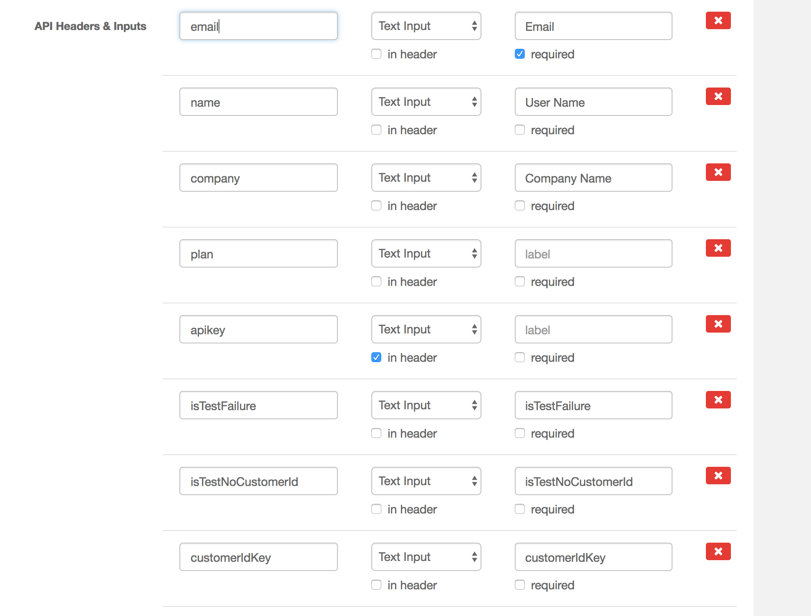
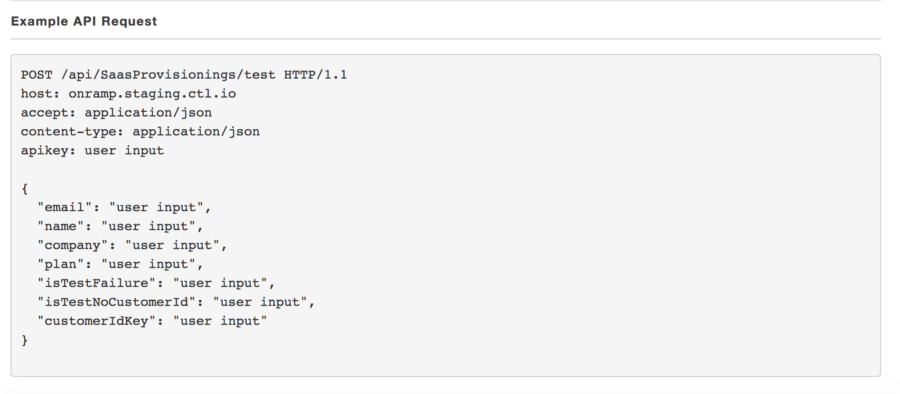
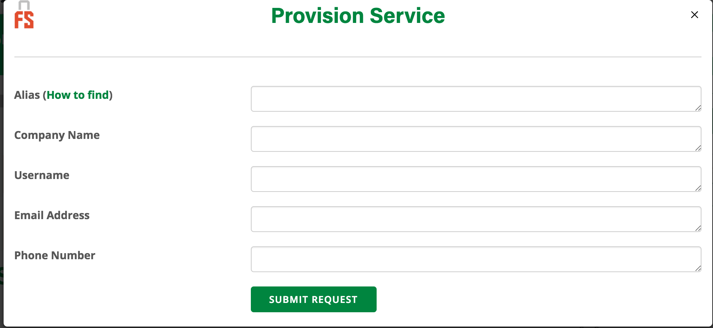

{{{
"title": "Software as a Service Product Provisioning",
"date": "09-06-2017",
"author": "Brandy Smith",
"attachments": [],
"contentIsHTML": false
}}}

### Overview

Software Providers that are classified as Software as a Service (SaaS)  will need to implement one of the integration types outlined in this [documentation](../../marketplace/providers/saas-integrations.md). Once the method of integration has been identified the software providers technical team will need to review and execute the steps outlined in either the [API documentation](../../marketplace/providers/software-as-a-service-saas-v2-api.md) or the [Tracking Pixel documentation](../../marketplace/providers/software-as-a-service-saas-tracking-pixel.md).  

The next step is to create the Product Provisioning within the Provider Portal for each respective product. This document will outline the steps that the software provider needs to complete in the Provider Portal to support the SaaS integration.

### Product Provisioning

1. Log into the [Provider Portal](https://provider-portal.ctl.io), using your CenturyLink Cloud credentials.

2. If a product tile has yet to be created, you can do so by following the steps outlined in the [Getting Started Guide](../../marketplace/providers/getting-started-guide-marketplace-ecosystem-provider-portal.md).

3. Once the product(s) has been created, the following will need to be completed for each product.

4. On the product home page, under the field **Product Type**: Check the SaaS box.

  

5. Checking the SaaS box in the **Product Type** field will populate the necessary fields under the SaaS tab on the left hand side. Click the SaaS tab to continue  Once under the SaaS tab you will begin to fill out the required fields.  

  

6. The first field is **Provisioning URL**. This is the providers URL that the API call should be made to.

7. The **Pre-Provisioning Message** field is optional and supports markdown. Examples of content for this field would be any pre-requisites that the end user would need to know about our execute prior to deploying the software.

8. The **Provisioning Success Message** field is optional and supports markdown. Examples of content for this field would be "Congratulations you have successfully deployed XXX software." It could also be a call to action for the end user, such as check your email for next steps.  

9. The **API Headers & Inputs** field is where the software provider gets to create both the customer facing and hidden parameters that are needed to complete the transaction. The CenturyLink Cloud Marketplace will provide the user interface & collect the information that is required to provision an account on your platform. However, we do not collect Private Card Information (PCI) on your behalf.

  

10. Above is an example of the different parameters that you can create. Each field can be customized to be visible or hidden to the customer, and if the field is a required field for the end user.

11. Once you have create the various **API Headers & Inputs** fields you want for the product, the box below will be populated with an Example of what the API request will look like based off the Headers & Inputs that were created.

  

12. Below is an example of what the form looks like to the end user (customer), which is generated based off the fields that you created in steps 9 & 10.

  

12. The **Product SKU Conditions** field is optional.

13. Below the **Example API Request** box, there is the option to preview and save your work. Be sure to click **SAVE** before leaving the SaaS tab!

  

For any questions, please contact us at [Marketplace@ctl.io](mailto:marketplace@ctl.io).
