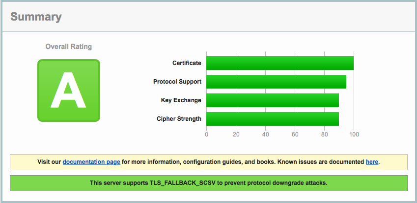
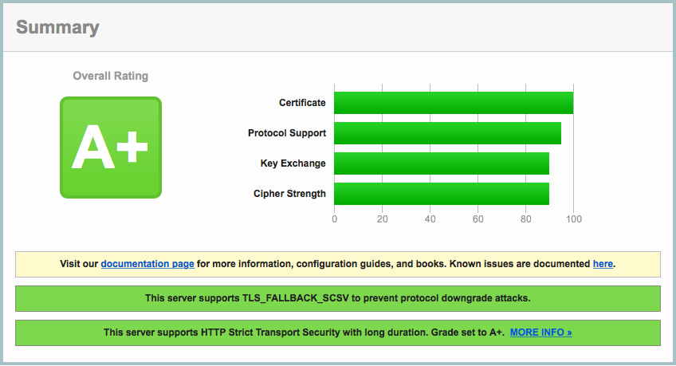

{{{
  "title": "Dedicated Load Balancer: Securing Web Traffic",
  "date": "12-17-2015",
  "author": "Maxim Volkov",
  "attachments": [],
  "related-products" : [],
  "contentIsHTML": false,
  "sticky": false
}}}

### Table of Contents

* [Introduction](#introduction)
* [Prerequisites](#prerequisites)
* [Tools of the trade](#tools-of-the-trade)
* [Generate Diffie-Hellman key](#generate-diffie-hellman-key)
* [SSL Parameters Change](#ssl-parameters-change)
* [Enable Ciphers](#enable-ciphers )
* [Strict Transport Security](#strict-transport-security)
* [Conclusion](#conclusion)

### Introduction

The security improvement of your infrastructure is a moving target. In April of 2015 the Payment Card Industry Data Security Standard (PCI DSS) has released an unscheduled and important update to PCI DSS requirements [PCI 3.1](https://www.pcisecuritystandards.org/documents/PCI_DSS_v3-1.pdf). A quote from this documents: "SSL and early TLS are not considered strong cryptography and cannot be used as a security control after June 30, 2016.". In this article we will show how to make your web traffic more secure and configure your Dedicated Load Balancer with stronger encryption.

### Prerequisites

* you have an active account with CenturyLink
* you have a dedicated load balancer which have been configured under your account with NetScaler firmware version at least 10.5 57.5
* you have ability to login into appliance with administrative credentials
* you are comfortable with executing commands in terminal
* your domain is secured with SSL key, all preliminary configuration is done and your https://www.MYDOMAIN.net is operational. [Note: Of course you would need to replace MYDOMAIN.net with your actual domain. For simplicity, we will assume that your vserver has name "my-vserver-productin-443".]

### Tools of the trade

To verify our progress through this tutorial you can use an excellent security online scanner provided by [Qualys SSL Labs](https://www.ssllabs.com/ssltest/index.html). After sorrow screening it will report overall rating together with found vulnerabilities. After each step in our configuration you can run a scan against your domain to verify you are moving into right direction.

To apply your new configuration you would have to log in into your dedicated load balancer using you favorite ssh client.

### Generate Diffie-Hellman key

First, lets generate [Diffie-Hellman protocol](//mathworld.wolfram.com/Diffie-HellmanProtocol.html) key we will use if further configuration. The following command will generate 2048 bit key file with the name "dh.key".

##### Command
  ```
  create ssl dhparam dh.key 2048 -gen 5
  ```

### SSL Parameters Change

The default SSL settings on your dedicated load balancer do have SSL v.3 as enabled, as well as Ephemeral RSA.


Both of those parameters have to be set to "disabled" in order to score higher rank on security scan.

In order to have a perfect forward secrecy we will enable Diffie-Hellman protocol using the key we generated earlier.

##### Command
```
  set ssl vserver my-vserver-productin-443 -ssl3 DISABLED -eRSA DISABLE -dh ENABLED -dhFile "/nsconfig/ssl/dh.key"
```

### Enable Ciphers

Next we will create a custom cipher group. It will only include ciphers sanctioned by new, stricter security requirements.

##### Command
```
  add ssl cipher "Better_Security"
  bind ssl cipher "Better_Security" -cipherName TLS1-ECDHE-RSA-AES256-SHA
  bind ssl cipher "Better_Security" -cipherName TLS1-ECDHE-RSA-AES128-SHA
  bind ssl cipher "Better_Security" -cipherName TLS1-ECDHE-RSA-DES-CBC3-SHA
  bind ssl cipher "Better_Security" -cipherName TLS1-DHE-RSA-AES-256-CBC-SHA
  bind ssl cipher "Better_Security" -cipherName TLS1-DHE-RSA-AES-128-CBC-SHA
  bind ssl cipher "Better_Security" -cipherName TLS1-DHE-DSS-AES-256-CBC-SHA
  bind ssl cipher "Better_Security" -cipherName TLS1-DHE-DSS-AES-128-CBC-SHA
  bind ssl cipher "Better_Security" -cipherName TLS1-DHE-DSS-RC4-SHA
  bind ssl cipher "Better_Security" -cipherName TLS1-EXP1024-DHE-DSS-DES-CBC-SHA
  bind ssl cipher "Better_Security" -cipherName TLS1-EXP1024-DHE-DSS-RC4-SHA
  bind ssl cipher "Better_Security" -cipherName TLS1-AES-256-CBC-SHA
  bind ssl cipher "Better_Security" -cipherName TLS1-AES-128-CBC-SHA
  bind ssl cipher "Better_Security" -cipherName SSL3-DES-CBC3-SHA
```
Now we associate our virtual server with created cipher group.

##### Command
```
  bind ssl vserver my-vserver-productin-443 -cipherName Better_Security
```

That will bring your score to "A".



### Strict Transport Security

To achieve higher security rating we would have to configure a Strict Transport Security. In other words, you need to prevent access to your secured website through other protocol but https. Following commands will create a rewrite action, then rewrite policy and associate virtual server with a new policy.

##### Command
```
  add rewrite action insert_STS_header insert_http_header Strict-Transport-Security "\"max-age=157680000\""
  add rewrite policy enforce_STS "true" insert_STS_header
  bind lb vserver my-vserver-productin-443 -policyName enforce_STS -priority 100 -gotoPriorityExpression END -type RESPONSE
```

Performing final scan will confirm that we achieved perfect security score.



### Conclusion

As the new vulnerabilities are detected, the security scanners are adjusted to detect new weaknesses, so make sure to recheck your score periodically and adjust your configuration following recommendations given during those checks.
