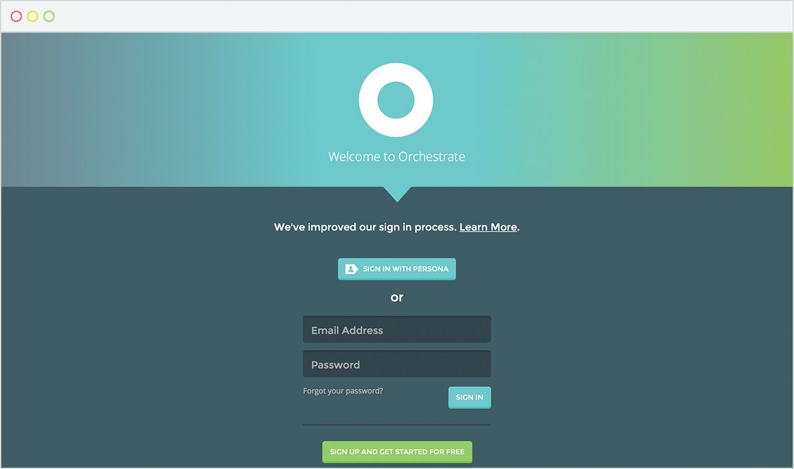
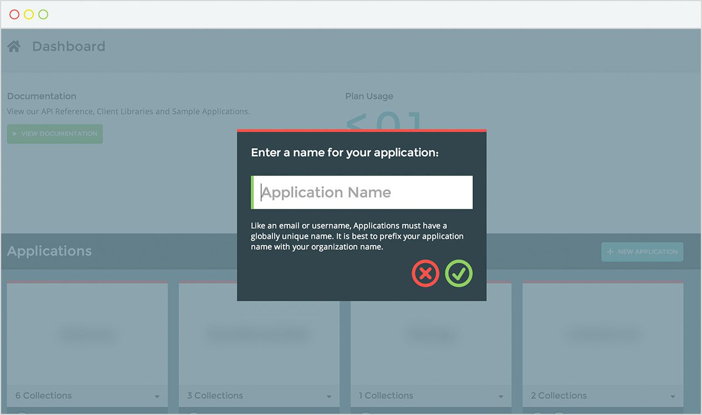
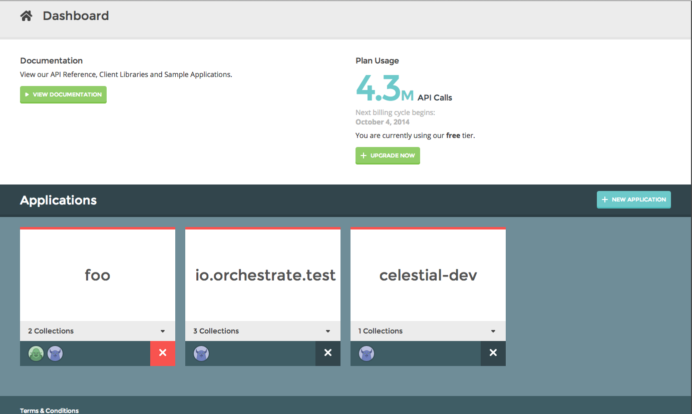
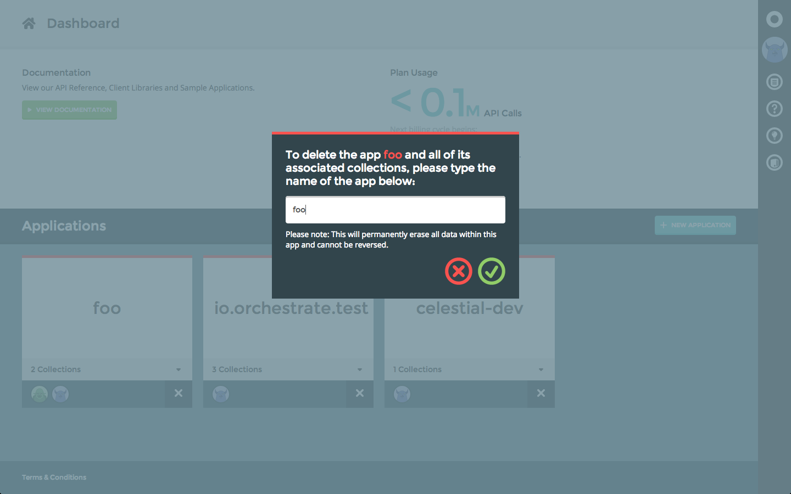
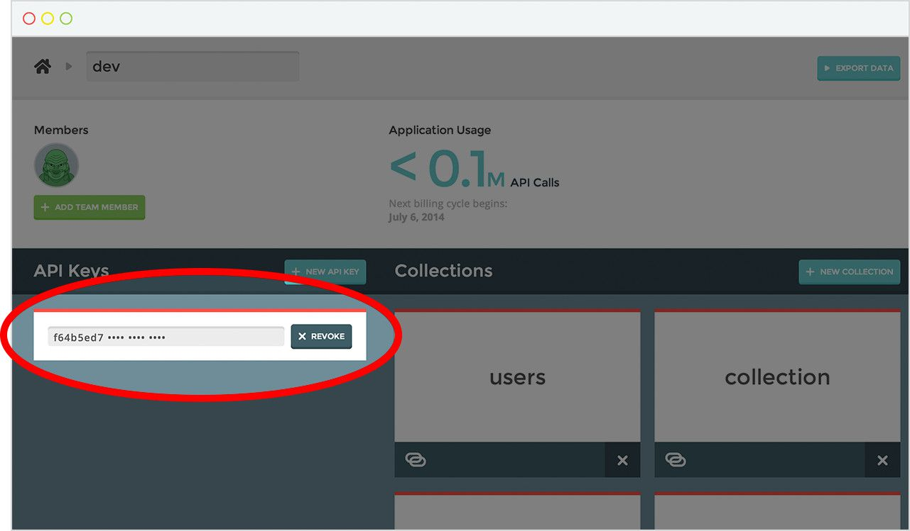

{{{
  "title": "Getting Started with Orchestrate",
  "date": "4-20-2015",
  "author": "Adam DuVander",
  "attachments": [],
  "related-products" : [],
  "contentIsHTML": false,
  "sticky": true
}}}

Orchestrate unifies multiple databases through a simple REST API. It runs as a service and supports queries like full-text search, time series events, graph relations, geographic queries, and key/value.

This articles gives a quick overview of terminology and initial steps required to use Orchestrate. Optionally you can take the [dashboard walk-through](./walkthrough) or skip straight to the [full Orchestrate documentation](https://orchestrate.io/docs).

### Create your account
It's easy to create an account with Orchestrate. Just visit the [Orchestrate Dashboard](https://dashboard.orchestrate.io/users/register).

### Create an application
Once you have an account, you can create a new application through the [Orchestrate Dashboard](https://dashboard.orchestrate.io). Every application on Orchestrate must have a unique name. It's best to prefix your application name with your organization name (My Company: Awesome App).

#### Deleting an application
To delete an application, you must login to the [Orchestrate Dashboard](https://dashboard.orchestrate.io). In the bottom right hand corner click the "X".

You must confirm that you want the application deleted, by typing its name and clicking the green checkmark. Once you delete an application, the application name becomes available again.

### API Keys
An **API Key** is a code passed from your application to our API that identifies your application. Keys should be kept secure and should not be made available publicly. An API Key is automatically generated for your application when you create it.

### Collections
Collections are a grouping of the JSON objects you will store and query. Collections are similar to tables in a relational database or buckets in object storage.

With some basic understanding of Orchestrate, dive into the
[Key / Value documentation](https://orchestrate.io/docs/key-value) on Orchestrate's website.
