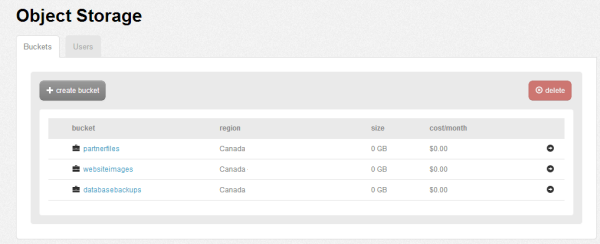
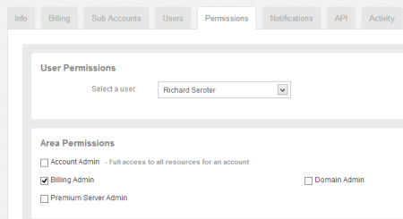
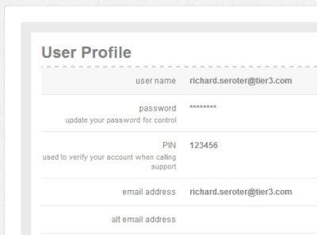
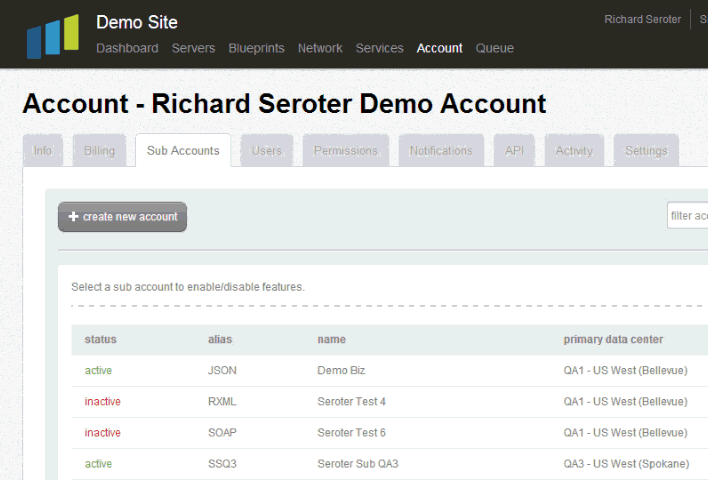
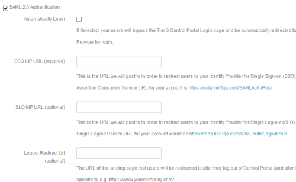

{{{
  "title": "Cloud Platform – Release Notes: May 29, 2013",
  "date": "10-29-2014",
  "author": "Richard Seroter",
  "attachments": []
}}}

### New Features (2)

* **CenturyLink Cloud Object Storage.** CenturyLink Cloud is proud to release an entirely new offering on the platform. Object Storage &mdash; built on the Enterprise-class Riak CS product &mdash; gives customers a highly-available, redundant location to store objects of any kind. Use it for server backups, Microsoft Office files, website images, media files, and much more.

  

* **Billing User Role.** The platform now supports a class of users who only have permission to view billing settings, browse invoices, and change billing details.

  

### Minor Enhancements (5)

* **PIN attribute added to user records and used when requesting support through ZenDesk Voice.** CenturyLink Cloud is using ZenDesk Voice for those seeking platform support, and want to ensure that the user's identity can be confirmed with more than just their user name. All users who contact CenturyLink Cloud through ZenDesk voice will be required to provide this PIN number to the CenturyLink Cloud support engineer.</strong>

    

* **API supports un-suspending a user account.** CenturyLink Cloud API users can now suspend users and accounts, and unsuspend users and accounts programmatically.</li>

* **Users can disable/enable sub-accounts from the Control Portal.** In the last release, we added the ability to view all accounts, whether enabled or disabled. In this release, we've made it possible to quickly change the status of an account to either disabled or enabled.
  

* **SAML Single Sign On supports "log out" capability.** Users can use single sign-on via SAML to access the CenturyLink Cloud Control Portal. In this release, we've added the ability to log users out of the Identity Provider (IdP). Users can also be redirected to a designated website upon logout.
  

* **API supports date filter range to only retrieve servers that have changed in a certain time period.** In order to help customers better synchronize CenturyLink Cloud server changes with internal configuration management systems, we've added a new set of API operations that let users retrieve a list of servers that have changed since a certain date. The following server actions trigger a change to the server's "last updated" timestamp: power operations (pause/power on/reboot/reset/power off/shutdown), add public IP, release public IP, create snapshot, delete snapshot, revert snapshot, archive, restore from archive, add custom field value, delete custom field value, install software, deploy package, run script, set maintenance mode, change RAM, change CPU, change storage.

For a demo of these features, please visit: <a href="http://www.slideshare.net/Tier3Cloud/new-product-releasemay2013final">http://www.slideshare.net/Tier3Cloud/new-product-releasemay2013final</a>.

