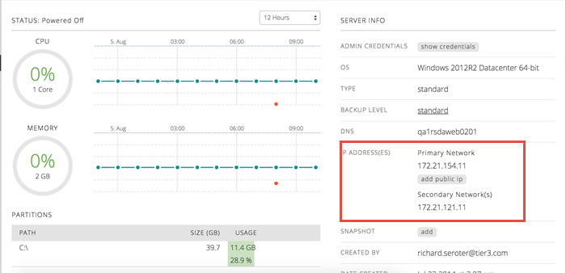
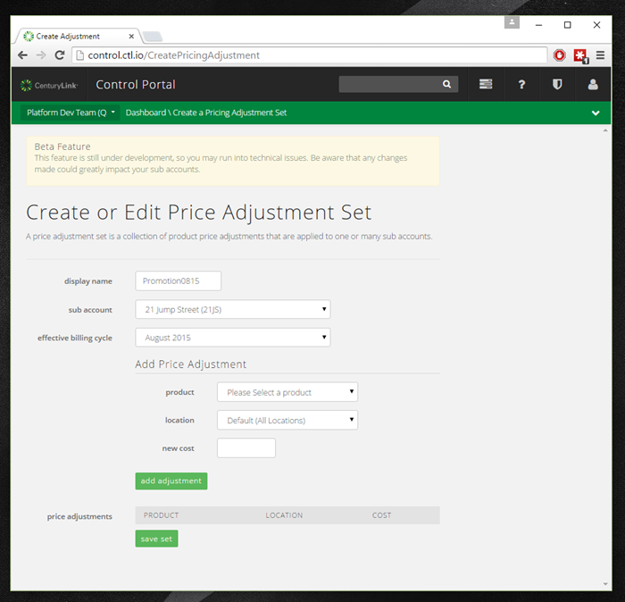
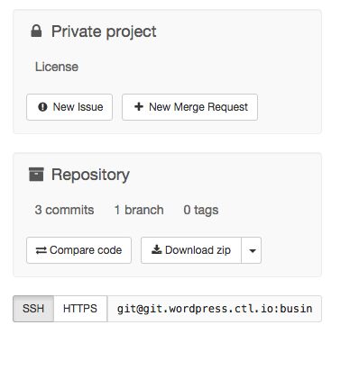
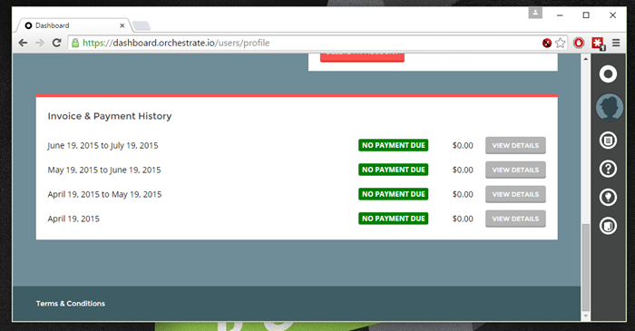

{{{
"title": "Cloud Platform - Release Notes: August 11, 2015",
"date": "8-11-2015",
"author": "Richard Seroter",
"attachments": [],
"contentIsHTML": false
}}}

### New Features (4)

* __Multi-NIC for virtual machines.__ Add up to four virtual network interfaces to a single VM, via API. Use this feature to programmatically add or remove vNICs in separate VLANs - especially useful for virtual appliances and advanced topologies. Multi-NIC configuration details will appear in the Control Portal and in API calls. For more information, refer to the API documentation for adding secondary network adapters and removing secondary network adapters.

  __NOTE: Two functions are not supported for VMs with additional NICS: "clone" and "convert to template.__  
    

* __Database as a Service: MySQL Limited Beta Release.__ Beta program starts August 14th! Participants in the program will be able to subscribe to a MySQL-compatible DBaaS instance through our User Interface or via AppFog. Users will instantly receive a connection to an active MySQL instance with a click of a button. We offer the option to secure the connection using a provided self-signed certificate. In addition, we will maintain daily backups held locally for 7 days. For more information, visit our product page on the CenturyLink Cloud website.

* __Custom Price Sheets ("Name Your Own Price") - Limited Preview.__ Account Administrators and Billing Managers can now configure custom price sheets for cloud services on a monthly basis. IT departments can use this capability for internal chargeback/showback scenarios; resellers can also offer custom or promotional pricing for selected services. To access this feature, login and go directly to [https://control.ctl.io/createPricingAdjustment](https://control.ctl.io/createPricingAdjustment). __Watch for additional functionality that will greatly improve usability!__  
  

* __WordPress Service: Local WordPress Development Environment built with Vagrant.__ Minimize downtime in production with a local dev environment for your Wordpress deployment! Our WordPress sites now include a fully functional local development environment built on [Vagrant](https://www.vagrantup.com/) and [VirtualBox](https://www.virtualbox.org/wiki/Downloads).  Simply [clone your new site using Git](https://www.ctl.io/knowledge-base/wordpress/wordpress-site-updates-with-git/), and run "vagrant up". Your local environment will match the technical configuration of your Production site, giving you confidence that changes tested in DEV will deploy to PROD successfully.  See our new [KB article](https://www.ctl.io/knowledge-base/wordpress/wordpress-local-development/) for more information on how to get started.

### Enhancements (8)

* __Invoicing API.__ Use a [modern API endpoint](https://www.ctl.io/api-docs/v2/#billing-get-invoice-data-for-an-account-alias) to retrieve cloud usage information for a given billing period. Supply an account alias and date, and pull back detailed information about your cloud invoice.

* __Bare Metal servers available in Europe.__ Building upon last month's launch of [pay-as-you-go Bare Metal servers](https://www.ctl.io/bare-metal/) in Virginia, we've turned up the service in a London-area data center. Provision servers for your workloads that require the isolation and performance of physical machines.

* __Cloud managed backup available in IL1.__ Get more control of your cloud server data backups by deploying [cloud managed backup](https://www.ctl.io/managed-services/backup/), now available in our Chicago-area data center.

* __WordPress Service: Zero Downtime Blue-Green Site Deployments.__ Now, when doing a [Git push to deploy](https://www.ctl.io/knowledge-base/wordpress/wordpress-site-updates-with-git/) updates to a WordPress site, our system will keep your existing site up and fully operational during the deployment.  Your site visitors may continue to use the existing site during the deployment.  When the deployment is complete, our system will seamlessly re-route traffic away from your original site to your newly updated site.

* __WordPress Service: Git SSH protocol now available.__ We now offer SSH access to our WordPress Git repositories, in addition to HTTPS.  Upload your public SSH key to Git, and avoid having to supply HTTPS credentials with Git operations.  See our new [KB article](https://www.ctl.io/knowledge-base/wordpress/wordpress-git-ssh/) to get started.  
  

* __WordPress Service: Performance tuning enhancements to Nginx and PHP.__ Faster site performance is now available with new PHP opcode caching and Nginx FastCGI caching settings in our platform.  These settings take effect by default for any new WordPress sites, and can be enabled for existing WordPress sites by performing a [Git push to deploy](https://www.ctl.io/knowledge-base/wordpress/wordpress-site-updates-with-git/) to update the site.

* __Orchestrate: View invoice and payment history from the Dashboard.__ Database customers can now view their individual invoices and payment history from within the Orchestrate dashboard's "account settings."  
  

* __Standalone, unmanaged Apache Spark Blueprint.__ Spark is part of the Apache Hadoop ecosystem and has been a part of our [Managed Hadoop](https://www.ctl.io/managed-services/cloudera/) offering for some time.  Spark powers a stack of libraries including SQL and DataFrames, MLlib for machine learning, GraphX, and Spark Streaming to give the user a powerful application for data analytics.  Spark can be used in conjunction with database systems outside the pure HDFS (Hadoop) environment.  This release will allow the user to connect Spark to their data set of choice and make use of the powerful Spark tools.

### Ecosystem: New Blueprints (1)

* __[Pivotal CF](https://www.ctl.io/knowledge-base/ecosystem-partners/marketplace-guides/getting-started-with-pivotal-cloud-foundry/)__ - This month we introduce an exciting new integration with Pivotal Software, offering a [simple blueprint deployment](https://www.ctl.io/knowledge-base/ecosystem-partners/marketplace-guides/getting-started-with-pivotal-cloud-foundry/) for the Pivotal Cloud Foundry framework. Enterprise architects and development managers seeking DevOps transformation look to Pivotal as the market leader for elastic runtime and microservices. The CenturyLink Cloud makes it easy to get started.  Our integration with Pivotal results in a flexible Private PaaS environment which elastically consumes IaaS resources from CenturyLink as needed.  Our integration with Pivotal makes it easy to get started with a number of software development services:

  __Pivotal Operations Manager__ - Operations Manager is the orchestration tool and web console that customers use to deploy and manage their hosted Pivotal Cloud Foundry PaaS within CenturyLink Cloud.  From this system, a series of development tools can be quickly deployed, administered, and managed - reducing IT operational overhead and increasing visibility.

  __Pivotal Elastic Runtime__ - This core element of the Cloud Foundry framework makes it faster and easier to build, test, deploy and scale applications.  Customers who use a Private PaaS model are assured that only their applications will run inside their virtual infrastructure pool - adding another layer of risk mitigation and control to their environment.

  __Pivotal CF Mobile Services__ - Pivotal provides consumer-grade, mobile backend services that customers can make part of their application environment with just a few clicks.  Deployed via Operations Manager and connected to the Elastic Runtime, mobile features can be quickly developed for push notifications, data synchronization, app distribution and API gateways.

  __Pivotal Spring Cloud Services for CF__ - This package of server-side components offers up battle-tested application components that can be rolled into any application project.  Pivotal includes such powerful open-source features such as Spring Cloud Netflix and Spring Cloud Config, which puts cloud-native application patterns in the hands of the enterprise developer.

  This [continues our momentum](https://www.ctl.io/blog/post/centurylink-building-platform-momentum-with-cloudfoundry/) in the Cloud Foundry community, and complements our major enhancements to the [AppFog](https://www.ctl.io/appfog/) service.  Individual developers and work teams that want fast access to an elastic runtime environment can use our [AppFog](https://www.ctl.io/appfog/) service to get started quickly.  Enterprise architects and development managers who want a more customizable environment look to Pivotal as the market leader for elastic runtime and microservice architecture.  Since both offerings are based around Cloud Foundry - our users get the best of both worlds.

### Open Source Contributions (2)

* __[Zodiac](https://labs.ctl.io/zodiac-easy-container-deployment-rollback/)__ - We've launched Zodiac, a lightweight CLI tool for easy deployment and rollback of dockerized applications. Integrates with Docker tooling (Compose, Swarm). See wiki notes [here](https://github.com/CenturyLinkLabs/zodiac/).

* __[Panamax.io](http://panamax.io/)__ - Added support for VirtualBox 5.0 and Vagrant 1.7.3+ to installer; UI integration with ImageLayers. Release notes here: [Panamax Installer v0.6.5](https://github.com/CenturyLinkLabs/panamax-coreos/blob/master/CHANGELOG.md#changelog) and [Panamax UI v0.2.21](https://github.com/CenturyLinkLabs/panamax-ui/blob/master/CHANGELOG.md#changelog)
