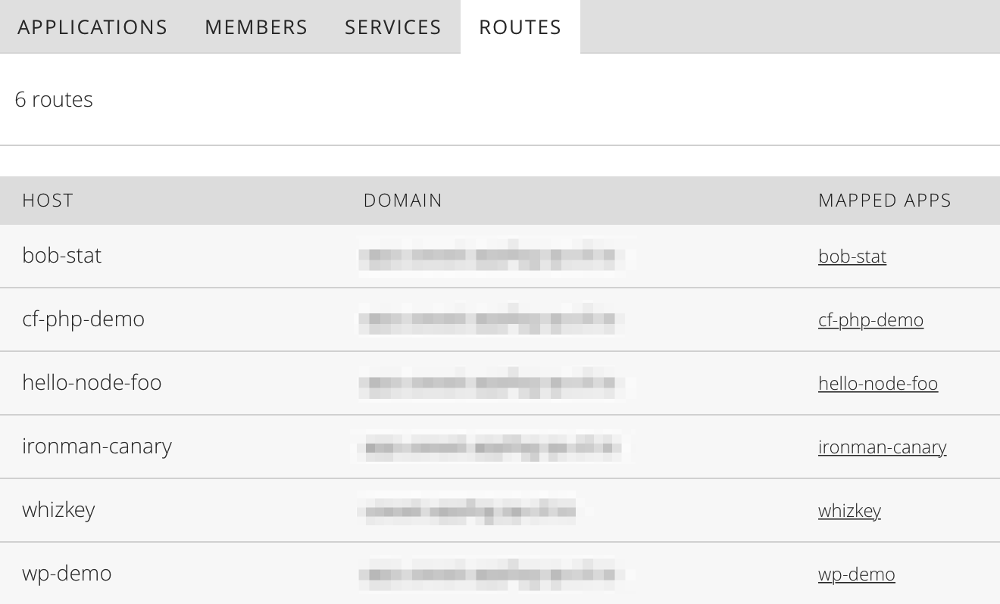
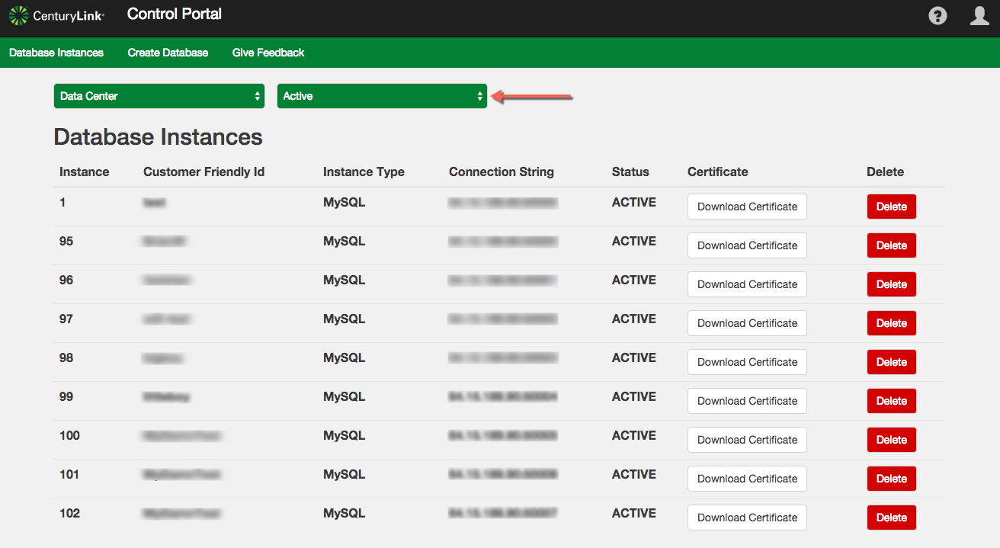

{{{
"title": "Cloud Platform - Release Notes: November 3, 2015",
"date": "11-03-2015",
"author": "Chris Sterling",
"attachments": [],
"contentIsHTML": false
}}}

### New Features (TODO)

* __AppFog.__ The [AppFog](https://www.ctl.io/appfog/) team has been busy this release and are delivering a few new capabilities in the Control Portal:
  
  * __Scale AppFog apps from Control__. AppFog apps can be scaled up or down from the control portal. Select the amount of memory, number of instance, and see a cost estimate for the change.
  
  

  * __Delete AppFog apps from Control.__ Easily delete defunct AppFog applications from the control portal.
  
  

  * __List all of an apps routes.__ All of an AppFog space's routes can now be displayed in the control portal.
  
  

### Enhancements (TODO)

* __Cloud Platform.__ The CenturyLink Cloud platform updates include:
  * __Subaccounts in the Service Catalog__. Administrators now have the ability to create and view sub-accounts using the CenturyLink Cloud Service Catalog.
  * __Reboot Message Upon Storage Removal.__ Users that remove a storage volume from a cloud server will now see a reboot required" message.
  * __Set Your Own Price: Default Price Sheet.__ Users with System Billing Manager privileges (or above) can now create a "default" price sheet that can then be inherited by all sub-accounts.

* __Windows 2008 R2 OS Template Updates.__ The following templates were updated with the latest vendor recommended patches. These enhancements add functions and make servers less susceptible to security vulnerabilities. The updates are live for both Windows 2008 R2 Standard and Windows 2008 R2 DataCenter.

* __New Blueprint - Cloudera (Unmanaged).__ Cloudera Express can now be deployed via Blueprints. This version is unmanaged, and designed for users interested proof of concept deployments.

* __Bare Metal.__ Administrative passwords for bare metal servers can now be updated from the Control Portal.

* __Managed MySQL Version Upgrade.__ The Managed MySQL version on CenturyLink Cloud has been updated to version 5.6.24.

* __SafeHaven.__ Stability enhancements were introduced:
    * The Storage Backing Device (SBD) now re-sends relevant metadata to the remote location during the Protection Group (PG) creation. This also improves the reliability of of ROW-COW PG creation.
    * Stability has improved when connecting to iSCSI targets, as well as when adding iSCSI database items during the on-boarding of Ubuntu 12.

### Early Adopter Program Updates (3)

* __MySQL Limited Beta__. This service has several new features available, including:
  * __Additional Instance Sizes__. Beta users can now select from four sizes: micro, small, medium, and large. The sizes range from 1 CPU / 1 GB RAM / 1 GB storage all the way to 4 CPU / 16 GB RAM / 256 GB storage.
  * __Backup location & encryption__. The daily backups that are part of the service are now de-coupled from their original VMs, and encrypted.
  * __New default URL for sites.__ Newly created MySQL DBaaS sites are now given the default domain of `[customer-specified-db].datacenter.dbaas.ctl.io`.
  * __New filters.__ The listing of your DB instances now allows you to filter based on status, specifically `active` and `terminated`.

  

  For more information and to sign up for the beta, visit our [product page on the CenturyLink Cloud website](https://www.ctl.io/dbaas/).

* __WordPress Limited Beta.__ The WordPress Beta is continuing to evolve based on program participant feedback and production environment learnings. A few of the recent enhancements:
    + __Integration with CenturyLink Cloud object storage buckets.__ Users can now link CenturyLink Cloud object storage buckets to a WordPress site during site creation. This helps with persistent storage of image uploads, and other media files.
    + __SMTP Email Support.__ Each new WordPress site now has SMTP email configured automatically to assist with administrative emails such as password resets, new accounts, and other emails sent from WordPress.

  For more information and to sign up for the beta, visit our [product page on the CenturyLink Cloud website](https://www.ctl.io/wordpress/).

* __Intrusion Prevention Limited Beta.__ The Intrusion Prevention Beta service now supports additional Windows versions. Customers can now use IPS on the following Windows operating systems:
  * Microsoft Windows Server 2008 Standard R2 (64-bit)
  * Microsoft Windows Server 2008 Enterprise (64-bit)
  * Microsoft Windows Server 2008 Enterprise R2 (64-bit)
  * Microsoft Windows Server 2012 Datacenter (64-bit)
  * Microsoft Windows Server 2008 Datacenter R2 (64-bit)
  * Microsoft Windows Server 2012 Datacenter (64-bit)
  * Microsoft Windows Server 2012 Datacenter R2 (64-bit)

  For more information and to sign up for the beta, visit our [product page on the CenturyLink Cloud website](https://www.ctl.io/intrusion-prevention-service/).

### Online Tools (1)

* __Customers can now choose their "home" datacenter during free trials & online sign-up.__ New customers [signing up via the web](http://www.ctl.io/free-trial/) can now choose one of several public cloud sites as their "home" location. Previously, each new account was assigned the VA1 location by default.

### Ecosystem: Selected New Blueprints from the Bitnami Library (5)

* __[Bitnami](https://bitnami.com/centurylink)__ Over the past few months, we’ve been working on integration between the Bitnami “stacks” library of open source software and our Blueprint orchestration.  This release we are excited to announce full integration [between the two libraries](https://www.ctl.io/knowledge-base/search/?q=bitnami+site%3Ahttps%3A%2F%2Fwww.ctl.io%2Fknowledge-base%2F), bringing the full power of Bitnami’s software automation to CenturyLink customers.  Although Bitnami’s software installation expertise can be applied to many different commercial products, their initial focus has been making open source software easier to install.  This allows CenturyLink users of varying skill levels the ability to solve business problems with open source software, such as:

    * __[Open Atrium](http://openatrium.com/)__ Open Atrium is collaboration software that enables organizations to securely connect their teams, projects, and knowledge. This framework allows any team to easily integrate with existing software solutions, while remaining flexible enough to change as the organization grows. CenturyLink users can use [this Blueprint](../Ecosystem Partners/Marketplace Guides/getting-started-with-openatrium-blueprint.md) to get started quickly with an intranet, social collaboration , web portal, or learning management project.

    * __[LimeSurvey](https://www.limesurvey.org/en/)__ LimeSurvey enables users to create online surveys and extract valuable information from the output. LimeSurvey offers an unlimited number of surveys at the same time, unlimited participants, configurable questions and survey content, all inside an easy WYSIWYG editor. CenturyLink users can use [this Blueprint](../Ecosystem Partners/Marketplace Guides/getting-started-with-limesurvey-blueprint.md) to get started quickly deploy their own surveys in minutes.

    * __[Open Project](https://www.openproject.org/)__ Everyone loves Project Managers! Right? OK, well at CenturyLink we know that the lifeblood of a good PM is knowledge. OpenProject is a free and open source collaboration software for project management with a wide set of features and plugins and an active international community. Using [the CenturyLink Open Project Blueprint](../Ecosystem Partners/Marketplace Guides/getting-started-with-openproject-blueprint.md), you can spin up your own private project management solution very fast. Show your Project Managers some love!

    * __[Discourse](http://www.discourse.org)__ Discourse is the next-next-generation community forum platform, deployable via [CenturyLink Cloud Blueprint](../Ecosystem Partners/Marketplace Guides/getting-started-with-discourse-blueprint.md). Discourse has a thoroughly modern design and is written in JavaScript. Page loads are very fast and new content is loaded as the user scrolls down the page. Discourse allows CenturyLink users to create categories, tag posts, manage notifications, create user profiles, and includes features to let communities govern themselves by voting out trolls and spammers. Discourse is built for mobile from the ground up and support high-res devices.

    * __[phpBB](https://www.phpbb.com/)__ Forums are very popular on the internet and the majority are powered by phpBB, an open-source, flat-forum bulletin board software solution. Able to organize a small group of people or power an entire website user base, phpBB software allows customized, engaging experiences with any forum of users. CenturyLink Cloud users can [deploy the phpBB Blueprint](../Ecosystem Partners/Marketplace Guides/getting-started-with-phpbb-blueprint.md) to spin a new site up in minutes. Consider spinning up your own phpBB forum instead of a Facebook group.

### Selected Bug Fixes (3)

* __Deleting a Site-to-Site VPN with an identical subnet configuration__...no longer deletes all Site-to-Site VPNs with the shared subnet configuration.

* __Adding Storage Volumes when Building Servers__...would in rare cases fail due to resource limits being incorrectly enforced. That no longer happens.

* __Associating anti-affinity policies with when creating hyperscale servers__...will now work more reliably.
