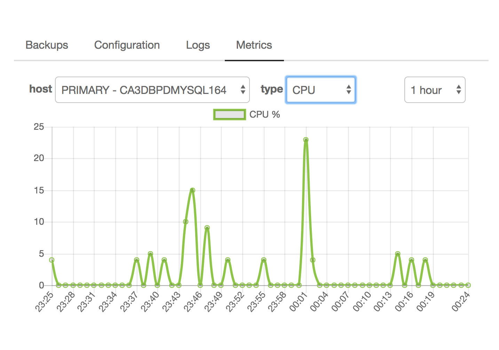

{{{
"title": "Cloud Platform - Release Notes: November 17, 2017",
"date": "11-16-2017",
"author": "John Gerger",
"attachments": [],
"contentIsHTML": false
}}}

### New Features (3)

* __MSSQL Relational DB is now Live!__

  Product Highlights include:
- MSSQL 2016 - Web, Standard, and Enterprise Editions
- Datacenter availability: NY1, VA1, UC1, IL1, AU1, CA3, GB1, GB3, SG1 (Germany coming soon)
- Cross-datacenter or inter-datacenter replication (Block Replication)
- Push-button failover (if replication is purchased)
- Singular connection string for either replica via DNS
- Visibility into replication status and server health
- Fast, reliable backups to local storage, then written to off-site storage
- Server metrics available in real-time & history (CPU, Disk, Memory)

  For more information, please visit: https://www.ctl.io/relational-database/relational-db-mssql/

* __MySQL Relational DB Updates__

- Now available in GB1
- Server metrics for CPU, Disk and Memory are now available in the UI.  Users can view real-time metrics as well as historical views.

__Cloud Application Manager__

* __Application Lifecycle Management__

  Cloud Application Manager Script Boxes now supports a new type of variable called Multi Options. This new variable type has a similar behavior than the existing Options variable type, but with the ability to select multiple selected values, either as default value or later as an actual value.

### Enhancements (1)

__Simple Backup__

* __Simple Backup Wildcard Restores__

   Based on customer feedback, the Simple Backup team has released the ability to use a wildcard during selective restores. The wildcard can be part of the filename or directory path, providing maximum flexibility for our users.

* __Simple Backup Anywhere__

  Simple Backup Anywhere has added support for AWS AMI Linux servers. For more information on Simple Backup Anywhere, please see our [KB Articles](https://www.ctl.io/knowledge-base/backup/backup-anywhere/)

### Announcements (3)

__Public Cloud IaaS__

* __GB1 Datacenter Announcement__

  As part of normal service operation, CenturyLink evaluates the CenturyLink Cloud platform resources for capacity, performance and connectivity constraints.  Over the past 12 months, CenturyLink has identified that our GB1 node, in the outer suburbs of London, was running on first generation hardware and would benefit from a hardware refresh.  However, our physical facility did not have the physical space necessary to facilitate an in-place expansion.  CenturyLink solved this problem by expanding the GB1 architecture across our high-capacity network to one of our other on-net datacenter facilities.

  CenturyLink is happy to have successfully completed this significant upgrade to the GB1 node.  Customer instances in GB1 are now running in Reading on our latest-generation hyper-converged, hardware platform.  Our approach to capacity expansions is to make them completely in the background, as is expected of a cloud service.  Extensive network engineering focus and planning went into ensuring all resources were auto-balanced into the upgraded infrastructure seamlessly, without downtime or impact to customer instances.  Since the upgrade was completed, we have seen significant performance improvements and have confirmed this with benchmarking by Cloud Spectator, who showed a significant performance of our GB1 node compared to the prior assessment conducted in May 2017 on the older node architecture.

  We recognize that this capacity expansion, while beneficial to customer application performance, has changed the physical location of GB1-hosted workloads.  If this alteration to the geography of the CenturyLink Cloud platform introduces any issues around node deployment patterns, we would be happy to work with customers on alternatives which leverage other parts of our global footprint.

* __Removed 3PAR QOS 4 for Utility Storage__

  Customers will no longer be able to order 3PAR QOS 4 when ordering Utility Storage when using the DCC UI or SavvisStation Portal.

* __Notice of Microsoft SQL Server Fee Change__

  *The following notice was sent to all MSSQL clients on Thursday, November 16th.*  

  Beginning [60 days following notice date], 2018, the service fees for Microsoft SQL Server on CenturyLink Cloud will change. As a result of a recent rate increase notification from Microsoft, we have re-evaluated our pricing for Microsoft SQL Server and are implementing the following price change to account for the increase and adjust based on the overall market .
  Customers will be billed the following new rate for any existing and new Microsoft SQL Server deployments.

  

  Should you have additional questions, please contact your Sales Representative or email help@ctl.io.

### Bug Fixes (1)

__DCC General Bug Fixes__

* __DCC Core - CPU/Memory Utilization__

  Fixed CPU/Memory utilization differences between what is displayed in SavvisStation Portal and the new DCC UI.
