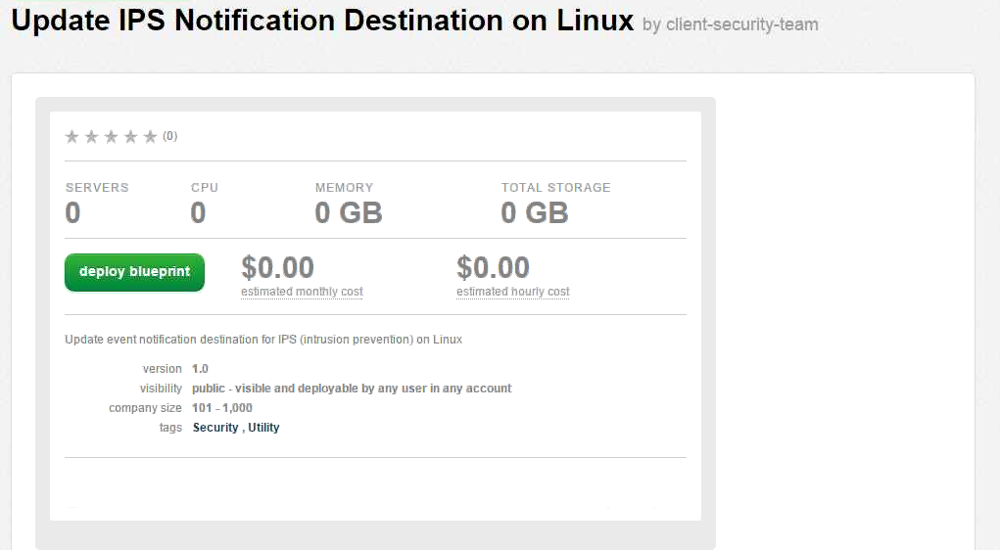
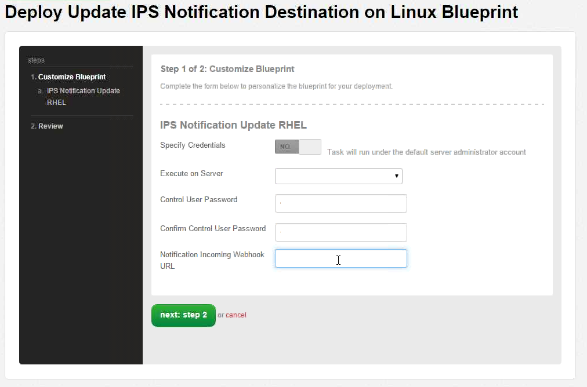

{{{
  "title": "Configuring Intrusion Prevention System (IPS) Notifications",
  "date": "09-21-2015",
  "author": "Sean Robb",
  "attachments": [],
  "related-products" : [],
  "contentIsHTML": false,
  "sticky": false
}}}

### Overview

The Platform CenturyLink IPS utilizes an Agent installed on your Virtual Machine (VM) that will monitor that VM for suspicious activity. If suspicious activity is found, the Agent will log it and may block or stop the activity, and will report it based on the IPS policy. There is a default policy associated to each VM that is automatically tuned based on the host operating system and installed applications.

The Blueprint allows a customer that has purchased the IPS service from Platform CenturyLink to modify how they would like to be notified regarding IPS security events. This Blueprint will only change **Slack** notification settings for the server it is run against.

Our API allows for a customer to set notification destinations for either **Slack** or **Sys Log**.  

### Prerequisites

* A CenturyLink Cloud Account
* Virtual Machine with CenturyLink Intrusion Prevention Agent installed
* Slack channel & WebHook URL [(See Utilizing SLACK for IPS Event Notifications)](utilizing-slack-for-ips-event-notifications.md)

### Supported Managed Operating Systems

* Red Hat Enterprise Linux 5 (64-bit only)
* Red Hat Enterprise Linux 6 (64-bit only)
* Microsoft Windows Server 2008 Standard R2 (64-bit only)
* Microsoft Windows Server 2008 Enterprise (64-bit only)
* Microsoft Windows Server 2008 Enterprise R2 (64-bit only)
* Microsoft Windows Server 2012 Datacenter (64-bit only)
* Microsoft Windows Server 2008 Datacenter R2 (64-bit only)
* Microsoft Windows Server 2012 Datacenter (64-bit only)
* Microsoft Windows Server 2012 Datacenter R2 (64-bit only)

### Configuration Process via Blueprints

1. Search for **IPS Notification** in the Blueprint library. Then, click on the desired Operating System blueprint to configure Notifications.

  

   

2. Click on the **deploy blueprint** button.

  

3. Select the appropriate Virtual Machine to execute on.

  * Enter and confirm User Password
  * Provide WebHook URL [(See "Utilizing SLACK for IPS Event Notifications")](utilizing-slack-for-ips-event-notifications.md)
  * Click **next: step 2.**

  

4. Review the blueprint parameters and select **deploy blueprint**.

  

5. The Blueprint log will show each step taken and its status during provisioning.

  

6. An email notification will be sent to the initiator of the Blueprint for both queuing and completion.

### Configuration Process via our API

Sets a destination for all IPS event notifications to be sent to. Calls to this operation must include a token acquired from the authentication endpoint. See the [Login API](https://www.ctl.io/api-docs/v2/#authentication-login) for information on acquiring this token.

#### URL

##### Structure

>PUT http://api.client-security.ctl.io/ips/api/notifications/{accountAlias}/{serverName}
>
>'[
>   {
>       "url":{some URL},
>       "typeCode":{endpoint type}
>   }
>]'

#### Request

##### URI Parameters

| **Name**     | **Type** | **Description**                                               | **REQ.**|
|--------------|----------|---------------------------------------------------------------|---------|
|accountAlias  |string    |Short code for a particular account                            |Yes      |
|serverName    |string    |The name of the server that the destination should be set for. |Yes      |

##### Content Properties

| **Name**                | **Type** | **Description**                      | **REQ.** |
|-------------------------|----------|--------------------------------------|----------|
|notificationDestinations |array     | List of Notification Destinations    |Yes       |       

##### Notification Destination Definition 

| **Name** | **Type** | **Description**                                                            | **REQ.** |
|----------|----------|----------------------------------------------------------------------------|----------|
|url       |string    |The URL endpoint for notification.                                          |Yes       |
|typeCode  |string    |This is the type of destination. For Slack it should be WEBHOOK or SYSLOG.  |Yes       |

##### Example

>PUT http://api.client-security.ctl.io/ips/api/notification/ALIAS/VA1ALIASMYSVR01
>
> '[
>   {
>     "url":"http://my.slack.webhook",
>     "typeCode":"WEBHOOK"
>   }
> ]'

We use the Postman client when making rest calls.  Here is an

### Frequently Asked Questions

**What is a WebHook?**

WebHook is an HTTP callback: an HTTP Post that occurs when something happens.

**Are there other formats or WebHooks available?**

Not at this time. If you would like to recommend another, please send request details to [features@cti.io](mailto:features@ctl.io).

**Do you retain the data after the event notification is sent?**

Yes, we retain the data for 60 days.  If you need a longer data retention period, we are working on additional add-on functionality to store this data.  If you are interested, please send request details to [features@ctl.io](mailto:features@ctl.io).

**Are you storing the full payload in another location?**

Yes, we retain the data in another location for 60 days.

**Do you support a text message or paging service?**

No, but we are happy to review any request sent to [features@ctl.io](mailto:features@ctl.io).
