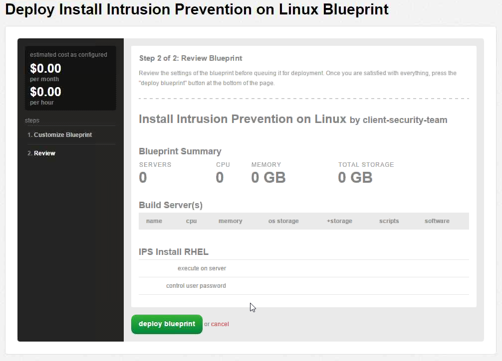

{{{
  "title": "IPS - Getting Started",
  "date": "02-28-2016",
  "author": "Client-Security",
  "attachments": [],
  "contentIsHTML": false,
  "sticky": true
}}}

### Overview
The Platform CenturyLink IPS utilizes an Agent installed on your Virtual Machine (VM) that monitors the VM for suspicious activity. If suspicious activity is found, the Agent logs the activity, which it may block or stop, and reports the incident based on the IPS policy. There is a default policy associated with each VM that is automatically tuned based on the host operating system and installed applications.

We currently support two methods for installing and uninstalling our IPS Agent on your VM.  The first method is via Blueprint (shown below).  The second method is via command line show here [IPS Anywhere](../Security/ipsAnywhere.md). We support any Cloud provider, along with Hybrid Clouds, and Internal Private Clouds.

The Blueprint method shown below installs and activates the IPS agent on your VM. We also provide a Blueprint for uninstalling the IPS agent on your VM.

### Prerequisites
* A CenturyLink Cloud Account
* One of the Supported Operating Systems listed below on the Virtual Machine
* Add the following Firewall Rules to allow agent download, activation and management from target machine.

  * dsm.client-security.ctl.io 443/tcp
  
  * activate.dsm.client-security.ctl.io 443/tcp
  
  * relay.dsm.client-security.ctl.io 443/tcp
  
  * api.client-security.ctl.io/ips/scripts/install.sh 443/tcp

  * api.client-security.ctl.io/ips/scripts/uninstall.sh 443/tcp

*  If utilizing syslog notificaitons, add the following rules to the firewall that the Syslog server sits behind

  * dsm01.client-security.ctl.io 514/udp
  
  * dsm02.client-security.ctl.io 514/udp

### Supported Managed Operating Systems
Current supported operating systems can be found here [Operating System Support](../Security/supported-ips-oses.md)

### Installation Process

1. Go into the **Blueprints Library**.

  

2. Search for **Install Intrusion Prevention** in the Refine Results section. Then, click **Install Intrusion Prevention on Linux** or **Install Intrusion Prevention on Windows**.  

   

3. Click the **deploy blueprint** button.  

  

4. From the **Execute on Server** drop down list, select the appropriate virtual machine. Enter and confirm the User Password.  Click the **next: step 2** button.  

  

5. Review the Blueprint parameters and click **deploy blueprint**.  

  

  **Note:** The Blueprint displays each step taken and its status during provisioning.  

  

6. An email notification is sent to the initiator of the Blueprint for both queuing and completion.

### Agent Billing & Deactivation

Once the IPS Agent is installed on a VM, it will incur an hourly charge until the uninstall blueprint is executed successfully.

**Note:** If a VM is to be decommissioned, the agent MUST be deactivated to avoid on-going charges.

### Support

If you need assistance, please send initial contact to [help@ctl.io](mailto:help@ctl.io). You will receive an automated reply with step-by-step instructions on setting up a Zendesk user account. The Zendesk account will allow for future engagements with customer service.

**Note:** If you do not setup a Zendesk user account, support requests may get filtered as spam in the ticketing system.

### Frequently Asked Questions

**Can I make modifications to my existing policy to further customize or tune it?**

Not at this time, if you'd like to see this feature, please contact [features@ctl.io](mailto:features@ctl.io).

**What does the IPS Product Provide?**

Platform CenturyLink's IPS service helps ensure secure protection against your Virtual Machine (VM) from known intrusion patterns that hackers utilize. It also allows you to spend less time on the maintenance of your system, instead allowing you to focus on the tasks for your core business.  We will ensure that all IPS agents have up-to-date signatures to prevent possible attacks.

**How do I configure the notifications settings to send alerts?**

Follow the process in the [Configuring IPS Notifications article](configuring-ips-notifications.md).

**Will you be adding support for additional Operating Systems?**

Yes, we are working on adding additional OSes. If you have a specific OS you would like to see supported, please contact features@ctl.io.

**If I decommission a Virtual Machine, do I need to uninstall the IPS agent?**

Yes, you still need to uninstall the IPS agent to avoid unnecessary charges. You can uninstall the agent via the uninstall IPS blueprint.
