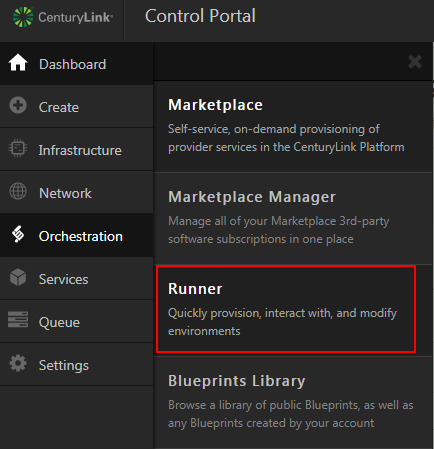
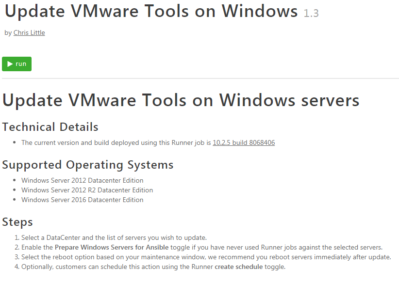

{{{
  "title": "Self-Service Updates of VMware Tools",
  "date": "12-5-2017",
  "author": "Aaron LeMoine",
  "attachments": [],
  "related-products" : [],
  "contentIsHTML": false,
  "sticky": true
}}}

### Description

VMware Tools is a suite of services and drivers supplied by VMware.  These services facilitate communication between CenturyLink Cloud's VMware vSphere environment and your server (virtual machine).  VMware Tools also provides drivers for memory management, NICs, storage, etc.  These drivers are optimized for use in a virtualized environment.  

Please note that keeping current with VMware Tools is not mandatory in order to receive support for your server in our environment.  VMware supports a wide variety of versions of VMWare Tools with each version of vSphere.  Because of this, an installed version of VMware Tools receives support for a long time.  There are times when a version of VMware Tools contains a bug that is fixed in a later release.  If you encounter the bug condition, it is recommended to upgrade.  As we lifecycle our infrastructure, we may encounter a condition where your version of VMware Tools is so old that it is no longer supported by our current version of vSphere.  If this happens, it will be necessary for you to upgrade to a newer version.

If you would like to update the version of VMware Tools on your servers, this is now available as a self-service task.  This article will discuss the steps needed for you to complete this upgrade.

### Support
* If you have any issues with the steps below please contact help@ctl.io

### Prerequisites
* Administrative access to servers
* Customers are advised to [Create a snapshot](./creating-and-managing-server-snapshots.md) if possible prior to any changes.
* Customers should plan a maintenance window for their systems to perform a reboot post update.

### Detailed Steps for Windows Servers using Automation

1. Within the [Control Portal](https://control.ctl.io/) navigate to **Orchestration > Runner** in the menu.

    

2. Select the **Update VMware Tools on Windows** Runner job by using the **Search** function or browsing the directory of public jobs.

    

3. Review the **Update VMware Tools on Windows** runner job supported operating systems and step-by-step instructions carefully.

4. Select **Run** and populate the Runner job with the location, servers and other choices in the job. Optionally, use the scheduler to set the update to occur as a specific date/time.

### Detailed Steps for Windows Servers using manual methodology
To update VMware Tools for Windows, you can download them from VMware's website and run the .exe installer. You can run the installer interactively or silently. It is recommended that you reboot after installation.

1. [Download the latest version from VMware's website](https://packages.vmware.com/tools/releases/latest/windows/x64/index.html)

2. Double-click on the downloaded .exe file to run the installer interactively.

3. Reboot the server.

### Detailed Steps for Linux Servers

To update them for Linux, updates should be made available through vendor repositories.  Please contact help@ctl.io for assistance if your Linux server does not connect to a repository properly.  RedHat servers will receive updates from CenturyLink Cloud's RHUI environment.  CentOS, Ubuntu and other Debian variants will receive updates from their respective vendors.

1. If possible, create a server snapshot.
2. Download and install the latest version from your vendor's repository using yum or apt-get.
3. Reboot the server.
