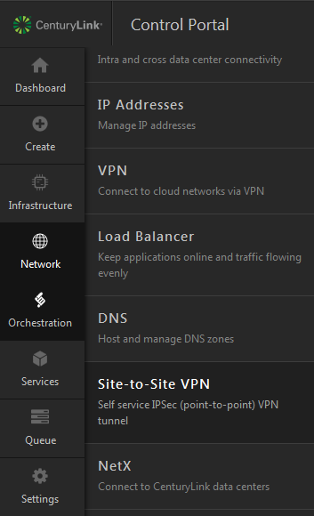

{{{
  "title": "Create Site-to-site VPN between CLC and AWS",
  "date": "01-31-2018",
  "author": "Anshul Arora",
  "attachments": [],
  "contentIsHTML": false
}}}

###  Overview
This guide will walk through the different scenarios of connecting to an AWS environment using Site to Site VPN, inlcuding connecting to new VPC, existing VPC through console and using a basic CloudFormation template.

### Create a Site to Site VPN in CenturyLink Cloud

First is to obtain the public IP address of the CenturyLink Cloud VPN gateway, this can be obtained from CenturyLink Cloud portal under Network -> Site to Site VPN.  
  
The CenturyLink Cloud end point IP address will be displayed once the desired data center is chosen (see below):
  
Once the IP address is collected, the next step will be creating the VPN connection for AWS.  Depending on the situation, one of the following steps will be required in order to establish the VPN connection:
1. For a new AWS environment, a new VPC will be required
2. An existing AWS enironment with VPC, a Virtual Private Gateway is needed

### Create VPC  
1. Login to your AWS Console.

2. Go to **Services**. Click on VPC.

3. Click on **Start VPC Wizard**  

4. Select **VPC with Public and Private Subnets and Hardware VPN Access**. Click **Select**.     
   * Enter **IPv4 CIDR block** . This is going to be a /16 IP block that will be created under the VPC.   
     **IPv6 CIDR Block** : Select the defaul option, **No IPv6 CIDR Block**.  
     Enter **VPC name**.  

   * Enter **Public subnet's IPv4 CIDR**. Enter a /24 IP block to use for the public subnet. This subnet should be within the range of        /16 IP clock specied in step a.  
     Select an **availability zone** for the subnet.
     Enter the **Public subnet name**

   * Enter **Private subnet's IPv4 CIDR**. Enter a /24 IP block to use for the private subnet. This subnet should be within the range        of /16 IP clock specied in step a.  
     Select an **availability zone** for the subnet.   
     Enter the **Private subnet name**.

   * Click **Next**.

5. Configure your VPN.  
   * Enter **Customer Gateway IP**.   
     To find this information, login to [Centurylink Portal](https://control.ctl.io/)   
     Click on **Network** > **Site-to-site VPN**  
     Click **+site to site vpn**  
     Select the right datacenter in front of **Control portal site**  
     Copy the **VPN Peer IPv4 address** and paste it in **Customer Gateway IP** in AWS.

   * Enter **Customer Gateway name** and **VPN Connection name**.  

   * Change **Routing type** to **Static**

   * Go back to CLC **Site to Site VPN** page to get the **IP prefix**.
     Click on **Add Network Block**. Select the **Network** and **subnet size**. click **Add network block**.
     Copy the IP address in fron of **Tunnel Encrypted Subnets** and paste it under **IP prefix** in AWS.  

   * Click **Create VPC**. This will initiate the VPC.

   * Click **ok**  
     Select the newly created VPC.
     click **VPN Connections**.  
     At the bottom left of the screen. Under tunnel details you can see the 2 tunnels created. The status will be down because CLC side      of the tunnel has not been configured yet

### Continue the VPN Configuration on CLC
1. Go back to the site-to-site VPN page in CLC cloud.

2. Enter **Site Name** and **Device Name**(can be any name).  

   **VPN Peer IPv4 Address** will the outside IP of tunnel 1 under AWS Tunnel details.  

3. **Tunnel Encrypted Subnets** : Click **Add network block**. This is the private subnet from the AWS VPC. Go back to the AWS cloud, and click on **Subnets** on the left side under **Virtual Private Cloud**.  

   Select the Private subnet under new VPC, and copy the **IPv4 CIDR** from under Summary. Go back to CLC page and paste this IP under      Tunnel encrypted subnets.   

4. Click **next: phase 1**   

#### Phase 1
1. Go back to AWS page, and click on **VPN Connections**. Click **Download Configuration**. Change the vendor to **pfsense** and click **Download**. From the configuration file, you can find all the AWS VPN configuration values. Make sure you copy the configuration for Tunnel 1 and not Tunnel 2.  

2. Copy the **pre-shared key** from the file and paste it in CLC in fron of **Pre-Shared Key**. Scroll down and click on **next: phase 2**

#### Phase 2  
1. You can keep the default values:  
**IPEC Protocol** ESP  
**Encryption Algorithm**: AES-128   
**Hashing Algorithm**: SHA1(96)    
**PFS Enabled**: ON, Group 2  
**Lifetime Value**: 1 hour  

2. Click **Finish**.  

3. Wait for the VPN job to finish, you can monitor the job by clicking on Status.  

4. Go back to AWS page, click on **VPN connections**. The first tunnel should now be **UP**.  

### NAT Gateway.
The private subnet needs to be routed using a NAT Gateway.

#### Elastic IP
1. Click on **Elastic IPs** on the left side onder **Virtual Private Cloud**.  

2. Click on **Allocate new address**.  Click **Alocate**  

3. This will privision a new Elastic IP. Click **Close**.

#### Create a NAT Gateway
1. Click on **NAT Gateways** on the left side.  

2. For **Subnet**, select the public subnet that was created with the VPC.  

3. For **Elastic IP Allocation ID**, Select the elastic IP that we created in previous section.  

4. Click **Create a NAT Gateway**

#### Edit Route Tables
1. Click **Edit route tables**.  

2. Select the route table with 0 associated subnets and the VPC that we created.  

3. Click on **Routes** tab.  

4. Click **Edit**.  

5. Click **Add another route**.  
   Under **destination**, enter 0.0.0.0/0. Undedr **target**, select the NAT Gateway created in previous section.  
   Click **Save**.  

6. Click on **Subnet Associations** tab.  

7. Click **Edit**.  

8. Select the private subnet, and click **Save**.  

This concludes the setup of VPN between Centurylink Cloud and AWS cloud.

To configure security groups, please follow [configure security groups](security-group.md)

### Video Tutorial  
<iframe width="560" height="315" src="https://www.youtube.com/embed/BcRTgbuj2Fo" frameborder="0" allow="autoplay; encrypted-media" allowfullscreen></iframe>
