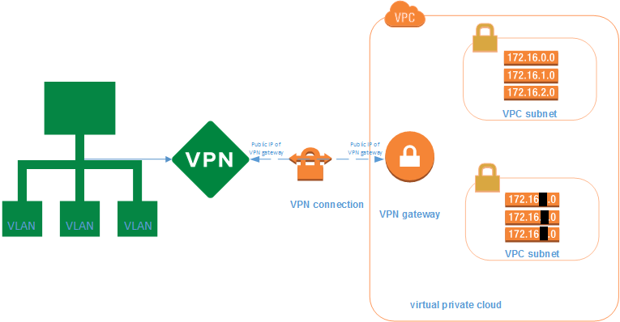
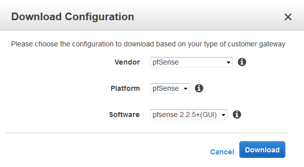

{{{
  "title": "Create Site-to-site VPN between CLC and AWS",
  "date": "03-06-2018",
  "author": "Gavin Lai",
  "attachments": [],
  "contentIsHTML": false
}}}

### Table of contents

* [Overview](#overview)
* [Create a Site to Site VPN in CenturyLink Cloud](#create-a-site-to-site-vpn-in-centurylink-cloud)
* [Use Case Scenarios](#use-case-scenarios)
* [Preparation](#preparation)
* [Deployment](#deployment)
* [Testing](#testing)
* [Troubleshooting](#troubleshooting)
* [Support](#support)

###  Overview
This guide will walk through the different scenarios of connecting to an AWS environment using Site to Site VPN, inlcuding connecting to new VPC, existing VPC through console and using a basic CloudFormation template.

### Create a Site to Site VPN in CenturyLink Cloud

Before creating the VPN, a network diagram below would help to identify the VLANs in CenturyLink cloud and the subnets in AWS to communicate over the site to site VPN.  

  

First is to obtain the public IP address of the CenturyLink Cloud VPN gateway, this can be obtained from CenturyLink Cloud portal under Network -> Site to Site VPN.  Detail is for the CenturyLink Cloud Site to Site VPN setup is available here.

  

The CenturyLink Cloud end point IP address will be displayed once the desired data center is chosen (see below):

  

Once the IP address is collected, the next step will be creating the VPN connection for AWS.  Depending on the situation, one of the following steps will be required in order to establish the VPN connection:

1. For a new AWS environment, a new VPC will be required
2. An existing AWS enironment with VPC, a Virtual Private Gateway is needed

A quick view on the configuration on the AWS side:
### Create VPC  
1. In the AWS console, go to **Services**. Click on VPC and select the appropriate AWS region.

2. Click on **Start VPC Wizard**

3. Select either **VPC with Private Subnets and Hardware VPN Access** or **VPC with Public and Private Subnets and Hardware VPN Access**. Click **Select**.     
   * Enter **IPv4 CIDR block** . This is going to be a /16 IP block that will be created under the VPC.   
     **IPv6 CIDR Block** : Select the defaul option, **No IPv6 CIDR Block**.  
     Enter **VPC name**.  

   * (if required) Enter **Public subnet's IPv4 CIDR**. Enter a /24 IP block to use for the public subnet. This subnet should be within the range of /16 IP clock specied in step a.  
     Select an **availability zone** for the subnet.
     Enter the **Public subnet name**

   * Enter **Private subnet's IPv4 CIDR**. Enter a /24 IP block to use for the private subnet. This subnet should be within the range        of /16 IP clock specied in step a.  
     Select an **availability zone** for the subnet.   
     Enter the **Private subnet name**.

   * Click **Next**.

5. Configure your VPN.  
   * Enter **Customer Gateway IP** using the public IP of the CenturyLink VPN gateway obtained from first step.   

   * Enter **Customer Gateway name** and **VPN Connection name**.  

   * Change **Routing type** to **Static**

   * Enter the IP address of the CenturyLink Cloud VLAN(s) that needs to be communicated over the VLAN and paste it under **IP prefix** of Static Routes in AWS.  

   * Click **Create VPC**. This will initiate the VPC.

   * Click **ok**  
     Select the newly created VPC.
     click **VPN Connections**.  
     At the bottom left of the screen. Under tunnel details you can see the 2 tunnels created. The status will be down because CLC side of the tunnel has not been configured yet

Once the VPN is created, go to the **VPN Connections** page under **VPC** of AWS portal, click on **Download Configuration**.  Pick either "Generic" or "pfSense" from the drop down menu, as both are text file configuration.  Please take note of the following parameters for the CenturyLink Cloud side VPN configuration:
  
```
  Your VPN Connection ID 		  : vpn-xxxxxxxx
  Your Virtual Private Gateway ID  : vgw-xxxxxxxx
  Your Customer Gateway ID		  : cgw-xxxxxxxx
  Remote Gateway: xxx.xxx.xxx.xxx
  Description: Amazon-IKE-vpn-xxxxxxxx-0
  Pre-Shared Key: xxxxxxxxxxxxxxxxxxxxxxxxxxxxx
  Phase 1
  Encryption algorithm : aes128
  Hash algorithm :  sha1
  DH key group :  2
  Lifetime : 28800 seconds
  NAT Traversal : Auto
  Deed Peer Detection : Enable DPD
  Phase 2
  Protocol : ESP
  Encryption algorigthms :aes128
  Hash algorithms : sha1
  PFS key group :   2
  Lifetime : 3600 seconds
```

### With an Existing VPC###
1.	Under VPC, Virtual Private Gateways, create a VPG for the VPC if one does not exist
2.	Once it is created, create a VPN connection under VPC on AWS portal
3.	Provide
  a.	Name Tag
  b.	Virtual Private Gateway that the VPN is connecting
  c.	Customer Gateway (New for CenturyLink Cloud)
  i.	IP can be found in Create VPN page on CenturyLink Cloud (1 per data center)
  d.	BGP ASN (leave as default)
  e.	Routing option: Static
  i.	Enter CenturyLink Cloud Network(s) that needs to communicate with AWS environment
  f.	Tunnel Options: default
4. Using the AWS VPN configuration file, with the information from the file, complete the VPN setup in CenturyLink Cloud Site to Site VPN setup

### Continue the VPN Configuration on CLC
1. From CenturyLink Cloud portal under Network -> Site to Site VPN.  Detail is for the CenturyLink Cloud Site to Site VPN setup is available here. Pick the VPN endpoint that is configured as part of the AWS VPN configuration and add the CenturyLink Cloud VLAN(s) as part of the VPN setup for **VPN Peer IPv4 Address**.
  

2. Enter **Site Name** (this can be the AWS VPN Connection ID) and **Device Name** (can be anything or using the AWS VPN ID).  

   **VPN Peer IPv4 Address** is the Remote Gateway from the configuration file.  

3. **Tunnel Encrypted Subnets** : Click **Add network block**. This is the private subnet from the AWS VPC.

4. Click **next: phase 1**   

Using the VPN configuration file downloaded to complete the next two step

#### Phase 1

1. **Protocol Mode** - Main
2. **Encryption Algorithm** - AES-128 (can be AES-128, AES-192, AES-256 or 3DES)
3. **Hashing Algorithm** - SHA1(96) (can be SHA1, SHA2 or MD5)
4. **Pre-Shared Key** - Shared Key from the AWS VPN configuration
5. **Diffie-Hellman Group** - Group 2
6. **Lifetime Value** - 8 hours
7. **DPD State** - ON
8. NAT-T State - OFF

#### Phase 2  
1. **IPEC Protocol** ESP  
2. **Encryption Algorithm**: AES-128   
3. **Hashing Algorithm**: SHA1  
4. **PFS Enabled**: ON, Group 2  
5. **Lifetime Value**: 1 hour  

Click **Finish**.  
Once the CenturyLink VPN is created, check on the AWS portal and click on **VPN connections**. The tunnel should now be **UP**.  


#### Edit Route Tables
1. Once VPN setup is completed, verify the VPC Route Tables is correct, either the default gateway or the CenturyLink subnets should be routed through the Virtual Private Gateway
2. Ensure Network ACL and Security Group are configured to allow traffic from the CLC network
  
  
3. Initiate “ping” or SSH from a CLC server to a server in the AWS network to validate the connectivity


This concludes the setup of VPN between Centurylink Cloud and AWS cloud.

To configure security groups, please follow [configure security groups](security-group.md)
