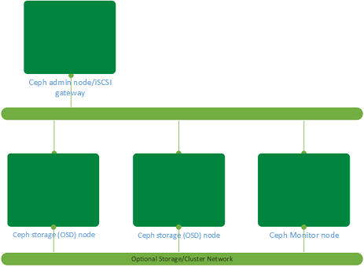
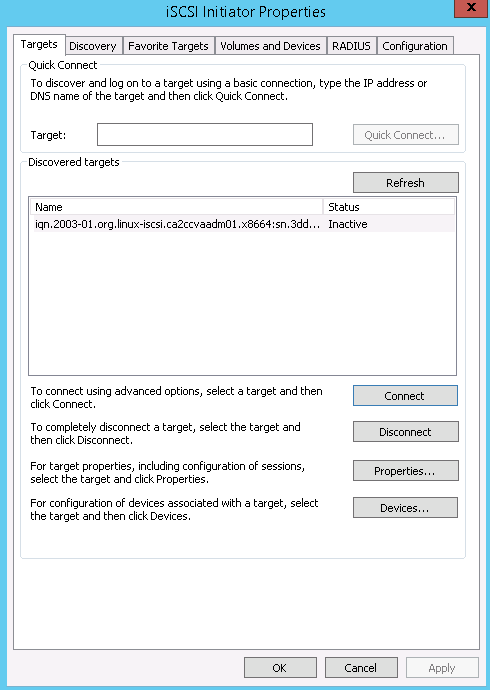
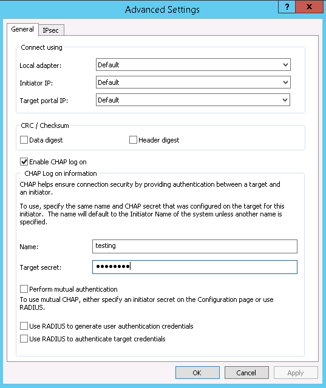

{{{
  "title": "CenturyLink Cloud Guide to iSCSI Ceph Block storage",
  "date": "01-13-2016",
  "author": "Gavin Lai",
  "attachments": [],
  "contentIsHTML": false
}}}

### Table of contents

* [Overview](#overview)
* [Prerequisites](#prerequisites)
* [Use Case Scenarios](#use-case-scenarios)
* [Creating the servers](#creating-the-servers)
* [Prepare the servers for Ceph Installation](#prepare-the-servers-for-ceph-installation)
* [Setting up the Administration Node using Ceph Hammer LTS release](#setting-up-the-administration-node-using-ceph-hammer-lts-release)
* [Installation of Ceph Cluster](#installation-of-ceph-cluster)
* [Setting up Storage node](#setting-up-storage-node)
* [Set up Block Storage Service](#set-up-block-storage-service)
* [Installation of iSCSI software and configure iSCSI target](#installation-of-iscsi-software-and-configure-iscsi-target)
* [Expanding the storage cluster](#expanding-the-storage-cluster)
* [Support](#support)


### Overview
Ceph is a free software storage platform that stores data in a distributed cluster.  It can provide a feature rich storage platform for Object Storage, Block Storage and File system to compliment CenturyLink Cloud storage offering.  This guide is a step by step guide to set up a Ceph Block storage cluster with iSCSI gateway.

### Prerequisites
-   Access to the CenturyLink Cloud platform as an authorized user
-   Identify the Network VLAN(s) for the public and storage/cluster network
-   Understanding of storage technology (for Ceph Specific knowledge, please refer to [Ceph's how to website](//docs.ceph.com/docs/master/))

### Use Case Scenarios
Ceph Block storage will iSCSI gateway can be used as shared storage for clusters and compute farm, dedicated storage for servers.  With its horizontal scalability, a storage platform larger than 4TB can be created.  In this use case, a 100GB redundant storage backend will be created with the iSCSI gateway.  Please see the diagram below:



### Creating the servers
Create a Ceph admin node, a monitoring node and two storage nodes to start the cluster deployment.

These servers can be created via the [Control Portal](//control.ctl.io), [API](//www.ctl.io/api-docs/v2/) or [CLI](//github.com/CenturyLinkCloud/clc-go-cli). Please refer to
the following articles: Create server using
[Portal](//www.ctl.io/knowledge-base/servers/creating-a-new-enterprise-cloud-server/),
[API](//www.ctl.io/knowledge-base/servers/using-the-api-to-create-and-then-manage-a-server/)
and [CLI](//github.com/CenturyLinkCloud/clc-go-cli).

For this example, all the servers are with 2 CPUs and 4 GB of memory using CentOS 7.x. The storage nodes will have a 100GB of raw partition as part of the installation.  An 100GB storage array is being created.

Example CLI to create the environment:
```
clc server create --name STOR --description "CEPH" --group-name CEPH
--template-name CENTOS-7-64-TEMPLATE --root-password xxxxxxxxx
--network-name PUBLIC_10.x.x.x/24 --cpu 2 --memory-gb 4 --type
standard --storage-type standard –additional-disks sizeGB=100,type=raw

clc server create --name STOR --description "CEPH" --group-name CEPH
--template-name CENTOS-7-64-TEMPLATE --root-password xxxxxxxxx
--network-name PUBLIC_10.x.x.x/24 --cpu 2 --memory-gb 4 --type
standard --storage-type standard –additional-disks sizeGB=100,type=raw

clc server create --name MON --description "CEPH" --group-name CEPH
--template-name CENTOS-7-64-TEMPLATE --root-password xxxxxxxxx
--network-name PUBLIC_10.x.x.x/24 --cpu 2 --memory-gb 4 --type
standard --storage-type standard

clc server create --name ADM --description "CEPH" --group-name CEPH
--template-name CENTOS-7-64-TEMPLATE --root-password xxxxxxxxx
--network-name PUBLIC_10.x.x.x/24 --cpu 2 --memory-gb 4 --type
standard --storage-type standard
```
The optional storage/cluster network can be created using [Add or Remove Network Interface to Server using Go CLI Knowledge Article](//www.ctl.io/knowledge-base/network/add-or-remove-network-interface-to-server-using-go-cli/).  

###Prepare the servers for Ceph Installation

Change hostname to the reflect the real hostname as ceph-deploy uses
hostnames to generate keys:
```
# grep HOSTNAME /etc/sysconfig/network | awk -F= '{print $2}' | tee
/etc/hostname

# hostname `grep HOSTNAME /etc/sysconfig/network | awk -F= '{print
$2}'`
```
Populate the /etc/hosts file of the administration node with all the
nodes in the environment.

Example:
```
# IPv4 Configuration

127.0.0.1 localhost
10.x.y.23 ceph-monitor-1.local ceph-monitor-1
10.x.y.19 ceph-admin-1.local ceph-admin-1
10.x.y.17 ceph-storage-1.local ceph-storage-1
10.x.y.22 ceph-storage-2.local ceph-storage-2

```
Make sure all the firewall ports are configured for Ceph nodes to
communicated with each others. The TCP ports required are as follows:

  |Node            | TCP ports required
  |----------------| -------------------------
  |Administration  | 80, 2003, and 4505-4506
  |Monitor         | 6789
  |OSD             | 6800-7300

To enable these ports:
```
# firewall-cmd --zone=public --add-port=80/tcp --permanent
# firewall-cmd --zone=public --add-port=2003/tcp --permanent
# firewall-cmd --zone=public --add-port=4505-4506/tcp --permanent

# firewall-cmd --zone=public --add-port=6789/tcp --permanent

# firewall-cmd --zone=public --add-port=6800-7300/tcp --permanent
# firewall-cmd --reload
```
Create a Ceph user on all the nodes (example user: cephuser):
```
# useradd -d /home/cephuser -m cephuser –p xxxxxxxxx

# echo "cephuser ALL = (root) NOPASSWD:ALL" | sudo tee
/etc/sudoers.d/cephuser

cephuser ALL = (root) NOPASSWD:ALL
```
From the admin node, setup the SSH key for remote management purpose:
```
# ssh-keygen

Generating public/private rsa key pair.
Enter file in which to save the key (/root/.ssh/id_rsa):
Created directory '/root/.ssh'.
Enter passphrase (empty for no passphrase): xxxxxxxx
Enter same passphrase again: xxxxxxxxx
Your identification has been saved in /root/.ssh/id_rsa.
Your public key has been saved in /root/.ssh/id_rsa.pub.
The key fingerprint is:
xx:xx:xx:xx:xx:xx:xx:xx:xx:xx:xx:xx:xx:xx:xx:xx root@cephadminnode
The key's randomart image is:
+--[ RSA 2048]----+
```
Copy the SSH key to the rest of the environment:
```
# ssh-copy-id cephuser@ceph-monitor-1

# ssh-copy-id cephuser@ceph-admin-1

# ssh-copy-id cephuser@ceph-storage-1

# ssh-copy-id cephuser@ceph-storage-2
```
Set up .ssh/config file for remote login without password
```
Host ceph-storage-1
 Hostname ceph-storage-1
 User cephs
Host ceph-storage-2
 Hostname ceph-storage-2
 User cephs
Host ceph-monitor-1
 Hostname ceph-monitor-1
 User cephs
Host ceph-admin-1
 Hostname ceph-admin-1
 User cephs
```
Enable SSH tty for ceph-deploy utility:
```
# sed -i '/requiretty/s/\^/#/' /etc/sudoers
```
To increase the amount of PID for the Ceph nodes:
```
# sysctl –w kernel.pid_max=4194303
```

### Setting up the Administration Node using Ceph Hammer LTS release

Assuming the /etc/hosts is up-to-date, install the Ceph repository on
the Administration node:
```
#rpm -Uhv http://ceph.com/rpm-%20hammer/el7/noarch/ceph-release-1-0.el7.noarch.rpm

#yum update -y && yum install ceph-deploy –y
```
Setup the cluster from the Administration node, as root create a
directory with the cluster name (ceph is used in this example):
```
# mkdir ~/ceph-cluster

# cd ~/ceph-cluster

#ceph-deploy new Initial_monitor_node_hostname
```
Once the script is completed, new files are created in \~/ceph-cluster.
Depending on the number of storage nodes in the initial configuration,
edit ceph.conf to reflect the number of OSD nodes (2 for this example)
and the public IP network address (if optional storage network is configured):
```
osd pool default size = 2
public network = x.x.x.x/xx
```
Once this is completed, the rest of the environment can be installed.

### Installation of Ceph Cluster

From the administration node:
```
#ceph-deploy install admin-node storage-node1 storage-node2
monitor-node1
```
Once completed, the monitoring node can be initialized with the
following command:
```
#ceph-deploy mon create-initial
```
### Setting up Storage node
```
#ceph-deploy disk list storage_node_name

[ceph-storage-1][INFO ] Running command: sudo /usr/sbin/ceph-disk
list
[ceph-storage-1][DEBUG ] /dev/sda :
[ceph-storage-1][DEBUG ] /dev/sda1 other, ext4, mounted on /boot
[ceph-storage-1][DEBUG ] /dev/sdb swap, swap
[ceph-storage-1][DEBUG ] /dev/sdc other, ext4, mounted on /
[ceph-storage-1][DEBUG ] /dev/sdd other, unknown

# ceph-deploy disk prepare ceph-storage-2:sdd ceph-storage-1:sdd

# ceph-deploy admin ceph-storage-1 ceph-storage-2 ceph-monitor-1
```
The cluster setup is completed, the following commands can be used to
verify the status of the cluster:
```
# ceph status

cluster 03ea01d3-c830-4382-9133-e9d955553d9f
 health HEALTH_OK
 monmap e1: 1 mons at {CA2CCVAMON01=10.56.171.19:6789/0}
        election epoch 2, quorum 0 CA2CCVAMON01
 osdmap e9: 2 osds: 2 up, 2 in
  pgmap v821: 64 pgs, 1 pools, 34660 MB data, 8669 objects
        69505 MB used, 122 GB / 189 GB avail
              64 active+clean    cluster 03ea01d3-c830-4382-9133-e9d955553d9f
     health HEALTH_OK
     monmap e1: 1 mons at {CA2CCVAMON01=10.56.171.19:6789/0}
            election epoch 2, quorum 0 CA2CCVAMON01
     osdmap e9: 2 osds: 2 up, 2 in
      pgmap v821: 64 pgs, 1 pools, 34660 MB data, 8669 objects
            69505 MB used, 122 GB / 189 GB avail
                  64 active+clean

# ceph health

HEALTH_OK
```
### Set up Block Storage Service

In this example, the administration node is used as the block storage
gateway, this can be installed on a separate server.
```
#ceph-deploy install ceph-admin-1

#ceph-deploy admin ceph-admin-1

# sudo chmod +r /etc/ceph/ceph.client.admin.keyring
```
This command will create a 50 GB block storage device using the Ceph
storage cluster and map to a pool iscsi-block1
```
# rbd create blkstor1 --size 51200

# rbd map blkstor1 --pool iscsi-block1 --name client.admin
```
A new device /dev/rbd0 would be created as a result from the commands
above, a simple ‘ls’ command can verify the result.

### Installation of iSCSI software and configure iSCSI target
```
#yum install targetcli targetd scsi-target-utils –y
```
Using targetcli to configure the iSCSI target:
```
#targetcli
targetcli shell version 2.1.fb37
Copyright 2011-2013 by Datera, Inc and others.
For help on commands, type 'help'.
/> cd backstores/block
/backstores/block> create iscsi1 /dev/rbd0
Created block storage object iscsi1 using /dev/rbd0.

/backstores/block> ls
o- block
...................................................................
[Storage Objects: 1]
o- iscsi1 ............................ [/dev/rbd0 (50.0GiB) write-thru
deactivated]

/backstores/block> cd ..

/> cd iscsi

/iscsi> set discovery_auth enable=0

/iscsi> create
Created target
iqn.2003-01.org.linux-iscsi.ceph-admin-1.x8664:sn.3dd05d87600a.
Created TPG 1.
Global pref auto_add_default_portal=true
Created default portal listening on all IPs (0.0.0.0), port 3260.

/iscsi> cd
iqn.2003-01.org.linux-iscsi.ceph-admin-1.x8664:sn.3dd05d87600a/

/iscsi/iqn.20....3dd05d87600a> ls
o- iqn.2003-01.org.linux-iscsi.ceph-admin-1.x8664:sn.3dd05d87600a
..................... [TPGs: 1]
o- tpg1 ................................................................
[no-gen-acls, no-auth]
o- acls
...........................................................................
[ACLs: 0]
o- luns
...........................................................................
[LUNs: 0]
o- portals
.....................................................................
[Portals: 1]
o- 0.0.0.0:3260
......................................................................
[OK]

/iscsi/iqn.20....3dd05d87600a> cd tpg1/

/iscsi/iqn.20...5d87600a/tpg1> cd luns

/iscsi/iqn.20...00a/tpg1/luns> create /backstores/block/iscsi1
Created LUN 0.

/iscsi/iqn.20...00a/tpg1/luns> cd ../acls

/iscsi/iqn.20...00a/tpg1/acls> ls
o- acls
...............................................................................
[ACLs: 0]
```

In order to configure the Access Control List, an iSCSI initiator name
is required. In this example a Windows host is used to mount the iSCSI
LUN.
```
/iscsi/iqn.20...00a/tpg1/acls> create
iqn.1991-05.com.microsoft:ca3ccva2take02
Created Node ACL for iqn.1991-05.com.microsoft:ca3ccva2take02
Created mapped LUN 0.

/iscsi/iqn.20...00a/tpg1/acls> cd
iqn.1991-05.com.microsoft:ca3ccva2take02

/iscsi/iqn.20...a3ccva2take02> set auth userid=testing

Parameter userid is now 'testing'.

/iscsi/iqn.20...a3ccva2take02> set auth password=password

/iscsi/iqn.20...00a/tpg1/acls> exit
Global pref auto_save_on_exit=true
Last 10 configs saved in /etc/target/backup.
Configuration saved to /etc/target/saveconfig.json
```
Once the configuration is completed, the iSCSI target service need to be
enabled with the firewall configured:
```
#firewall-cmd --permanent --add-port=3260/tcp

#firewall-cmd –reload

#systemctl enable target

#systemctl start target
```
The iSCSI storage can be authenticated using CHAP. The screen-shots below
show the Windows iSCSI initiator configuration:





Once connected, the iSCSI drive can be used as a block storage device.

### Expanding the storage cluster
Ceph cluster can be expanded by adding more nodes into the cluster.  This also increases the serviceability of the storage environment as storage nodes can be added or removed from the cluster without impacting production.  
By following the steps from [Creating the servers](#creating-the-servers),
[Prepare the servers for Ceph Installation](#prepare-the-servers-for-ceph-installation) to prepare a new storage node.  Once completed, on the Ceph administration node, run:
```
# ceph-deploy install ceph-storage-3
:
:
[ceph-storage-3][DEBUG ] Complete!
[ceph-storage-3][INFO  ] Running command: sudo ceph --version
[ceph-storage-3][DEBUG ] ceph version 0.94.5 (9764da52395923e0b32908d83a9f7304401fee43)
```
Then run the following to verify the storage node (sdd is the additional storage)
```
# ceph-deploy disk list ceph-storage-3
[ceph_deploy.conf][DEBUG ] found configuration file at: /root/.cephdeploy.conf
[ceph_deploy.cli][INFO  ] Invoked (1.5.28): /usr/bin/ceph-deploy disk list ceph-storage-3
[ceph_deploy.cli][INFO  ] ceph-deploy options:
[ceph_deploy.cli][INFO  ]  username                      : None
[ceph_deploy.cli][INFO  ]  verbose                       : False
[ceph_deploy.cli][INFO  ]  overwrite_conf                : False
[ceph_deploy.cli][INFO  ]  subcommand                    : list
[ceph_deploy.cli][INFO  ]  quiet                         : False
[ceph_deploy.cli][INFO  ]  cd_conf                       : <ceph_deploy.conf.cephdeploy.Conf instance at 0x7fd5e92eb4d0>
[ceph_deploy.cli][INFO  ]  cluster                       : ceph
[ceph_deploy.cli][INFO  ]  func                          : <function disk at 0x7fd5e92e2c08>
[ceph_deploy.cli][INFO  ]  ceph_conf                     : None
[ceph_deploy.cli][INFO  ]  default_release               : False
[ceph_deploy.cli][INFO  ]  disk                          : [('ceph-storage-3', None, None)]
[ceph-storage-3][DEBUG ] connection detected need for sudo
[ceph-storage-3][DEBUG ] connected to host: ceph-storage-3
[ceph-storage-3][DEBUG ] detect platform information from remote host
[ceph-storage-3][DEBUG ] detect machine type
[ceph-storage-3][DEBUG ] find the location of an executable
[ceph_deploy.osd][INFO  ] Distro info: CentOS Linux 7.1.1503 Core
[ceph_deploy.osd][DEBUG ] Listing disks on ceph-storage-3...
[ceph-storage-3][DEBUG ] find the location of an executable
[ceph-storage-3][INFO  ] Running command: sudo /usr/sbin/ceph-disk list
[ceph-storage-3][DEBUG ] /dev/sda :
[ceph-storage-3][DEBUG ]  /dev/sda1 other, ext4, mounted on /boot
[ceph-storage-3][DEBUG ] /dev/sdb swap, swap
[ceph-storage-3][DEBUG ] /dev/sdc other, ext4, mounted on /
[ceph-storage-3][DEBUG ] /dev/sdd other, unknown
[ceph-storage-3][DEBUG ] /dev/sr0 other, unknown
```
Prepare the new storage to join the cluster:
```
# ceph-deploy disk prepare ceph-storage-3:sdd
# ceph-deploy admin ceph-storage-3
```
The new storage can now be used, to verify the expansion by:
```
# ceph status
cluster 03ea01d3-c830-4382-9133-e9d955553d9f
 health HEALTH_WARN
        28 pgs backfill
        10 pgs backfilling
        3 pgs stuck unclean
        recovery 9456/22431 objects misplaced (42.156%)
 monmap e1: 1 mons at {CA2CCVAMON01=10.56.171.19:6789/0}
        election epoch 2, quorum 0 CA2CCVAMON01
 osdmap e22: 3 osds: 3 up, 3 in; 38 remapped pgs
  pgmap v891: 64 pgs, 1 pools, 34660 MB data, 8669 objects
        72395 MB used, 214 GB / 284 GB avail
        9456/22431 objects misplaced (42.156%)
              28 active+remapped+wait_backfill
              26 active+clean
              10 active+remapped+backfilling
recovery io 192 MB/s, 48 objects/s
```
Similar process can be done for the additional storage and monitoring node to increase both redundancy and capacity of the environment.  
In order to take the full advantage of the features of Ceph, please refer to the [Ceph documentation website](//docs.ceph.com/docs/master/)

### Support
* For issues related to deploying Ceph, accessing the deployed software, please visit the [Ceph Website](//ceph.com/help/)
* For issues related to cloud infrastructure (VM's, network, etc), or is you experience a problem deploying any Blueprint or Script Package, please open a CenturyLink Cloud Support ticket by emailing [noc@ctl.io](mailto:noc@ctl.io) or [through the CenturyLink Cloud Support website](//t3n.zendesk.com/tickets/new).
