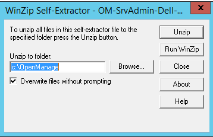
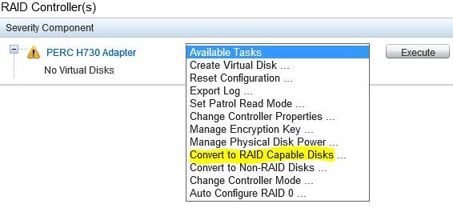
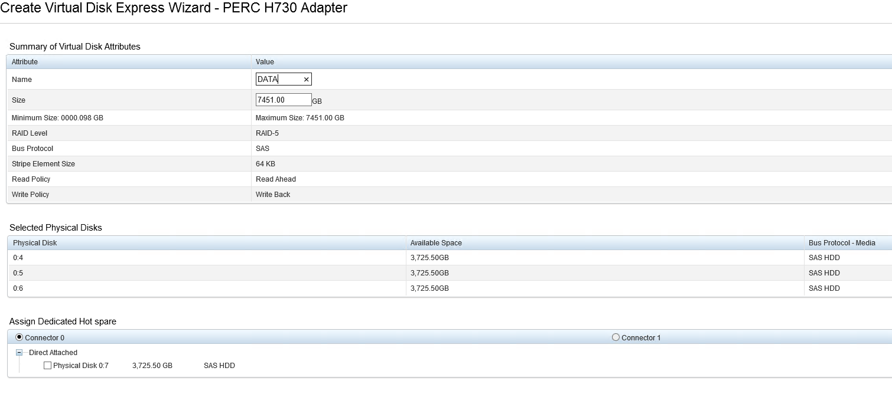

### Description

This will only apply to Bare Metal server types where configurable RAID/JBOD is supported. For additional information on which server support this feature refer to our [Bare Metal FAQ](link).

This article will walk you through how to use Dell's OpenManage Server Administrator tool on Bare Metal. By the end, you should be able to Create and Delete RAID volumes to meet your specific needs.

### Prequisite

-   Bare Metal server that supports configurable RAID/JBOD configuration.

### Steps

**Installing OMSA for Windows:**

1.  To start, download [OMSA install files.](http://www.dell.com/support/contents/us/en/04/article/Product-Support/Self-support-Knowledgebase/enterprise-resource-center/SystemsManagement/OMSA)

2.  Run and Extract

> 

1.  Run installer from C:\\OpenManage\\windows\\setup.exe

2.  Perform install

**Installing OMSA for CentOS/Red Hat:**

1.  \# wget -q -O - http://linux.dell.com/repo/hardware/dsu/bootstrap.cgi | bash

2.  \# yum install dell-system-update -y

3.  \# yum install srvadmin-all -y

4.  \# reboot

**Installing OMSA for Ubuntu:**

1.  \# echo 'deb http://linux.dell.com/repo/community/ubuntu trusty openmanage' | sudo tee -a /etc/apt/sources.list.d/linux.dell.com.sources.list

2.  \# gpg --keyserver pool.sks-keyservers.net --recv-key 1285491434D8786F

3.  \# gpg -a --export 1285491434D8786F | sudo apt-key add –

4.  \# apt-get update

5.  \# apt-get install srvadmin-all

6.  reboot

**Connecting to OMSA**

1.  To connect to OMSA, after installing go to

2.  You will be prompted to enter credentials. Use the administrator or root user and password to log in.

**Changing the RAID controller mode**

1.  Connect to OMSA

2.  To change controller mode click “Storage” and pick “Change controller mode” under available tasks and click Execute.

> 

1.  Change controller mode to desired mode and hit “Apply changes”. You can see the current controller mode on this page.

2.  Changing the controller mode requires a reboot.

3.  If you are changing from RAID to HBA mode, you will need to delete any security keys, and existing RAID volumes before it will let you switch to HBA mode. Don’t forget to convert your disks back to “Non-RAID disks”.

4.  Restart the machine.

**Creating a RAID volume**

1.  Connect to OMSA

2.  Before we can create a RAID we must convert the disks to RAID mode. Click storage, then under available tasks for the controller choose “Convert to RAID Capable Disks”

> 

1.  Select your disks you wish to create a RAID volume with and select apply.

2.  Now choose “Create Virtual Disk” from the Available task list.

> 

1.  Choose “Express Wizard” and choose your desired RAID level from the dropdown list and hit continue.

2.  Type in a name for your volume. Validate that all of the settings you expect are correct. Note that you may set up a hot spare at this time if you choose and your RAID setting allows it.

> 

1.  Once proceeding, you should have a new RAID volume available. You will need to format it, and assign it a drive letter before you can use it.

**Deleting a RAID Volume**

1.  Connect to OMSA

2.  Expand “Storage” -&gt; PERC H730 Adapter -&gt; Virtual Disks

3.  Choose “Delete” from the available tasks on the Virtual Disk you wish to delete.

> 

1.  It will warn you that all data will be lost. Confirm and your volume has been deleted.
