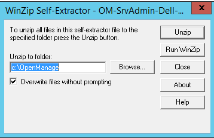
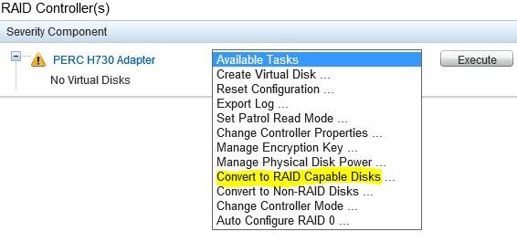
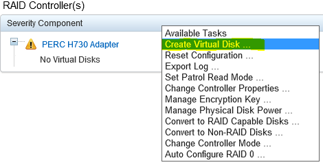
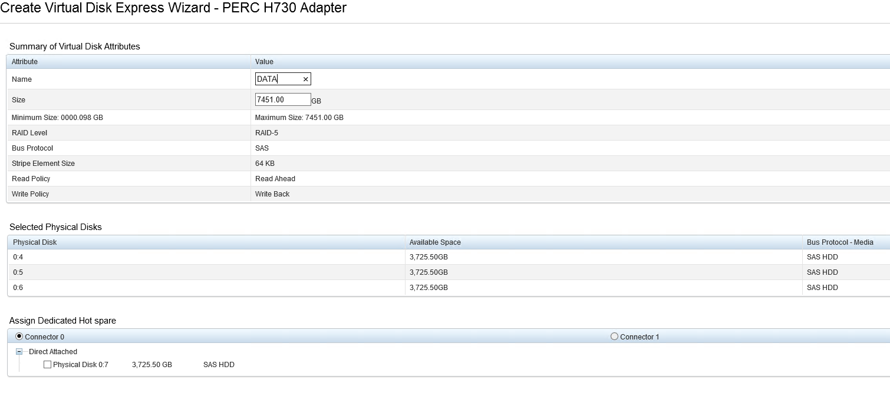
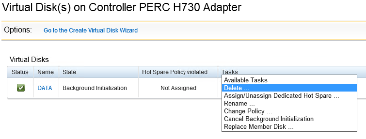

{{{
"title": "Configure the RAID controller on Bare Metal servers",
"date": "10-10-2016",
"author": "Joe Nguyen & Bryan Friedman",
"attachments": [],
"contentIsHTML": false,
"sticky": false
}}}

### Table of Contents

* [Overview](#overview)
* [Prerequisites](#prerequisites)
* [Installing OMSA for Windows](#installing-omsa-for-windows)
* [Installing OMSA for CentOS or RHEL](#installing-omsa-for-centos-or-rhel)
* [Installing OMSA for Ubuntu](#installing-omsa-for-ubuntu)
* [Connecting to OMSA](#connecting-to-omsa)
* [Changing the RAID controller Mode](#changing-the-raid-controller-mode)
* [Creating a RAID Volume](#creating-a-raid-volume)
* [Deleting a RAID Volume](#deleting-a-raid-volume)

### Overview

Customers who implement particular Bare Metal server types are able to customize the configuration using both JBOD (HBA) and RAID modes.  For additional information on which servers support this feature refer to our [Bare Metal FAQ](../Servers/bare-metal-faq.md).  Using this guide customers will leverage the Dell OpenManage Server Administrator (OMSA) to create and delete RAID volumes to meet specific performance and availability needs.

### Prerequisites

* Purchase a Bare Metal Server that support JBOD/RAID:
  * 20 cores E5/256 GB RAM/2x800GB SSD/12x2TB 7200 SATA
  * 16 cores E5/256 GB RAM/2x800GB SSD/4x4TB 7200 SATA

### Installing OMSA for Windows

1. Download [OMSA.](http://www.dell.com/support/contents/us/en/04/article/Product-Support/Self-support-Knowledgebase/enterprise-resource-center/SystemsManagement/OMSA)

2. Run and Extract

    

3. Run the installer in C:\OpenManager\windows\setup.exe

4. Use the default installer options.

### Installing OMSA for CentOS or RHEL

1. ```wget -q -O - http://linux.dell.com/repo/hardware/dsu/bootstrap.cgi | bash```

2. ```yum install dell-system-update -y```

3. ```yum install srvadmin-all -y```

4. ```reboot```

### Installing OMSA for Ubuntu

1. ```echo 'deb http://linux.dell.com/repo/community/ubuntu trusty openmanage' | sudo tee -a /etc/apt/sources.list.d/linux.dell.com.sources.list```

2. ```gpg --keyserver pool.sks-keyservers.net --recv-key 1285491434D8786F```

3. ```gpg -a --export 1285491434D8786F | sudo apt-key add –```

4. ```apt-get update```

5. ```apt-get install srvadmin-all```

6. ```reboot```

### Connecting to OMSA

1. To connect to OMSA navigate to ```https://<yourIPaddress>:1311```

2. You will be prompted to enter credentials. Use the administrator or root user and password to log in.

### Changing the RAID controller Mode

1. Connect to OMSA

2. To change controller mode click **Storage** and select **Change Controller Mode** under available tasks and click Execute.

    

3. Change controller mode to desired mode and hit **Apply changes** and **Reboot the server immediately**. You can see the current controller mode on this page.
  * Changing the controller mode requires a reboot.
  * If you are changing from RAID to HBA mode, you will need to delete any security keys, and existing RAID volumes before it will let you switch to HBA mode. Don’t forget to convert your disks back to **Non-RAID disks**.

### Creating a RAID volume

1. Connect to OMSA

2. Before we can create a RAID we must convert the disks to RAID mode. Select **Storage**, then under available tasks for the controller choose **Convert to RAID Capable Disks.**

    

3. Select the disks you wish to convert to RAID capable and apply.

4. Now choose “Create Virtual Disk” from the Available task list.

    

5. Choose **Express Wizard** or **Advanced Wizard** and your desired RAID level from the drop down list and hit continue. Advanced Wizard is recommended for most cases as it permits the user to define the number of disks in the RAID Virtual Disk instead of using predefined configurations.

6. Type in a name for your volume. Validate that all of the settings you expect are correct. Note that you may set up a hot spare at this time if you choose and your RAID setting allows it.

    

7. Once completed, you should have a new RAID volume available. You will need to format it, and assign it a drive letter or mount point within the Operating System before you can use it.

### Deleting a RAID Volume

1. Connect to OMSA

2. Navigate to **Storage, PERC H730 Adapter, Virtual Disks.**

3. Choose **Delete** from the available tasks on the Virtual Disk you wish to delete.

    

4. OMSA will warn you that all data will be lost. Confirm this dialog box and your volume will be deleted.
