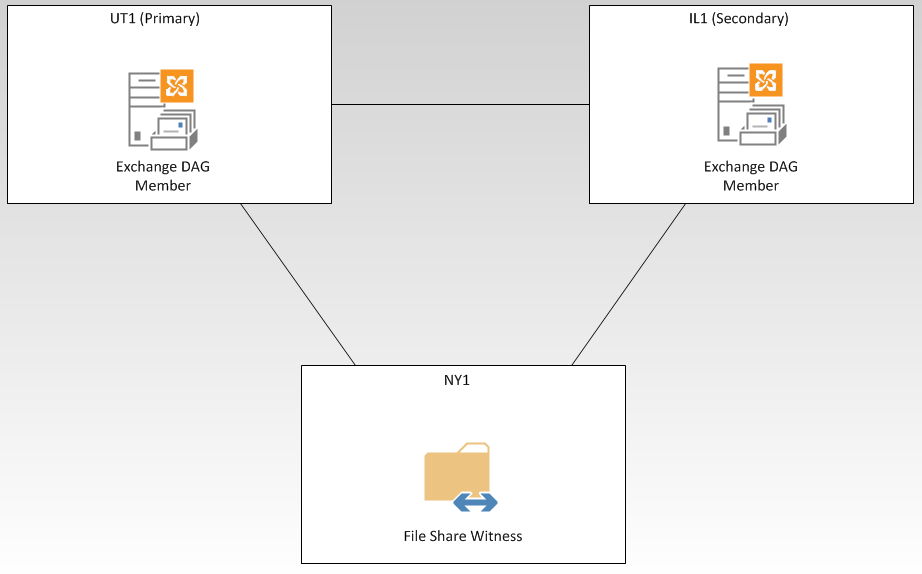
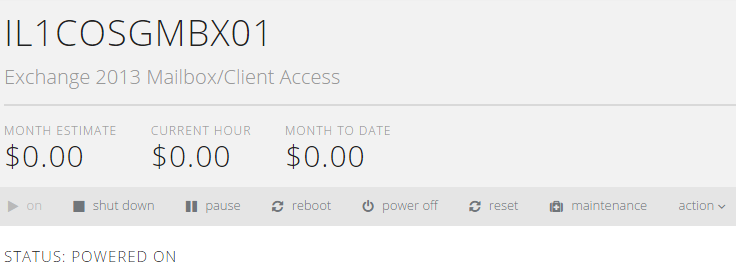
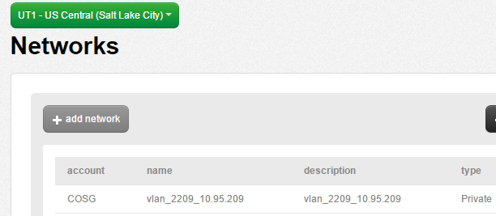
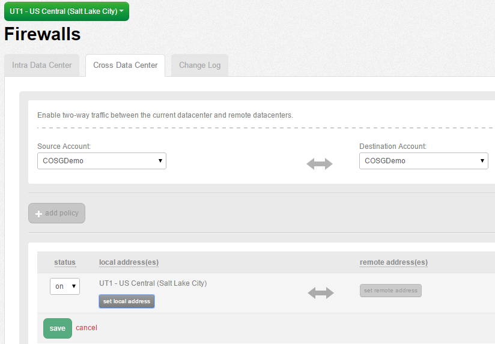
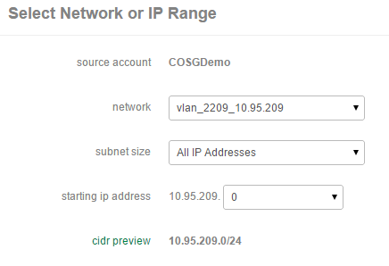
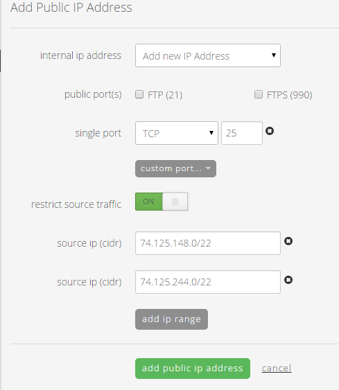
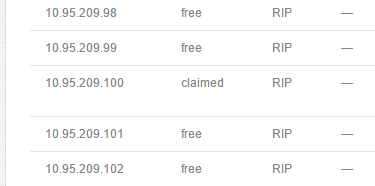

{{{
  "title": "Deploy HA Exchange on CenturyLink Cloud",
  "date": "3-31-2015",
  "author": "Mark Turpin",
  "attachments": [],
  "contentIsHTML": false
}}}

### Exchange 2013 on CenturyLink Cloud – High Availability and Automatic Failover

Exchange 2013 offers excellent high availability and disaster recovery for enterprise messaging. With CenturyLink Cloud’s Global Data Center footprint, it is easy to deploy a globally scaled and highly available Exchange architecture.

### Prerequisites

Exchange 2013 requires an Active Directory environment.  AD can easily be automated through the [CLC create server wizard](../servers/creating-a-new-enterprise-cloud-server.md) or through [deploying an AD blueprint](../blueprints/deploy-microsoft-windows-2012-active-directory-domain-services.md).  For the purpose of this article, an AD forest exists already, or has been deployed from a CLC blueprint.  A domain controller will be required in each datacenter (and minimal resources should suffice, depending on environment).  This article also assumes you have Domain Admin permissions (and Exchange Organization Admin).  Load balancers and additional mailbox servers could be added to this design for larger organizations.

### Design

Our design for a basic Exchange 2013 DR/HA environment will involve 3 datacenters and 3 servers.  For example, UT1 is our primary/active Exchange datacenter; IL1 is our secondary/passive Exchange datacenter, and NY1 will hold the file share witness (FSW) for the Exchange Database Availability Group (DAG).



### CLC Server Creation

Create an Exchange server in UT1 & another in IL1 with the [CLC create server wizard](../servers/creating-a-new-enterprise-cloud-server.md).  Since both servers will host the Client Access and Mailbox roles, you will want to start them with at least 2CPU/16GB of RAM each.  Join both servers to Active Directory.  Create the 3rd server in NY1 for the FSW – this can be done with minimal resources, such as 1CPU/2GB of RAM, and should also be domain joined.



Note – if these are the first servers in a datacenter for your account, then a /24 network will automatically be provisioned as part of the server creation process.



### CLC Firewall Policies

Each server will need to be able to communicate with the subnet that the other two servers are on.  In this example, we will [create Cross Datacenter firewall policies](../network/creating-cross-data-center-firewall-policies.md) that open up each /24 subnet to each other.





The end result should have a firewall policy for the following:

* UT1 subnet <> IL1 subnet
* UT1 subnet <> NY1 subnet
* IL1 subnet <> NY1 subnet


### Exchange Installation

Install Exchange 2013 on both servers in UT1/IL1 using the [setup wizard](https://technet.microsoft.com/en-us/library/bb124778%28v=exchg.150%29.aspx) from Exchange software and be sure to select Client Access/Mailbox roles for both servers.  Next, configure Exchange 2013 [mail flow and client access](https://technet.microsoft.com/en-us/library/jj218640(v=exchg.150\).aspx).  The specifics of the installation and configuration parameters depend on your particular environment. To make your Exchange externally available, you will need to create DNS records on an external DNS provider:

* Autodiscover SRV record
* A record for OWA
* MX records, which could point to an Anti-Spam cloud

[Request the NOC to add a PTR record](../support/requesting-a-public-dns-ptr-record.md):

* Create two PTR records by entering the IP address of each server transmitting mail to the Internet and the FQDN (external CAS URL; IE, the A record for OWA).  The PTR record will provide a valid reverse lookup for spam checks when other email systems receive your email.

Both Exchange servers will need to [add two public IP’s](../network/how-to-add-public-ip-to-virtual-machine.md) each.


One public IP will be used for IIS traffic (OWA, ActiveSync, ECP, etc) and will require ports 80/443 open.  This public IP can use the existing private IP (10.92.231.12 in this instance).  80 & 443 are standard public ports that have a checkbox.


The second public IP will be used for mail flow.  This will require you to use the internal ip address dropdown and select Add New IP Address; this will add a second internal IP (such as 10.92.231.13).  Next, you will need to select custom port and add TCP 25 for SMTP.  Finally, click the grey button next to restrict source traffic and add the public subnets your email is coming from. For example, mail flow from an anti-spam cloud (such as Postini) will require port 25 open with a source IP restriction to lock down to the IP’s delivering mail.



### Create and Configure the Exchange DAG

Now that our servers and external firewall policies are configured in the CLC portal, we need to configure the FSW server in NY1 before creating the DAG with the following steps:

* The Exchange Trusted Subsystem group in Active Directory must be added to the local Administrators group
* Run the following cmdlet in PowerShell (as administrator):

```
Add-WindowsFeature FS-FileServer
```

* Ensure that File and Print Sharing is allowed in the Windows Firewall if the firewall is enabled

At this point the FSW server is ready for the DAG to be created.  As a pre-requisite for the DAG, we will need to claim the internal cluster IP’s for each datacenter by requesting a NOC ticket (You can open a ticket by simply sending an email to noc@ctl.io).  We need both IP’s to be marked as claimed in the portal so they will be unavailable for newly provisioned servers (as provision servers will use the next available IP).  Below is an example of a claimed IP which we will use for the IL1 portion of the DAG:



To create the Exchange DAG and then add both mailbox servers to it, we can use the Exchange Management Shell to execute the following (example):

```
New-DatabaseAvailabilityGroup -Name EmailDAG -WitnessServer NY1COSGFSW01 -WitnessDirectory C:\FSW -DatabaseAvailabilityGroupIPAddresses 10.95.209.100, 10.92.231.100
```

```
Add-DatabaseAvailabilityGroupServer -Identity EmailDAG -MailboxServer UT1COSGMBX01
```

```
Add-DatabaseAvailabilityGroupServer -Identity EmailDAG -MailboxServer IL1COSGMBX01
```

Note the following – the witness server is specified to be the NY1 FSW server & and the folder is specified.  The DAG IP Addresses are NOT the IP addresses of each Exchange server; rather, they are the cluster IP’s – one in each datacenter (UT1/IL1).  When the DAG is active in one datacenter, it will use that cluster IP.

An alternative file share witness can also be configured when creating the DAG – and that should reside in IL1 or UT1.  It can only be manually activated in the event of a failure in NY1.  It is also highly recommended to turn on DAC mode for the DAG.

```
Set-DatabaseAvailabilityGroup  -Identity EmailDAG -DatacenterActivationMode DagOnly
```

We can [create a few databases](https://technet.microsoft.com/en-us/library/aa997976(v=exchg.150\).aspx) for the DAG and then [add a copy](https://technet.microsoft.com/en-us/library/dd298080(v=exchg.150\).aspx) to the other datacenter.  We now have database availability and disaster recovery on the application level.  In order to add Exchange Client Access HA/DR capability, we can use a 3rd party DNS provider (such as Dyn) to ping the public IP’s or do SSL tests over a period of time (for instance, 5 minutes). When the public IP stops responding, then the external DNS provider will failover the DNS records to their secondary public IP’s (in our design, this would be the IL1 public IP’s).

### Disaster Recovery Scenarios

If the IL1 datacenter has an outage or failure, Exchange will not be affected.  All databases will be mounted in the primary datacenter, UT1.  Exchange will also prevent databases from being mounted in IL1 when the datacenter returns, due to quorum majority (UT1 MBX server + NY1 FSW are 2 votes; IL1 MBX server is 1 vote).  Client Access will not be affected as it was pointed at UT1 and not IL1.

If the UT1 datacenter has an outage or failure, Exchange will automatically fail over databases to IL1 (speed determined by the settings on MountDialOverride).  Client Access will also failover to IL1 once the specified time period for ping or SSL tests has been reached, and your external DNS provider fails over DNS records to the IL1 public IP’s.  Exchange will also prevent databases from being mounted in UT1 when the datacenter returns, due to quorum majority (IL1 MBX server + NY1 FSW are 2 votes; UT1 MBX server is 1 vote).

If the NY1 datacenter has an outage or failure, Exchange will run normally.  All that would be needed in this scenario would be to manually activate the alternate FSW using the Set-DatabaseAvailabilityGroup cmdlet in Exchange Management Shell.

### Placing the File Share Witness in a 3rd Datacenter is the Key

Using a 3rd datacenter for the FSW is the reason we are able to design an Exchange architecture with automatic failover.  Here’s a quote from Ross Smith IV, Principal Program Manager for Exchange, on the Exchange Team Blog:

*“Ultimately, the placement of the witness server determines whether the architecture can provide automatic datacenter failover capabilities or whether it will require a manual activation to enable service in the event of a site failure.
If your organization has a third location with a network infrastructure that is isolated from network failures that affect the site resilient datacenter pair in which the DAG is deployed, then the recommendation is to deploy the DAG’s witness server in that third location. This configuration gives the DAG the ability to automatically failover databases to the other datacenter in response to a datacenter-level failure event, regardless of which datacenter has the outage.”*
