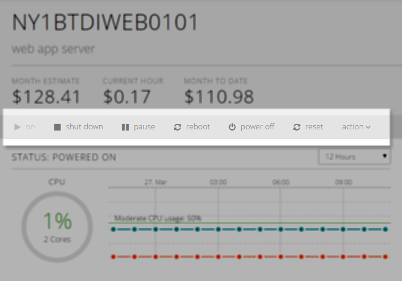

{{{
  "title": "Descriptions of Server/Group Power Commands",
  "date": "3-27-2015",
  "author": "Richard Seroter",
  "attachments": [],
  "contentIsHTML": false
}}}

###Description
CenturyLink Cloud users can issue power commands against individual servers or Groups of servers. For Groups, this makes it easy to quickly power off or reboot entire sets of servers with a single command. This KB article explains what each power command does to the underlying virtual machine.

###Commands
**On**

Applies to cloud servers that are powered off. Initiates the operating system boot sequence. Billing charges for memory, CPU, and operating system (if applicable) start accruing, and monitors are re-enabled.

**Shut down**

Initiates a graceful shutdown of the corresponding server or servers. Like the “off” power command, all memory and CPU charges cease, monitors are disabled, and the machine is left in a powered off state.

**Pause**

When a virtual machine is paused, its state is frozen (e.g. memory, open applications) and monitoring ceases. Billing charges for CPU and memory stop. A paused machine can be quickly brought back to life by issuing the “On” power command. Any applicable operating system charges continue to accrue while a machine is paused.

**Reboot**

Executes a graceful reboot of the target server or servers. Unlike the forced “reset” power command, this instructs the operating system to initiate a proper stop and restart.

**Power off**

This is a forced shutdown of a server. It’s the equivalent to unplugging a physical machine. All memory and CPU charges stop accruing, monitors are disabled, and the machine ends up in a powered off state. Any operating system charges (if applicable) and storage charges continue accruing. If the server is moved to archive storage, then any applicable operating system charges cease.

**Reset**

Similar to the relationship between “Off” and “Stop OS”, the reset command is a forced power off + power on combination. It is equivalent to the reset button on a physical computer.
