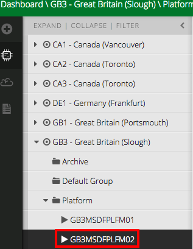
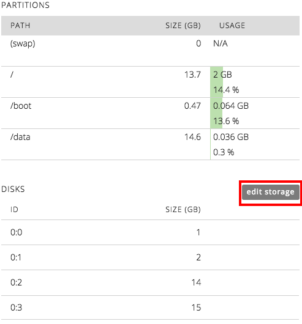
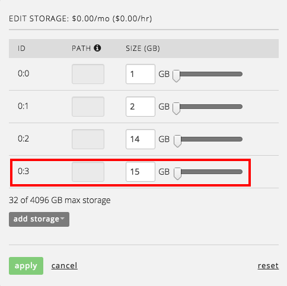
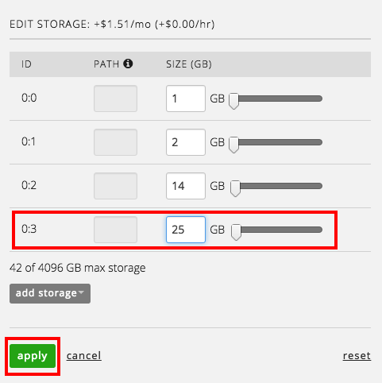
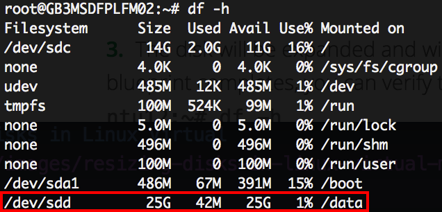

{{{
  "title": "Resizing Disks in Linux Virtual Machines",
  "date": "09-23-2015",
  "author": "Anthony Hakim",
  "attachments": []
}}}

### Description
Server resource requirements change frequently as environments scale. Storage is one of the most dynamic elements, and is often resized as environments grow and change. The CenturyLink Cloud Control Portal provides a self-service function to accommodate increased storage demands _without_ the need for a reboot. Non-boot and swap disks on a Linux VM will automatically be expanded upon request. Further, their file systems grow to reflect expanded storage.

### Steps

1. To modify storage allocations:

Navigate to the server in the Control Portal, then click on it.

  

In the right pane, scroll down to **PARTITIONS**, then click the **edit storage** button.

  

  

To resize the disk, you can either enter the new size (must be greater than the current value), or drag the slider to increase the size of the disk, then click **apply**.

  

The resize disk request will be submitted to the queue.

  

 Once complete, you can test using the following commands:

  
