{{{
  "title": "Using ownCloud with CenturyLink DBaas",
  "date": "09-17-2015",
  "author": "Gavin Lai",
  "attachments": [],
  "contentIsHTML": false
}}}


### Technology Profile
ownCloud is a personal productivity powerhouse. It gives you universal access to all your files, contacts, calendars and bookmarks across all of your devices. Unlike many of the shared repository services out there, with ownCloud, you have your own, private repo. However, just like the public repo companies, with ownCloud you can share your files with friends and co-workers. If you need it, ownCloud even integrates with other storage providers. Best of all, ownCloud is open source and free!

### Description
This CenturyLink Cloud knowledge article provides a walkthrough to install and configure ownCloud on the Linux platform (from scratch and Blueprint), customize ownCloud to utilize CenturyLink Cloud's DBaaS (Beta), SMTP Relay and Object Storage.

For more information, please visit [http://owncloud.org](//owncloud.org)

### Audience
CenturyLink Cloud Users

### Impact
After reading this article, the user can configure a customized ownCloud environment to utilize DBaaS, mail relay and Object storage (Enterprise edition) to minimize administration for local resources


### Prerequisite
- Access to the CenturyLink Cloud platform as an authorized user
- Access to CenturyLink Cloud Database as a Service as an authorized user
- Access to Object Storage if required, CenturyLink Cloud Object Storage can be used as primary storage for the Enterprise Edition of ownCloud


### Postrequisite
If you want to access your application over the internet, please perform the following tasks after the server is deployed successfully:

1. If you need to connect to your server via the Internet, [Add a Public IP](../Network/how-to-add-public-ip-to-virtual-machine.md) to your server through Control Portal

2. [Allow incoming traffic](../Network/how-to-add-public-ip-to-virtual-machine.md) for desired ports by clicking on the Servers Public IP through Control Portal and configuring appropriately.
  * The default ports to access the application are: 80, 443

- After adding a public IP for OwnCloud perform the following actions:
	- Edit the web server configuration files in /etc/apache2/sites-enabled as follows:
	```
	{
    DocumentRoot "/var/www/owncloud/"
    # Alias /owncloud/ "/var/www/owncloud/"
    # Alias /owncloud "/var/www/owncloud"
	}
    ```
  - Restart Apache using *sudo  service apache2 restart*
  - (The following steps will enable management of ownCloud from the public IP address)
		- Access the server's public IP address using a web browser (with VPN still connected)
		- ownCloud setup will prompt to add the new IP address as a "trusted domain" <br>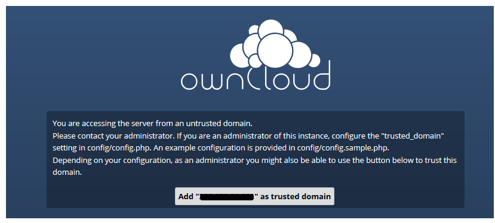<br>
		- Click on "Add "IP address" as a trusted domain", it will redirect this request to the private IP address to create the necessary entries to the owncloud configuration file
  <br>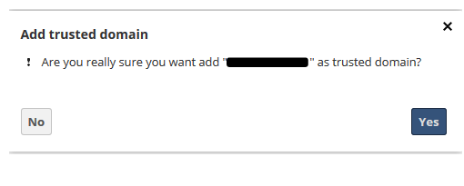<br>

### Deploying ownCloud on a New Server
**(For Steps using Blueprint, please see [Getting Started with ownCloud Blueprint](..\Ecosystem Partners\Marketplace Guides\getting-started-with-owncloud-blueprint.md))**

Create a Linux server in CenturyLink Cloud using the following knowledge articles
- For virtual server, [Create a virtual server](../Servers/how-to-create-customer-specific-os-templates.md)
- [Create a bare metal server](../../Servers/creating-a-new-bare-metal-server.md) for a private deployment)
**Blueprint ownCloud installation is located in /opt/bitnami directory**

#### Create a MySQL instance on CenturyLink DBaaS (Beta)
1. Use [Create a MySQL instance on CenturyLink DBaaS](../Database/getting-started-with-MySQL-DBaaS.md) knowledge article to create a database instance
2. Note down the user name and the connection string from the setup <br>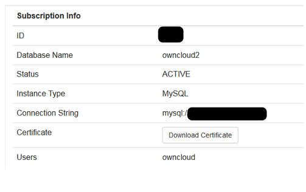<br>
3. Download the certificate to configure secure connectivity to DBaaS

#### Connect to the server via OpenVPN
1. Assume you have OpenVPN client setup for the CenturyLink Cloud account
2. If not, please refer to [How To Configure Client VPN](../network/how-to-configure-client-vpn.md)

#### Steps to deploy ownCloud to an existing server
1. Download the ownCloud installation from [ownCloud.org](//owncloud.org/install/)
2. Look for the package for the installed OS, this example will use Ubuntu 14.x
3. ownCloud supports CentOS, Debian, RHEL, Ubuntu and [more](//software.opensuse.org/download/package?project=isv:ownCloud:community&package=owncloud)
4. For Ubuntu 14.x, download the ownCloud package and add the repository key to apt (this key will updates periodically).
```
{
	wget http://download.opensuse.org/repositories/isv:ownCloud:community/xUbuntu_14.10/Release.key
	sudo apt-key add - < Release.key  
	sudo sh -c "echo 'deb http://download.opensuse.org/repositories/isv:/ownCloud:/community/xUbuntu_14.10/ /' >> /etc/apt/sources.list.d/owncloud.list"
	sudo apt-get update
	sudo apt-get install owncloud
}
```
5. **Enable SSL**
 - In order to enable SSL, a certificate is required.  Either a self-signed certificate or your own certificate can be used.  
 - The following gives an example of self signed certificate with an expiration date of 365 days :
	1. Create the certificate (***use /opt/bitnami instead of /etc for Blueprint installation, detail steps are [here](//wiki.bitnami.com/Applications/BitNami_ownCloud#How_to_enable_SSL.3f)***):

		```
		{
			cd /etc/apache2
			mkdir ssl
			sudo openssl req -x509 -nodes -days 365 -newkey rsa:2048 -out /etc/apache2/ssl/server.crt -keyout /etc/apache2/ssl/server.key
			sudo ln -s /etc/apache2/sites-available/default-ssl.conf /etc/apache2/sites-enabled/000-default-ssl.conf

		}
		```
		Edit the following two parameters to reflect the location of the certificate:
		```
		{
		SSLCertificateFile    /etc/apache2/ssl/server.crt
		SSLCertificateKeyFile /etc/apache2/ssl/server.key
		}
		```

	2. Enable SSL on the web server:
		```
		{
			sudo a2enmod ssl
			sudo a2ensite default-ssl
			sudo service apache2 reload
		}
		```

6. **Configure ownCloud connection to CenturyLink MySQL DBaaS (Beta)**
##### To trigger the initial setup in the ownCloud Blueprint installation, move the config.php file from /opt/bitnami/apps/owncloud/htdocs/config directory to a new location (please [backup the data for restoration](//wiki.bitnami.com/Applications/BitNami_ownCloud#How_to_create_a_full_backup_of_ownCloud.3f))
	1. If not already, connect to [CenturyLink Cloud VPN](../network/how-to-configure-client-vpn.md)
	2. Point the web browser to the private address of the ownCloud server
	3. The ownCloud configuration page will appear
	<br><br>
	4. Click on ***Storage and Database***, select ***MySQL***
	5. Using the information from DBaaS to complete the information, the format for the host is IP_Address:port (e.g. 192.168.1.1:45678)
	<br>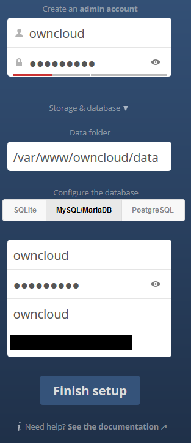<br>
	6. Click "Finish Setup", the welcome page will display <br>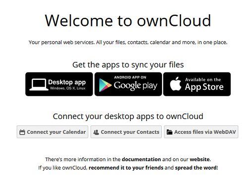<br>
	7. Download the certificate from Database as a Service to the ownCloud server to enable secure communication between the database and the ownCloud server.
		- Add the following to section to the config.php file (default location: /var/www/owncloud/config/)
		```
		{   'dbdriveroptions' =>
				array (
				1009 => '/etc/mysql/ssl/ca-cert.pem',
				),
		}
		```

7. **Configure ownCloud to utilize SMTP Relay**
	1. Configure SMTP Relay [SMTP Relay](../Mail/smtp-relay-services-simple.md)
	2. From the owncloud main page, select ***Admin*** from the user account <br><br>
	3. Select ***Mail Server*** from the left pane     <br>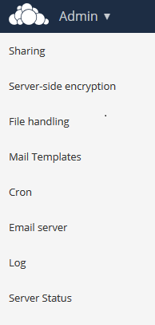<br>
	4. Configure the SMTP Relay user based on SMTP Relay information from the portal <br>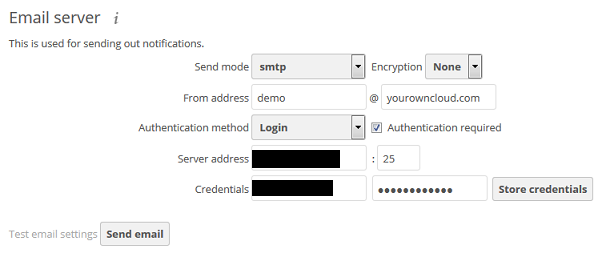<br>
	5. Use the test function to verify the account information

8. **Configure ownCloud to utilize Object Storage**

 **There are two ways to utilize Object Storage in ownCloud, one is adding Object Storage as an external storage and the other is to utilize Object Storage as the primary storage for ownCloud**
  **Steps to add Object Storage as External storage**
  1. [Access to CenturyLink Cloud storage](../Object Storage/introducing-object-storage.md) (S3 compatible) or any other object storage
  2. Login to ownCloud portal as Administrator
  3. Select ***Apps*** from the top left drop down menu <br>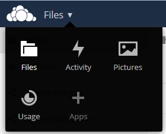<br>
  4. Enable ***External Storage Support*** from the ***Not enabled*** list  <br>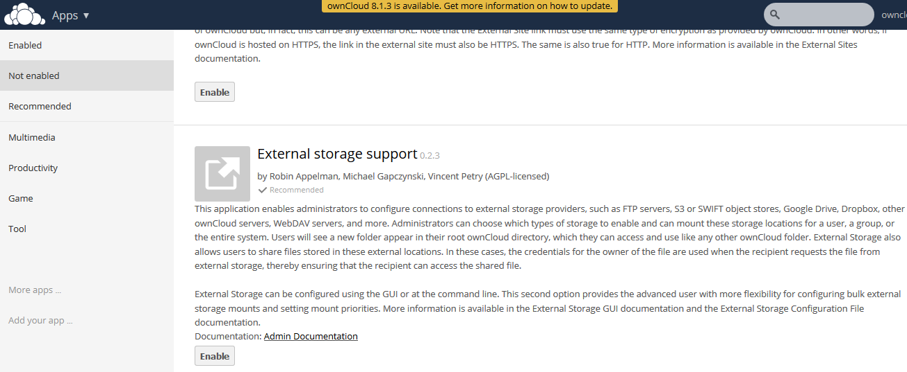
  5. From the owncloud main page, select ***Admin*** from the user account <br> 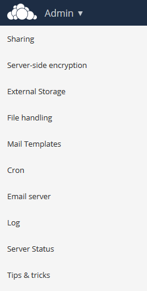 <br>
  6. Configure ***External Storage***, ***Add Storage*** with "Amazon S3 and Compliant" and populate the fields using the credential from Step 1 and set permissions <br>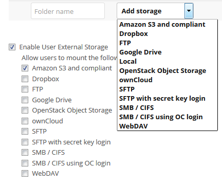<br> <br><br>
  7.  Once completed, the Object Storage will be part of the storage locations under "Files" <br>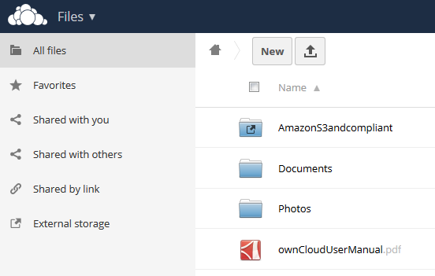<br>

  **Steps to add Object Storage as Local storage**
 1. [Access to CenturyLink Cloud storage](../Object Storage/introducing-object-storage.md) (S3 compatible) or any other object storage
 2. Depending on the version of ownCloud, the options of utilizing Object Storage are different, please see [here](//owncloud.com/owncloud-server-or-enterprise-edition/)
 3. ownCloud Server supports Local storage, GlusterFS/Red Hat Storage, OpenStack Swift as primary storage; Enterprise Edition supports additional primary storage with S3 compatible storage
 4. In order to utilize Object Storage for primary storage, edit config.php (default location: /var/www/owncloud/config/) with the Object Storage credential, like the example below:

	 ```
		{	'objectstore' => array(
			'class' => 'OCA\ObjectStore\S3',
			'arguments' => array(
			'key' => 'xxxxxxxxxxxxx',
			'secret' => 'xxxxxxxxxxxxxxxxxxxxxxxxxxxxxxxxxx',
			'bucket' => 'owncloud',
			'region' => 'canada.os.ctl.io'
				),
			),
		}
		```

6.Now, the ownCloud server is set up to consume Database as a Service, SMTP Relay and Object Storage, this will minimize the administration of the local environment and eliminate resource constraint.  

### Pricing
The costs associated with this deployment are for the CenturyLink Cloud infrastructure only.  There are no ownCloud license costs or additional fees bundled in.

### About ownCloud
[ownCloud](//owncloud.org/history/) gives you universal access to your files through a web interface or WebDAV. It also provides a platform to easily view & sync your contacts, calendars and bookmarks across all your devices and enables basic editing right on the web. Installation has minimal server requirements, doesn’t need special permissions and is quick. ownCloud Server is extendable via a simple but powerful API for applications and plugins.


### Frequently Asked Questions

#### Who should I contact for support?
* For issues related to deploying the ownCloud on CenturyLink Cloud, Licensing or Accessing the deployed software, please visit the [ownCloud Support website](//owncloud.org/support/)
* For issues related to cloud infrastructure (VM's, network, etc), or is you experience a problem deploying any Blueprint or Script Package, please open a CenturyLink Cloud Support ticket by emailing [noc@ctl.io](mailto:noc@ctl.io) or [through the CenturyLink Cloud Support website](//t3n.zendesk.com/tickets/new).
