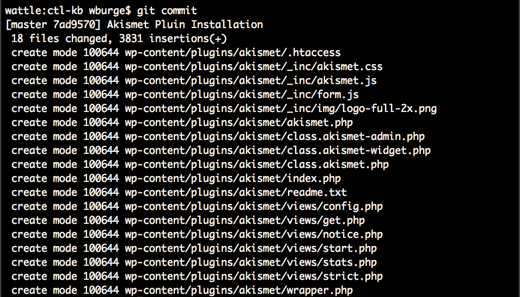
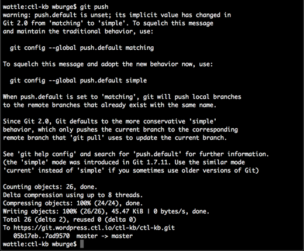
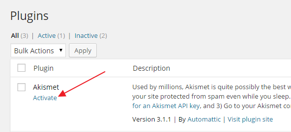

{{{
  "title": "WordPress Plugin Installation",
  "date": "07-17-2015",
  "author": "Bill Burge",
  "attachments": [],
  "contentIsHTML": false
}}}

### IMPORTANT NOTE

CenturyLink Cloud WordPress hosting is currently in a Limited Beta program with specific customers by invitation only and is not intended for production usage.

During the Limited Beta there is no production Service Level Agreement.

## Overview

CenturyLink Cloud WordPress sites use Git to deploy new WordPress code including new plugins.

In order to activate a plugin you will need to download a WordPress Plugin and upload it into the Master branch of the Centurylink Git repository provided to you during your CenturyLink Cloud Wordpress site creation. This will then force a refresh of your WordPress blog and allow you to activate and configure the plugin.

**NOTE:** These instructions assume the following...

* The Git CLI is installed
* A working knowledge of Git usage

##Deploying a WordPress Plugin Using the Git CLI

1. [Clone your WordPress Git Repo](wordpress-clone-push-gitlab.md "Clone your WordPress Git Repo")

2. Open the wp-content folder.

  

3. Open the plugins folder.

  

4. Download the WordPress Plugin you want to install.

  _In this example we will be installing Akismet_.

5. Locate the local folder the plugin was downloaded to and copy it into the plugins folder of your cloned Git repository.

  

  You will end up with the following...

  

6. Inside your repo, at the command line, running `git status` will now show you uncommited changes.

  

7. Commit your changes using the `git add` command.

  _In this example we will run git add * to add all files to the repo_

  

8. Running `git status` will show new files to commit.

  

9. Run `git commit` to commit files.

  

10. An editor will open. Insert a comment and save the file.

  

11. The CLI will then output file creation.

  
  
12. Run `git push` to push changes back to your Git Repository and force a restart of your WordPress site.

  

13. In your WordPress installation expand _Plugins_.

  

14. Next to your installed plugin click _Activate_

  

15. Your plugin is now installed.
